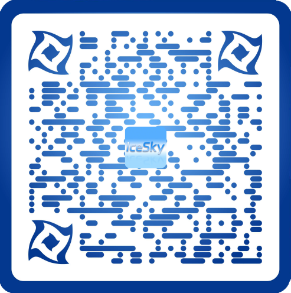

<link href="./static/css/bootstrap.min.css">

# Windows App Recommend

**[中文 README](./README_ZH.md) | English README**

## Educational Apps 

### Enlightenment education 
It can be used for Chinese preschool and primary school enlightenment education, early education and interest cultivation

* [汉语拼音](https://apps.microsoft.com/detail/9MZX6CQ10SW7?hl=zh-cn&gl=CN) 
  
  
  It includes the introduction of Chinese initials, finals, overall recognition, pronunciation, writing stroke order, memory methods, etc

* [启蒙教育](https://apps.microsoft.com/detail/9NBLGGH425RC?hl=zh-cn&gl=CN)
 
  
  Include 三字经、百家姓、千字文、弟子规、nursery rhymes, tongue twisters, stories
* [国学启蒙](https://apps.microsoft.com/detail/9NHSJH132S35?hl=zh-cn&gl=CN)
 
  
  Include 《百家姓》、《三字经》、《千字文》、《弟子规》、《蒙求》、《神童诗》及《续神童诗》, with audio, pinyin, annotations, and translations
* [德育启蒙](https://apps.microsoft.com/detail/9NLLGXJP1ZTP?hl=zh-cn&gl=CN)
  
  
  Include 《名贤集》、《增广贤文》、《孝经》、《二十四孝》, with audio, pinyin, annotations, and translations
* [笠翁对韵](https://apps.microsoft.com/detail/9PDC01WZNBNT?hl=zh-cn&gl=CN)
  
  
  Include 30 articles of 《笠翁对韵》 with audio, pinyin and annotations
* [骈句启蒙](https://apps.microsoft.com/detail/9MW92HQL4FZ5?hl=zh-cn&gl=CN)
  
  
  Include 30 articles each of 《龙文鞭影》，《声律启蒙》、《笠翁对韵》、《训蒙骈句》, with audio, pinyin and annotations
* [经典儿歌](https://apps.microsoft.com/detail/9NX45P7H18MD?hl=zh-cn&gl=CN)
  
  
  Include Chinese classic children's songs, animated theme songs, ancient poetry children's songs, etc
* [千家诗](https://apps.microsoft.com/detail/9NBLGGH42JP3?hl=zh-cn&gl=CN)
  
  
  Include more than 200 ancient Chinese poems, and provides reading and search functions
* [唐诗300首](https://apps.microsoft.com/detail/9NBLGGH424DD?hl=zh-cn&gl=CN)
  
  
  Provide 《唐诗三百首》 audio and searching by author and title
* [宋词300首](https://apps.microsoft.com/detail/9NBLGGH42JL6?hl=zh-cn&gl=CN) 
  
  
  Provide 《宋词三百首》 audio and searching by author and title
* [极简英文儿歌](https://apps.microsoft.com/detail/9NCZGGBPNNT6?hl=zh-cn&gl=CN)
  
  
  Very simple English initiation nursery rhyme with audio and annotations
* [迪士尼英文儿歌](https://apps.microsoft.com/detail/9P5PR052N1DD?hl=zh-cn&gl=CN)
  
  
  Contains 100 classic English children's rhymes with audio and annotations
* [苏西托曼儿歌](https://apps.microsoft.com/detail/9PBMWG0RKQ3N?hl=zh-cn&gl=CN)
  
  
  English nursery rhymes that contain the pleasant sounds of a variety of instruments
* [鹅妈妈童谣](https://apps.microsoft.com/detail/9PHBW0MJM92H?hl=zh-cn&gl=CN)
  
  
  A collection of English nursery rhymes, including nursery rhymes, riddles, lullaby, alphabet songs, animal songs, etc., with audio and annotations
* [英文儿歌合集](https://apps.microsoft.com/detail/9MZBJ01MGN1C?hl=zh-cn&gl=CN)
  
  
  It contains more than 160 classic English nursery rhymes, with audio and annotations

### Knowledge expansion and improvement 
It can be used as extracurricular knowledge to expand and improve

* [诗词散文](https://apps.microsoft.com/detail/9NBLGGH42RL7?hl=zh-cn&gl=CN)
   
  
  It contains more than 140 classic Chinese ancient poems, with reading and children's songs

* [唐诗300首+](https://apps.microsoft.com/detail/9NWSJ79860Q0?hl=zh-cn&gl=CN) 
   
  
  Provide 《唐诗三百首》 with audio, pinyin, annotations and translations, you can view the author's introduction, creative background and poetry appreciation
* [宋词300首+](https://apps.microsoft.com/detail/9N80M3VMVBXK?hl=zh-cn&gl=CN)
   
  
  Provide 《宋词三百首》 with audio, pinyin, annotations and translations, you can view the author's introduction, creative background and poetry appreciation
* [元曲300首](https://apps.microsoft.com/detail/9NBLGGH42JP4?hl=zh-cn&gl=CN)
   
  
  Provide 《元曲三百首》 audio and searching by author and title
* [小学必背古诗文](https://apps.microsoft.com/detail/9NCJSGBVLWWT?hl=zh-cn&gl=CN)
   
  
  Provide ancient poems that need to be memorized in Chinese primary school, with 
audio, pinyin, annotations, and translations
* [中学必背古诗文](https://apps.microsoft.com/detail/9P5B3C3R6GHP?hl=zh-cn&gl=CN)
   
  
  Provide ancient poems that need to be memorized in Chinese middle school, with 
audio, pinyin,  annotations, and translations
* [高中必背古诗文](https://apps.microsoft.com/detail/9PCD7LCS18DK?hl=zh-cn&gl=CN)
   
  
  Provide ancient poems that need to be memorized in Chinese high school, with 
audio, pinyin,  annotations, and translations
* [成语大全](https://apps.microsoft.com/detail/9P8DZNDDBTR4?hl=zh-cn&gl=CN)
   
  
  It contains more than 30,000 Chinese idiom with pinyin, sources, explanations, examples, etc., and supports text search and special type query 
* [成语接龙诵读](https://apps.microsoft.com/detail/9NP4LCJPZNNM?hl=zh-cn&gl=CN)
   
  
  Provide adult and children's pronunciation and follow-read functions of Chinese idiom 
* **简笔画**
  It contains 5 levels of stick figure learning, and supports functions such as free drawing, picture coloring, and step learning, etc.

  [少儿简笔画](https://apps.microsoft.com/detail/9MSNH6TTWMHT?hl=zh-cn&gl=CN)
 
  
  [初级简笔画](https://apps.microsoft.com/detail/9NB3LRCRQ36G?hl=zh-cn&gl=CN)
 
  
  [中级简笔画](https://apps.microsoft.com/detail/9NDDFLMN19H6?hl=zh-cn&gl=CN)
 
  
  [高级简笔画](https://apps.microsoft.com/detail/9NBVHHCS2GWW?hl=zh-cn&gl=CN)
 
  
  [简笔画大师](https://apps.microsoft.com/detail/9NRLNP19TV4R?hl=zh-cn&gl=CN)
 
  
* [填色](https://apps.microsoft.com/detail/9PP861LBHWDB?hl=zh-cn&gl=CN)
   
  
  It contains more than 100 line drawing pictures, and supports the function of coloring preset pictures and local pictures, and supports export colored pictures
* [中国百科](https://apps.microsoft.com/detail/9NHFV6M0VMX3?hl=zh-cn&gl=CN)
   
  
  It contains Chinese traditional knowledge such as the 12 zodiac signs, the 24 solar terms, the hours, dynasties, and traditional festivals 
* [中国省级地图](https://apps.microsoft.com/detail/9P1WCC4N8ZLT?hl=zh-cn&gl=CN)
   
  
  Learn the basic situation of each province and memorize the shape and location of the provincial-level administrative regions in China
* [世界各国概况](https://apps.microsoft.com/detail/9P65BSZH61RM?hl=zh-cn&gl=CN)
   
  
  Memorize and understand the basic information of each country, such as the national flag, national emblem, and capital
* [中国诗词大全](https://apps.microsoft.com/detail/9P3432W9K924?hl=zh-cn&gl=CN)
   
  
  Contains more than 300,000 Chinese ancient poems, supports query and recitation
* [古诗文背诵](https://apps.microsoft.com/detail/9NSJ6FNW6F8N?hl=zh-cn&gl=CN)
   
  
  It contains more than 1,500 Chinese ancient poems such as Tang poems, Song poems, and Yuan songs, and supports desktop notification mode
* [元素周期表PWA](https://apps.microsoft.com/detail/9PCQBHB8R04G?hl=zh-cn&gl=CN)
   
  
  A tool to learn the periodic table of chemical elements, you can view various information about the elements
  [在线使用](https://periodictableblazor.azurewebsites.net)

  [元素周期表+](https://apps.microsoft.com/detail/9NJKL858L4VS?hl=zh-cn&gl=CN)
 
  
  A tool to learn the periodic table of chemical elements, which allows you to view elemental information and provide a comparison function

### English learning 
Gradually improve your English listening and speaking skills from easy to difficult

* [千万别学英语](https://apps.microsoft.com/detail/9N1LDB3LP7NK?hl=zh-cn&gl=CN)
   
  
  Provide 《千万别学英语》 with audio and annotations

* [小学英语听力](https://apps.microsoft.com/detail/9N097LX5NH27?hl=zh-cn&gl=CN)
   
  
  Provide 《小学英语听力》 with audio and annotations
* [小学英语听力100篇](https://apps.microsoft.com/detail/9P55LZ1VSR5S?hl=zh-cn&gl=CN)
   
  
  Provide 《小学英语听力100篇》 with audio and annotations
* [小学英语晨读](https://apps.microsoft.com/detail/9MXRXDHZ8CVT?hl=zh-cn&gl=CN)
   
  
  Provide 《小学英语晨读》 with audio and annotations
* [小学英语阅读](https://apps.microsoft.com/detail/9NDVPQHR9J2M?hl=zh-cn&gl=CN)
   
  
  Provide 《小学英语阅读》 with audio and annotations
* [小学英语会话](https://apps.microsoft.com/detail/9P4HJ8KDZ0L1?hl=zh-cn&gl=CN)
   
  
  Provide 《小学英语会话》 with audio and annotations
* [英文故事100篇](https://apps.microsoft.com/detail/9NCSXGKG8CJK?hl=zh-cn&gl=CN)
   
  
  Provide 100 English stroies with audio and annotations
* [英文日常会话](https://apps.microsoft.com/detail/9PBGXLTJZNR8?hl=zh-cn&gl=CN)
   
  
  Provide 《英语日常会话》 with audio and annotations
* [英语900句 基础篇](https://apps.microsoft.com/detail/9MVKPKF9B1ZS?hl=zh-cn&gl=CN)
   
  
  Provide 《英语900句 基础篇》 with audio and annotations
* [英语900句 生活篇](https://apps.microsoft.com/detail/9PPJHZDFWDD0?hl=zh-cn&gl=CN)
   
  
  Provide 《英语900句 生活篇》 with audio and annotations
* [英语口语3000句](https://apps.microsoft.com/detail/9NQK8N5B10LL?hl=zh-cn&gl=CN)
   
  
  Provide 《英语口语3000句》 with audio and annotations
* [英语日常口语](https://apps.microsoft.com/detail/9PJJKSL3FZS1?hl=zh-cn&gl=CN)
   
  
  Provide 《英语日常口语》 with audio and annotations
* [英语职场口语](https://apps.microsoft.com/detail/9P2FZQ13G1JS?hl=zh-cn&gl=CN)
   
  
  Provide 《英语职场口语》 with audio and annotations
* [雅思口语900句](https://apps.microsoft.com/detail/9NCH3P5K41S9?hl=zh-cn&gl=CN)
   

  Provide 《雅思口语900句》 with audio and annotations
  
### Other language learning 
Learn the basics of Japanese and Korean

* [韩语字母表](https://apps.microsoft.com/detail/9PMK5CMKZZTK?hl=zh-cn&gl=CN)
  
  
  It includes functions such as pronunciation learning, stroke order learning, writing practice, and memory training of Korean letters

* [日语50音图](https://apps.microsoft.com/detail/9NC8KSMB6W44?hl=zh-cn&gl=CN)
   
  
  It includes functions such as pronunciation learning, stroke order learning, writing practice, and memory training for Japanese 50 phonetic charts
* [日语900句](https://apps.microsoft.com/detail/9PGGP3J4MXXZ?hl=zh-cn&gl=CN)
   
  
  It includes four categories: basic sentence patterns, daily topics, communicative expressions, and mood expressions
* [日语基础会话](https://apps.microsoft.com/detail/9NWK38NF9XQH?hl=zh-cn&gl=CN)
   
  
  It includes four categories: basic sentence patterns, communicative language, daily topics, and mood expressions  
   
* [50音图](https://apps.microsoft.com/detail/9NHZ8R1QFXR2?hl=zh-cn&gl=CN)
   
  
  A learning tool for 50 phonetic charts in Japanese, supports sorting and memorizing by row and column and sequential testing

### Ancient Chinese Literature 
Learn about the traditional culture that has been summarized and inherited by the Chinese nation for thousands of years

* [格言联璧](https://apps.microsoft.com/detail/9NVCXH9J3PVK?hl=zh-cn&gl=CN)
   
  
  Provide 《格言联璧》 with audio, pinyin, annotations, and translations

* [幼学琼林](https://apps.microsoft.com/detail/9P5210CX9TM6?hl=zh-cn&gl=CN)
   
  
  Provide 《幼学琼林》 with audio, pinyin, annotations, and translations
* [菜根谭](https://apps.microsoft.com/detail/9P6SP8KG3DR3?hl=zh-cn&gl=CN)
   
  
  Provide 《菜根谭》 with audio, pinyin, annotations, and translations
* [老子中庸大学](https://apps.microsoft.com/detail/9P0RKSNRRWFP?hl=zh-cn&gl=CN)
   
  
  Provide 《老子》,《中庸》,《大学》 with audio, pinyin, annotations, and translations   
* [论语](https://apps.microsoft.com/detail/9NHW3JNP9V3K?hl=zh-cn&gl=CN)
   
  
  Provide 《论语》 with audio, pinyin, annotations, and translations
* [孟子](https://apps.microsoft.com/detail/9NT8GKQKQXHM?hl=zh-cn&gl=CN)
   
  
  Provide 《孟子》 with audio, pinyin, annotations, and translations
* [庄子](https://apps.microsoft.com/detail/9P8ZTX0BSWXJ?hl=zh-cn&gl=CN)
   
  
  Provide 《庄子》 with audio, pinyin, annotations, and translations
* [诗经](https://apps.microsoft.com/detail/9NLZW9RM17TQ?hl=zh-cn&gl=CN)
   
  
  Provide 《诗经》 with audio, pinyin, annotations, and translations
* [楚辞](https://apps.microsoft.com/detail/9P3B14JCBC7B?hl=zh-cn&gl=CN)
   
  
  Provide 《楚辞》 with audio, pinyin, annotations, and translations
* [周易](https://apps.microsoft.com/detail/9N2CL5SMZ0ZS?hl=zh-cn&gl=CN)
   
  
  Provide 《周易》 with audio, pinyin, annotations, and translations
* [尚书](https://apps.microsoft.com/detail/9N6HNSBHMBFQ?hl=zh-cn&gl=CN)
   
  
  Provide 《尚书》 with audio, pinyin, annotations, and translations
* [兵法谋略](https://apps.microsoft.com/detail/9MZ1HCPDLMF3?hl=zh-cn&gl=CN)
   
  
  Provide 《孙子兵法》 and 《三十六计》 with audio, pinyin, annotations, and translations
* [陶渊明文集](https://apps.microsoft.com/detail/9P1BTCD6KXP0?hl=zh-cn&gl=CN)
   
  
  Provide 《陶渊明文集》 with audio, pinyin, annotations, and translations
   
   
## Tools App

* [随机选择工具](https://apps.microsoft.com/detail/9N2S39RTRPB6?hl=zh-cn&gl=CN)
   

  [随机选择工具PWA](https://apps.microsoft.com/detail/9PMKD8SSQZH7?hl=zh-cn&gl=CN)
   

  Provide a variety of random selection methods
  [在线使用](https://makedecision.azurewebsites.net)

* [网址集合](https://apps.microsoft.com/detail/9PLD6M5GCCWV?hl=zh-cn&gl=CN)
   
  
  Provide predefined websites, custom modifications are supported

  [网址集合增强版](https://apps.microsoft.com/detail/9P89C1H8QHH7?hl=zh-cn&gl=CN)
 
  
  Provide predefined websites, support custom styles and search
* [JsonTools](https://apps.microsoft.com/detail/9P198RFZ9RTS?hl=zh-cn&gl=CN)
   
  
  Provides Json preview, editing, and conversion functions
* [C#ToConfig](https://apps.microsoft.com/detail/9P7FCM5T6BXZ?hl=zh-cn&gl=CN)
   
  
  It is possible to convert C# entity classes to Json
* [ColorTool](https://apps.microsoft.com/detail/9P102NQ0CWX8?hl=zh-cn&gl=CN)
   
  
  Provides functions such as color schema, color palette, gradient color, Chinese and Japanese classic colors, etc
* [ImageTool](https://apps.microsoft.com/detail/9MV16HSW0NLR?hl=zh-cn&gl=CN)
   
  
  Provides color adjustment, filters, and transformation functions for image
* [调试工具](https://apps.microsoft.com/detail/9MV2NK7FZ4CC?hl=zh-cn&gl=CN)
   
  
  Provide for Tcp、Udp、Websocket、Mqtt、SignalR、zeroMq testing
* [ModbusTcpTool](https://apps.microsoft.com/detail/9NZTLN2M1RL8?hl=zh-cn&gl=CN)
   
  
  Provide for ModbusTCP master and slave testing

* [TCP转发工具](https://apps.microsoft.com/detail/9P8RD3LDT8TW?hl=zh-cn&gl=CN)
   
  
  Forward messages received by Tcp to other Tcp, Websocket, and Mqtt
* [通信转发工具](https://apps.microsoft.com/detail/9P8FJRT704DC?hl=zh-cn&gl=CN)
   
  
  Data forward tool for Tcp, Websocket, Mqtt, supports many-to-many mode
* [ToolsSet](https://apps.microsoft.com/detail/9NQGTZGM4LRH?hl=zh-cn&gl=CN)
   
  
  A collection of commonly used tools that offer hundreds of features

  [FreeToolsSet](https://apps.microsoft.com/detail/9N6W6006WDVK?hl=zh-cn&gl=CN)
 
  
  The free version of ToolsSet, only include a subset of the tools
* [简笔画](https://apps.microsoft.com/detail/9NXD45TW8HMX?hl=zh-cn&gl=CN)
   
  
  Stick figure learning tool with thousands of line drawings for tracing and coloring
* [FunColoring](https://apps.microsoft.com/detail/9NMDVK2Z3D9P?hl=zh-cn&gl=CN)
   
  
  Fun coloring app, including dozens of line drawings, support for opening local files and online pictures to color
* [视频监控](https://apps.microsoft.com/detail/9NCRFPFG5JB3?hl=zh-cn&gl=CN)
   
  
  Multi-window video watching, support custom layout

* [流量计数器](https://apps.microsoft.com/detail/9NW2XDGDKZHM?hl=zh-cn&gl=CN)
   
  
  A tool that counts based on videos, supports exporting to Excel

## Game

* [猜词游戏](https://apps.microsoft.com/detail/9NLX9V1X4MRL?hl=zh-cn&gl=CN)
   

   [猜词游戏PWA](https://apps.microsoft.com/detail/9N61ZN52ZCWC?hl=zh-cn&gl=CN)
   
  
  A collection of word guessing games including Chinese, English, numbers, etc
  [在线使用](https://xxxxlegame.azurewebsites.net)

* [数独](https://apps.microsoft.com/detail/9PJXNP3T8V00?hl=zh-cn&gl=CN)
   
  
  A classic Sudoku game with an automatic problem-solving feature
* [扫雷](https://apps.microsoft.com/detail/9NCS89MQ8P5N?hl=zh-cn&gl=CN)
   
  
  A classic minesweeper game that offers three styles and supports custom amounts
* [数织](https://apps.microsoft.com/detail/9NP8GH864JTW?hl=zh-cn&gl=CN)
   
  
  A Nonograms with random levels and hundreds of predefined levels

  [数织 解题版](https://apps.microsoft.com/detail/9NP8GH864JTW?hl=zh-cn&gl=CN)
 
  
  A Nonograms with random levels and hundreds of predefined levels, and supports puzzle solving functions

   
-----

  *Scan the QR code below to follow and subscribe Wechat official account
  **【IceSky】**
  , to get more development techniques and tools, software introductions and tips.*

  </img>

