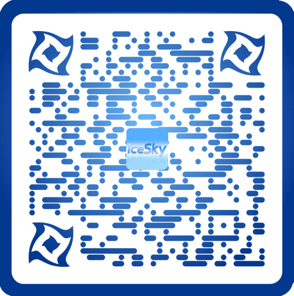

<link href="./static/css/bootstrap.min.css">

# Windwos 应用推荐

**中文 README | [English README](./README.md)**

## 教育类应用 

### 启蒙教育 
可以用于学前及小学初级阶段的启蒙教育，进行早教及兴趣培养

* [汉语拼音](https://apps.microsoft.com/detail/9MZX6CQ10SW7?hl=zh-cn&gl=CN) 
   
  
  包含声母、韵母、整体认读的介绍、发音、书写笔顺、记忆方法等

* [启蒙教育](https://apps.microsoft.com/detail/9NBLGGH425RC?hl=zh-cn&gl=CN)
   
  
  包含三字经、百家姓、千字文、弟子规、儿歌、童谣、绕口令、故事等
* [国学启蒙](https://apps.microsoft.com/detail/9NHSJH132S35?hl=zh-cn&gl=CN)
   
  
  包含《百家姓》、《三字经》、《千字文》、《弟子规》、《蒙求》、《神童诗》及《续神童诗》，提供真人朗诵音频，带有拼音、注释或者翻译
* [德育启蒙](https://apps.microsoft.com/detail/9NLLGXJP1ZTP?hl=zh-cn&gl=CN)
   
  
  包含《名贤集》、《增广贤文》、《孝经》、《二十四孝》，提供真人朗诵音频，带有拼音、注释及解说
* [笠翁对韵](https://apps.microsoft.com/detail/9PDC01WZNBNT?hl=zh-cn&gl=CN)
   
  
  包含《笠翁对韵》30篇的朗读、拼音及注释
* [骈句启蒙](https://apps.microsoft.com/detail/9MW92HQL4FZ5?hl=zh-cn&gl=CN)
   
  
  包含《龙文鞭影》，《声律启蒙》、《笠翁对韵》、《训蒙骈句》各30篇，提供真人朗诵音频，带有拼音及注释
* [经典儿歌](https://apps.microsoft.com/detail/9NX45P7H18MD?hl=zh-cn&gl=CN)
   
  
  包含经典儿歌、动画主题曲、唐诗儿歌、三字经儿歌、笠翁对韵儿歌等
* [千家诗](https://apps.microsoft.com/detail/9NBLGGH42JP3?hl=zh-cn&gl=CN)
   
  
  包含五言、七言绝句和律诗两百余首，提供朗读及搜索功能
* [唐诗300首](https://apps.microsoft.com/detail/9NBLGGH424DD?hl=zh-cn&gl=CN)
   
  
  包含五言和七言的绝句、律诗等，提供朗读及按照作者、标题搜索功能
* [宋词300首](https://apps.microsoft.com/detail/9NBLGGH42JL6?hl=zh-cn&gl=CN) 
   
  
  包含宋词三百余首，提供朗读及按照作者、标题搜索功能
* [极简英文儿歌](https://apps.microsoft.com/detail/9NCZGGBPNNT6?hl=zh-cn&gl=CN)
   
  
  非常简单的英语启蒙儿歌，带有音频及注释
* [迪士尼英文儿歌](https://apps.microsoft.com/detail/9P5PR052N1DD?hl=zh-cn&gl=CN)
   
  
  包含100首经典英文儿歌，带有音频及注释
* [苏西托曼儿歌](https://apps.microsoft.com/detail/9PBMWG0RKQ3N?hl=zh-cn&gl=CN)
   
  
  苏西托曼英文儿歌，包含了多种乐器的悦耳声音
* [鹅妈妈童谣](https://apps.microsoft.com/detail/9PHBW0MJM92H?hl=zh-cn&gl=CN)
   
  
  英国民间的童谣集，包含儿歌、谜语、催眠曲、字母歌、绕口令、动物歌等，带有音频及注释
* [英文儿歌合集](https://apps.microsoft.com/detail/9MZBJ01MGN1C?hl=zh-cn&gl=CN)
   
  
  包含经典英文儿歌及童谣160余首，带有音频及注释

### 拓展提高 
可以作为课外知识进行拓展提高

* [诗词散文](https://apps.microsoft.com/detail/9NBLGGH42RL7?hl=zh-cn&gl=CN)
   
  
  包含两汉乐府、南北朝民歌、历代诗歌散文等一百四十余首，提供朗读和儿歌形式

* [唐诗300首+](https://apps.microsoft.com/detail/9NWSJ79860Q0?hl=zh-cn&gl=CN) 
   
  
  包含五言、七言唐诗共计三百余首，提供真人朗诵音频、拼音、注释及翻译，可以查看作者介绍、创作背景及诗文鉴赏
* [宋词300首+](https://apps.microsoft.com/detail/9N80M3VMVBXK?hl=zh-cn&gl=CN)
   
  
  包含宋词三百余首，提供真人朗诵音频、拼音、注释及翻译，可以查看作者介绍、创作背景及诗文鉴赏
* [元曲300首](https://apps.microsoft.com/detail/9NBLGGH42JP4?hl=zh-cn&gl=CN)
   
  
  包含《元曲三百首》的全部诗作，提供朗读及按照曲牌、作者、标题搜索功能
* [小学必背古诗文](https://apps.microsoft.com/detail/9NCJSGBVLWWT?hl=zh-cn&gl=CN)
   
  
  小学阶段需要背诵的古代诗文，提供真人朗诵音频、拼音、注释及翻译
* [中学必背古诗文](https://apps.microsoft.com/detail/9P5B3C3R6GHP?hl=zh-cn&gl=CN)
   
  
  初中阶段需要背诵的古代诗文，提供真人朗诵音频、拼音、注释及翻译，可以查看作者介绍、创作背景及诗文鉴赏
* [高中必背古诗文](https://apps.microsoft.com/detail/9PCD7LCS18DK?hl=zh-cn&gl=CN)
   
  
  高中阶段需要背诵的古代诗文，提供真人朗诵音频、拼音、注释及翻译，可以查看作者介绍、创作背景及诗文鉴赏
* [成语大全](https://apps.microsoft.com/detail/9P8DZNDDBTR4?hl=zh-cn&gl=CN)
   
  
  包含三万余条成语的拼音、出处、解释、示例等，支持文本模糊检索、特殊类型查询、成语接龙等功能
* [成语接龙诵读](https://apps.microsoft.com/detail/9NP4LCJPZNNM?hl=zh-cn&gl=CN)
   
  
  提供成语接龙的成人和儿童语音的诵读和跟读功能
* **简笔画**
  包含5个级别的简笔画学习，支持自由绘画、临摹绘画、绘画填色、图片填色、步骤学习等功能

  [少儿简笔画](https://apps.microsoft.com/detail/9MSNH6TTWMHT?hl=zh-cn&gl=CN)
   
  
  [初级简笔画](https://apps.microsoft.com/detail/9NB3LRCRQ36G?hl=zh-cn&gl=CN)
   
  
  [中级简笔画](https://apps.microsoft.com/detail/9NDDFLMN19H6?hl=zh-cn&gl=CN)
   
  
  [高级简笔画](https://apps.microsoft.com/detail/9NBVHHCS2GWW?hl=zh-cn&gl=CN)
   
  
  [简笔画大师](https://apps.microsoft.com/detail/9NRLNP19TV4R?hl=zh-cn&gl=CN)
   
  
* [填色](https://apps.microsoft.com/detail/9PP861LBHWDB?hl=zh-cn&gl=CN)
   
  
  包含一百多张线条画图片，支持对预设图片及本地图片填色和导出填好色的图片功能
* [中国百科](https://apps.microsoft.com/detail/9NHFV6M0VMX3?hl=zh-cn&gl=CN)
   
  
  包含十二生肖、二十四节气、时辰、朝代、传统节日等知识
* [中国省级地图](https://apps.microsoft.com/detail/9P1WCC4N8ZLT?hl=zh-cn&gl=CN)
   
  
  可以了解各省基本概况，学习记忆省级行政区形状及位置
* [世界各国概况](https://apps.microsoft.com/detail/9P65BSZH61RM?hl=zh-cn&gl=CN)
   
  
  可以记忆和了解各个国家的国旗国徽首都等基本概况
* [中国诗词大全](https://apps.microsoft.com/detail/9P3432W9K924?hl=zh-cn&gl=CN)
   
  
  包含超过30万首诗词，支持查询和背诵
* [古诗文背诵](https://apps.microsoft.com/detail/9NSJ6FNW6F8N?hl=zh-cn&gl=CN)
   
  
  包含唐诗、宋词、元曲等1500余首古诗文，支持桌面通知模式
* [元素周期表PWA](https://apps.microsoft.com/detail/9PCQBHB8R04G?hl=zh-cn&gl=CN)
   
  
  学习化学元素周期表的工具，可以查看元素的各种信息
  [在线使用](https://periodictableblazor.azurewebsites.net)

  [元素周期表+](https://apps.microsoft.com/detail/9NJKL858L4VS?hl=zh-cn&gl=CN)
   
  
  学习化学元素周期表的工具，可以查看元素信息并提供比较功能

### 英语学习 
从易到难逐步提高英语听说能力

* [千万别学英语](https://apps.microsoft.com/detail/9N1LDB3LP7NK?hl=zh-cn&gl=CN)
   
  
  提供《千万别学英语》的真人朗诵音频及注释

* [小学英语听力](https://apps.microsoft.com/detail/9N097LX5NH27?hl=zh-cn&gl=CN)
   
  
  提供《小学英语听力》的真人朗诵音频及注释
* [小学英语听力100篇](https://apps.microsoft.com/detail/9P55LZ1VSR5S?hl=zh-cn&gl=CN)
   
  
  提供《小学英语听力100篇》的真人朗诵音频及注释
* [小学英语晨读](https://apps.microsoft.com/detail/9MXRXDHZ8CVT?hl=zh-cn&gl=CN)
   
  
  提供《小学英语晨读》的真人朗诵音频及注释
* [小学英语阅读](https://apps.microsoft.com/detail/9NDVPQHR9J2M?hl=zh-cn&gl=CN)
   
  
  提供《小学英语阅读》的真人朗诵音频及注释
* [小学英语会话](https://apps.microsoft.com/detail/9P4HJ8KDZ0L1?hl=zh-cn&gl=CN)
   
  
  提供《小学英语会话》的真人朗诵音频及注释
* [英文故事100篇](https://apps.microsoft.com/detail/9NCSXGKG8CJK?hl=zh-cn&gl=CN)
   
  
  包含100篇英文故事，提供真人朗读及注释
* [英文日常会话](https://apps.microsoft.com/detail/9PBGXLTJZNR8?hl=zh-cn&gl=CN)
   
  
  提供《英语日常会话》的真人朗诵音频及注释
* [英语900句 基础篇](https://apps.microsoft.com/detail/9MVKPKF9B1ZS?hl=zh-cn&gl=CN)
   
  
  提供《英语900句 基础篇》的真人朗诵音频及注释
* [英语900句 生活篇](https://apps.microsoft.com/detail/9PPJHZDFWDD0?hl=zh-cn&gl=CN)
   
  
  提供《英语900句 生活篇》的真人朗诵音频及注释
* [英语口语3000句](https://apps.microsoft.com/detail/9NQK8N5B10LL?hl=zh-cn&gl=CN)
   
  
  提供《英语口语3000句》的真人朗诵音频及注释
* [英语日常口语](https://apps.microsoft.com/detail/9PJJKSL3FZS1?hl=zh-cn&gl=CN)
   
  
  提供《英语日常口语》的真人朗诵音频及注释
* [英语职场口语](https://apps.microsoft.com/detail/9P2FZQ13G1JS?hl=zh-cn&gl=CN)
   
  
  提供《英语职场口语》的真人朗诵音频及注释
* [雅思口语900句](https://apps.microsoft.com/detail/9NCH3P5K41S9?hl=zh-cn&gl=CN)
   

  提供《雅思口语900句》的真人朗诵音频及注释
  
### 其他语言学习 
学习日语和韩语的基础

* [韩语字母表](https://apps.microsoft.com/detail/9PMK5CMKZZTK?hl=zh-cn&gl=CN)
   
  
  包括韩语字母的读音学习、笔顺学习、书写练习、记忆训练等功能

* [日语50音图](https://apps.microsoft.com/detail/9NC8KSMB6W44?hl=zh-cn&gl=CN)
   
  
  包括日语50音图的读音学习、笔顺学习、书写练习、记忆训练等功能
* [日语900句](https://apps.microsoft.com/detail/9PGGP3J4MXXZ?hl=zh-cn&gl=CN)
   
  
  包含基本句型、日常话题、交际用语和心情表达四大类别
* [日语基础会话](https://apps.microsoft.com/detail/9NWK38NF9XQH?hl=zh-cn&gl=CN)
   
  
  包含基本句型、交际用语、日常话题、心情表达四大部分   
   
* [50音图](https://apps.microsoft.com/detail/9NHZ8R1QFXR2?hl=zh-cn&gl=CN)
   
  
  日语50音图的学习工具，支持按行列分类记忆及顺序测试

### 经典国学 
了解学习中华民族几千年总结延续下来的传统文化

* [格言联璧](https://apps.microsoft.com/detail/9NVCXH9J3PVK?hl=zh-cn&gl=CN)
   
  
  提供《格言联璧》的真人朗诵音频，带有拼音、注释及解说

* [幼学琼林](https://apps.microsoft.com/detail/9P5210CX9TM6?hl=zh-cn&gl=CN)
   
  
  提供《幼学琼林》的真人朗诵音频，带有拼音、注释及翻译
* [菜根谭](https://apps.microsoft.com/detail/9P6SP8KG3DR3?hl=zh-cn&gl=CN)
   
  
  提供《菜根谭》的真人朗诵音频，带有拼音、注释及翻译
* [老子中庸大学](https://apps.microsoft.com/detail/9P0RKSNRRWFP?hl=zh-cn&gl=CN)
   
  
  提供《老子》、《中庸》、《大学》的真人朗诵音频，带有拼音、注释及翻译   
* [论语](https://apps.microsoft.com/detail/9NHW3JNP9V3K?hl=zh-cn&gl=CN)
   
  
  提供《论语》的真人朗诵音频，带有拼音、注释及翻译
* [孟子](https://apps.microsoft.com/detail/9NT8GKQKQXHM?hl=zh-cn&gl=CN)
   
  
  提供《孟子》的真人朗诵音频，带有拼音、注释及翻译
* [庄子](https://apps.microsoft.com/detail/9P8ZTX0BSWXJ?hl=zh-cn&gl=CN)
   
  
  提供《庄子》的真人朗诵音频，带有拼音、注释及翻译
* [诗经](https://apps.microsoft.com/detail/9NLZW9RM17TQ?hl=zh-cn&gl=CN)
   
  
  提供《诗经》的真人朗诵音频，带有拼音、注释及翻译
* [楚辞](https://apps.microsoft.com/detail/9P3B14JCBC7B?hl=zh-cn&gl=CN)
   
  
  提供《楚辞》的真人朗诵音频，带有拼音、注释及翻译
* [周易](https://apps.microsoft.com/detail/9N2CL5SMZ0ZS?hl=zh-cn&gl=CN)
   
  
  提供《周易》的真人朗诵音频，带有拼音、注释及翻译
* [尚书](https://apps.microsoft.com/detail/9N6HNSBHMBFQ?hl=zh-cn&gl=CN)
   
  
  提供《尚书》的真人朗诵音频，带有拼音、注释及翻译
* [兵法谋略](https://apps.microsoft.com/detail/9MZ1HCPDLMF3?hl=zh-cn&gl=CN)
   
  
  提供《孙子兵法》、《三十六计》的真人朗诵音频，带有拼音、注释及翻译
* [陶渊明文集](https://apps.microsoft.com/detail/9P1BTCD6KXP0?hl=zh-cn&gl=CN)
   
  
  提供《陶渊明文集》的真人朗诵音频，带有拼音、注释及翻译
   
   
## 工具应用

* [随机选择工具](https://apps.microsoft.com/detail/9N2S39RTRPB6?hl=zh-cn&gl=CN)
   

  [随机选择工具PWA](https://apps.microsoft.com/detail/9PMKD8SSQZH7?hl=zh-cn&gl=CN)
  

  提供包括2选1、3选1、6选1等多种随机选择方式
  [在线使用](https://makedecision.azurewebsites.net)

* [网址集合](https://apps.microsoft.com/detail/9PLD6M5GCCWV?hl=zh-cn&gl=CN)
   
  
  提供多个类别的预定义网站，支持自定义

  [网址集合增强版](https://apps.microsoft.com/detail/9P89C1H8QHH7?hl=zh-cn&gl=CN)
   
  
  提供多个类别的预定义网站，支持自定义样式及搜索
* [JsonTools](https://apps.microsoft.com/detail/9P198RFZ9RTS?hl=zh-cn&gl=CN)
   
  
  提供对Json的预览、编辑和转换功能
* [C#ToConfig](https://apps.microsoft.com/detail/9P7FCM5T6BXZ?hl=zh-cn&gl=CN)
   
  
  可以将C#实体类转换为Json
* [ColorTool](https://apps.microsoft.com/detail/9P102NQ0CWX8?hl=zh-cn&gl=CN)
   
  
  提供色盘、颜色对比、渐变色、中日传统色等功能
* [ImageTool](https://apps.microsoft.com/detail/9MV16HSW0NLR?hl=zh-cn&gl=CN)
   
  
  提供图片的颜色调整、多种滤镜及各种变换功能
* [调试工具](https://apps.microsoft.com/detail/9MV2NK7FZ4CC?hl=zh-cn&gl=CN)
   
  
  提供Tcp、Udp、Websocket、Mqtt、SignalR、zeroMq的调试功能
* [ModbusTcpTool](https://apps.microsoft.com/detail/9NZTLN2M1RL8?hl=zh-cn&gl=CN)
   
  
  提供ModbusTcp服务端和客户端调试

* [TCP转发工具](https://apps.microsoft.com/detail/9P8RD3LDT8TW?hl=zh-cn&gl=CN)
   
  
  将Tcp接收的消息转发到其他Tcp、Websocket、Mqtt的工具
* [通信转发工具](https://apps.microsoft.com/detail/9P8FJRT704DC?hl=zh-cn&gl=CN)
   
  
  Tcp、Websocket、Mqtt消息互转工具，支持多对多模式
* [ToolsSet](https://apps.microsoft.com/detail/9NQGTZGM4LRH?hl=zh-cn&gl=CN)
   
  
  提供数百种功能的常用工具集合

  [FreeToolsSet](https://apps.microsoft.com/detail/9N6W6006WDVK?hl=zh-cn&gl=CN)
   
  
  工具集合的免费版，仅提供部分工具
* [简笔画](https://apps.microsoft.com/detail/9NXD45TW8HMX?hl=zh-cn&gl=CN)
   
  
  包含上千张线条图的简笔画学习工具，支持临摹和填色
* [FunColoring](https://apps.microsoft.com/detail/9NMDVK2Z3D9P?hl=zh-cn&gl=CN)
   
  
  有趣的填色软件，包含数十张线条图，支持打开本地文件和网络图片填色
* [视频监控](https://apps.microsoft.com/detail/9NCRFPFG5JB3?hl=zh-cn&gl=CN)
   
  
  多窗口视频监控浏览，支持自定义布局

* [流量计数器](https://apps.microsoft.com/detail/9NW2XDGDKZHM?hl=zh-cn&gl=CN)
   
  
  根据视频统计交通流量的工具，支持导出为excel

## 游戏

* [猜词游戏](https://apps.microsoft.com/detail/9NLX9V1X4MRL?hl=zh-cn&gl=CN)
   

   [猜词游戏PWA](https://apps.microsoft.com/detail/9N61ZN52ZCWC?hl=zh-cn&gl=CN)
   
  
  包含中文、英文、数字等多种猜词游戏的集合
  [在线使用](https://xxxxlegame.azurewebsites.net)

* [数独](https://apps.microsoft.com/detail/9PDGSF0P8NT9?hl=zh-cn&gl=CN)
   
  
  经典的数独游戏，提供自动解题功能
* [扫雷](https://apps.microsoft.com/detail/9NCS89MQ8P5N?hl=zh-cn&gl=CN)
   
  
  经典的扫雷游戏，提供三种样式，支持自定义数量
* [数织](https://apps.microsoft.com/detail/9NP8GH864JTW?hl=zh-cn&gl=CN)
   
  
  包含随机关卡和数百预定义关卡的数织游戏

  [数织 解题版](https://apps.microsoft.com/detail/9NP8GH864JTW?hl=zh-cn&gl=CN)
   
  
  包含随机关卡和上千预定义关卡的数织游戏，支持解迷功能

   
-----

  *扫描下方二维码关注微信公众号
  **【IceSky】**
  ，获取更多开发技术和工具软件介绍及技巧。*

  </img>

