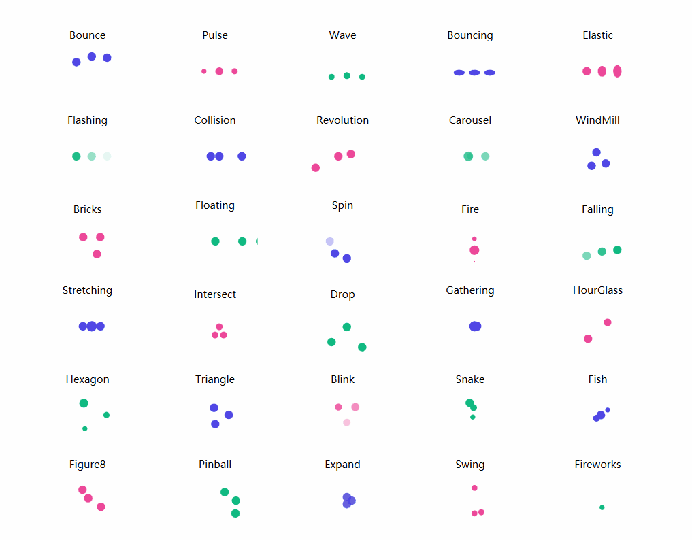

## Introduce
This is a WPF control library that includes dozens of predefined loading animations, a general-purpose loading animation control, a mask overlay control, and an ItemsControl that supports customization.

## Loading animations
* Blink
* Bounce
* Bouncing
* Bricks
* Carousel
* Collision
* Drop
* Elastic
* Expand
* Falling
* Figure8
* Fire
* Fireworks
* Fish
* Flashing
* Floating
* Gathering
* Hexagon
* HourGlass
* Intersect
* Pinball
* Pulse
* Revolution
* Snake
* Spin
* Stretching
* Swing
* Triangle
* Wave
* WindMill




### Basic Usage
1. Add reference namespace
   ```Xml
   xmlns:anim="clr-namespace:IceSky.WpfLoading.Animations;assembly=IceSky.WpfLoading" 
   ```
2. Add control in XAML file
  ```Xml
  <anim:Bounce/>
  ```
3. Modify configuration parameters (Optional)
  * Color
  * Size
  * AnimationSpeed：Animation speed, a double value > 0, specifying the multiplier for the default speed; > 1 speeds up, < 1 slows down


## Common loading contorl
* Basic settings: item width, item height, count, border radius
* Color settings: start and end point colors, and whether the color cycles
* Layout settings: curvature, arc, inner radius, spacing
* Rotation settings: ring rotation, discrete rotation, item rotation
* Transform settings: duration, delay, scale, offset, opacity

Basic settings


Color settings


Layout settings:


Rotation settings:


Transform settings:


### Basic Usage

1. Add reference namespace
   ```Xml
   xmlns:anim="clr-namespace:IceSky.WpfLoading.Animations;assembly=IceSky.WpfLoading" 
   ```
2. Add control in XAML file
   
   You can set up the parameters in the designer, then click the 'Copy Code' button below the parameters to copy it, and paste it wherever you want to use it.
    > The automatically generated code namespace may not match the one defined in the references, please check and modify it!
  
   Copied code example：
   ```xml
   <local:GradientLoadingControl
	 CornerRadius="6"
	 Count="12"
	 IsRingRotation="True"
	 DelayTime="100"/>
   ```
   [Control Designer]()

## Mask Layer
* Options
  * Blur background
  * Mask color
  * Mask opacity
* Event
  * Open
  * OpenWithTask
  * Close

### Basic Usage

1. Add reference namespace（✳The namespace of this control is different from the previous）
   ```Xml
   xmlns:control="clr-namespace:IceSky.WpfLoading;assembly=IceSky.WpfLoading" 
   ```
2. Add control in XAML file
   ```Xml
   <control:MaskPanel x:Name="maskPanel"
             TargetBlurElement="{Binding ElementName=BusinessGrid}">
             ……
             Content in the mask layer
             ……
   </control:MaskPanel>
   ```
   > TargetBlurElement: the container that contains content to be blurred

3. Add open/close logic in the .cs file
   ``` cs
   //Normal open, needs to close manually
   maskPanel.Open();
   //Close
   maskPanel.Close();

   //Open with task, and will automatically close when task complete or timeout
   maskPanel.OpenWithTask(task, taskCts, 3000);

   ```

## Custom ItemsControl
* Layout types: Linear, Circular, Triangle, Hexagon, Rhombus
* Triangle and hexagon support edge layout and grid layout.
* Supports custom parameter animations for scaling, offset, and transparency

### Basic Usage

1. Add reference namespace
   ```Xml
   xmlns:control="clr-namespace:IceSky.WpfLoading;assembly=IceSky.WpfLoading" 
   ```

2. Add control in the XAML file and set the style
   ```Xml
   <control:AnimateItemsControl>
      <control:AnimateItemsControl.ItemTemplate>
          <DataTemplate>
              <Border Background="Green" Width="20" Height="20" BorderBrush="Red" BorderThickness="1"/>
          </DataTemplate>
      </control:AnimateItemsControl.ItemTemplate>
   </control:AnimateItemsControl>
   ```