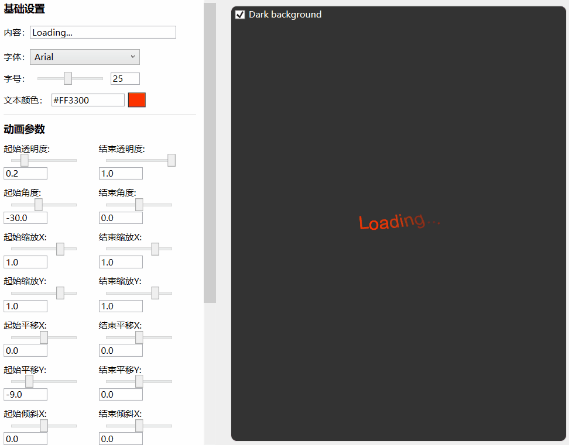
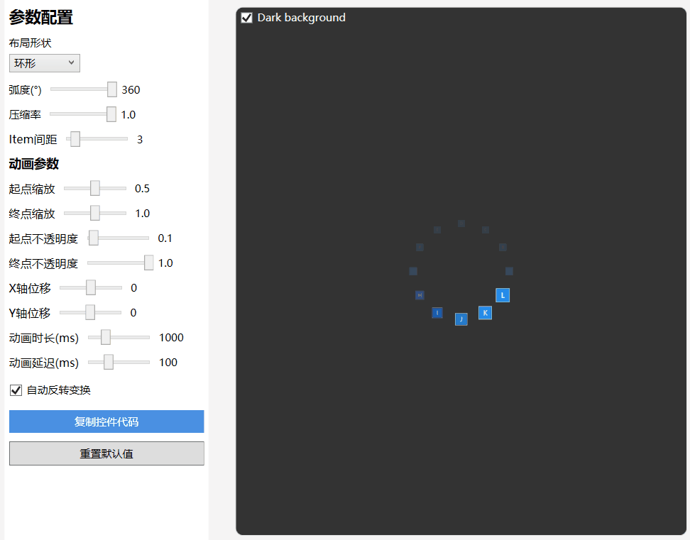
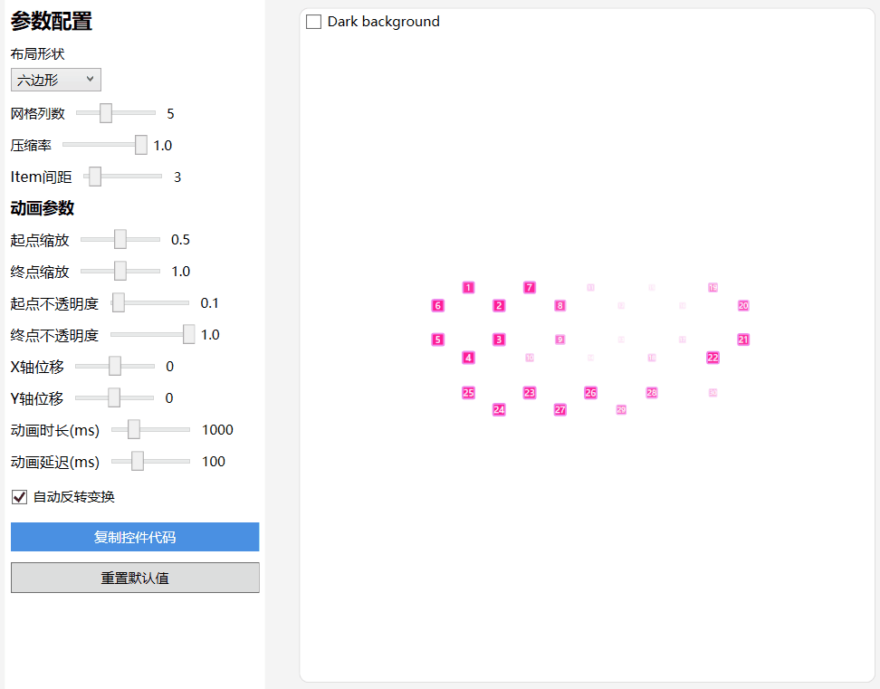

## 介绍
这是一个WPF Loading控件库，其中包含数十个已经定义好的加载动画、一个通用的加载动画控件、一个遮罩层控件以及一个支持自定义的ItemsControl控件

## 加载动画
* Blink、Bounce、Bouncing、Bricks、Carousel
* Collision、Drop、Elastic、Expand、Falling
* Figure8、Fire、Fireworks、Fish、Flashing
* Floating、Gathering、Hexagon、HourGlass、Intersect
* Pinball、Pulse、Revolution、Snake、Spin
* Stretching、Swing、Triangle、Wave、WindMill


* BlockFlow、BlockHourglass、BlockJump、BlockScale、BlockSway
* BlockWave、BoxShift、Charge、Circle、Cross
* DiamondStar、DoubleArc、DrawStar、Flame、FourArc
* GradientArc、HollowStar、MovingTriangle、NenoStar、PulseTriangle
* Quantum、Radar、RectDraw、RectDraw2、RotateSkew
* RotatingBall、Satellites、SimpleArc、ThreeArc、TonePillar


### 使用方法
1. 添加引用及资源文件
   ```Xml
   xmlns:anim="clr-namespace:IceSky.WpfLoading.Animations;assembly=IceSky.WpfLoading" 
   <Window.Resources>
      <ResourceDictionary>
         <ResourceDictionary.MergedDictionaries>
               <ResourceDictionary Source="pack://application:,,,/IceSky.WpfLoading;component/Generic.xaml"/>
         </ResourceDictionary.MergedDictionaries>
      </ResourceDictionary>
   </Window.Resources>
   ```
2. 在Xaml文件中添加控件
  ```Xml
  <anim:Bounce Color="#4F46E5"/>
  ```
1. 配置参数
  * 点动画参数： Color（颜色）、Size（尺寸）
  * 其他形状动画参数（不同动画可能部分参数无效）：Fill（填充颜色）、Stroke（描边颜色）、StrokeThickness（描边宽度）
  * AnimationSpeed：动画速度，>0 的double数值，指定默认速度的倍率，大于1加速，小于1减速 


## 通用加载动画控件
* 基本参数：元素宽度、元素高度、元素数量、圆角半径
* 颜色参数：起始和结束点颜色、颜色是否循环
* 布局设置：曲率、弧度、内径、平均分配间距和固定间距
* 旋转动画：整体旋转、离散旋转、元素旋转
* 变换设置：时长、延迟、缩放、平移、透明度

基本参数设置：


颜色设置：


布局设置：


旋转动画：


变换设置：


### 使用方法

1. 添加引用及资源文件
   ```Xml
   xmlns:anim="clr-namespace:IceSky.WpfLoading.Animations;assembly=IceSky.WpfLoading" 
   <Window.Resources>
      <ResourceDictionary>
         <ResourceDictionary.MergedDictionaries>
               <ResourceDictionary Source="pack://application:,,,/IceSky.WpfLoading;component/Generic.xaml"/>
         </ResourceDictionary.MergedDictionaries>
      </ResourceDictionary>
   </Window.Resources>
   ```
2. 在Xaml文件中添加控件
   
   可以在设计工具中配置好参数之后点击参数下方的复制代码按钮进行复制，然后粘贴到要使用的地方即可。
    > 自动生成的代码命名空间可能和引用中定义的不一致，注意修改！
  
   复制的代码示例：
   ```xml
   <local:GradientLoadingControl
      CornerRadius="6"
      Count="12"
      IsRingRotation="True"
      DelayTime="100"/>
   ```
   [设计器地址](https://github.com/IceSkyDev/IceSky.WpfLoading.Sample)
   
## 文本动画
* 基本参数：文本内容、字体、字号、颜色
* 动画参数：透明度、旋转角度、X/Y偏移、X/Y倾斜
* 变换参数：时长、延迟、自动反转、重复次数
  


### 使用方法
1. 添加引用及资源文件
   ```Xml
   xmlns:anim="clr-namespace:IceSky.WpfLoading.Animations;assembly=IceSky.WpfLoading" 
   <Window.Resources>
      <ResourceDictionary>
         <ResourceDictionary.MergedDictionaries>
               <ResourceDictionary Source="pack://application:,,,/IceSky.WpfLoading;component/Generic.xaml"/>
         </ResourceDictionary.MergedDictionaries>
      </ResourceDictionary>
   </Window.Resources>
   ```
2. 在Xaml文件中添加控件

   可以在设计工具中配置好参数之后点击参数下方的复制代码按钮进行复制，然后粘贴到要使用的地方即可。
    > 自动生成的代码命名空间可能和引用中定义的不一致，注意修改！
  
   复制的代码示例：
   ```xml
   <anim:TextLoadingControl
      TextColor="#FFFF3300"
      FontFamily="Arial"
      FontSize="25"
      OpacityFrom="0.2"
      RotateFrom="-30"
      TranslateYFrom="-9"
      CharacterDelay="150"/>
   ```

## 遮罩层
* 设置参数
  * Blur background
  * Mask color
  * Mask opacity
* 事件
  * Open
  * OpenWithTask
  * Close

### 使用方法

1. 添加引用及资源文件（✳此控件的命名空间和前面的不一样）
   ```Xml
   xmlns:control="clr-namespace:IceSky.WpfLoading;assembly=IceSky.WpfLoading" 
   <Window.Resources>
      <ResourceDictionary>
         <ResourceDictionary.MergedDictionaries>
               <ResourceDictionary Source="pack://application:,,,/IceSky.WpfLoading;component/Generic.xaml"/>
         </ResourceDictionary.MergedDictionaries>
      </ResourceDictionary>
   </Window.Resources>
   ```
2. 在Xaml文件中添加控件
   ```Xml
   <control:MaskPanel x:Name="maskPanel"
             TargetBlurElement="{Binding ElementName=BusinessGrid}">
             ……
             遮罩层中的内容
             ……
   </control:MaskPanel>
   ```
   > TargetBlurElement表示包含要被模糊的内容的控件容器

3. 在后台中增加显示隐藏逻辑
   ```csharp
   //普通显示，需手动关闭
   maskPanel.Open();
   //关闭
   maskPanel.Close();

   //绑定任务显示，任务结束或超时会自动关闭，需要传递任务 Task 和 CancellationTokenSource
   maskPanel.OpenWithTask(task, taskCts, 3000);

   ```


## 自定义控件
* 布局类型：直线布局、环形布局、三角形布局、六边形布局、菱形布局
* 三角形和六边形支持沿边布局和网格布局
* 支持缩放、偏移、透明度自定义参数动画

环形布局：


六边形网格布局：


### 使用方法

1. 添加引用及资源文件
   ```Xml
   xmlns:control="clr-namespace:IceSky.WpfLoading;assembly=IceSky.WpfLoading" 
   <Window.Resources>
      <ResourceDictionary>
         <ResourceDictionary.MergedDictionaries>
               <ResourceDictionary Source="pack://application:,,,/IceSky.WpfLoading;component/Generic.xaml"/>
         </ResourceDictionary.MergedDictionaries>
      </ResourceDictionary>
   </Window.Resources>
   ```

2. 在Xaml文件中添加控件并设置元素样式，默认样式为蓝色正方形
   ```Xml
   <control:AnimateItemsControl>
      <control:AnimateItemsControl.ItemTemplate>
          <DataTemplate>
              <Border Background="Green" Width="20" Height="20" BorderBrush="Red" BorderThickness="1"/>
          </DataTemplate>
      </control:AnimateItemsControl.ItemTemplate>
   </control:AnimateItemsControl>
   ```