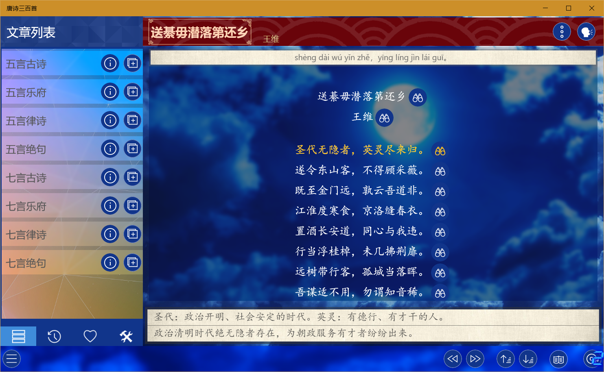
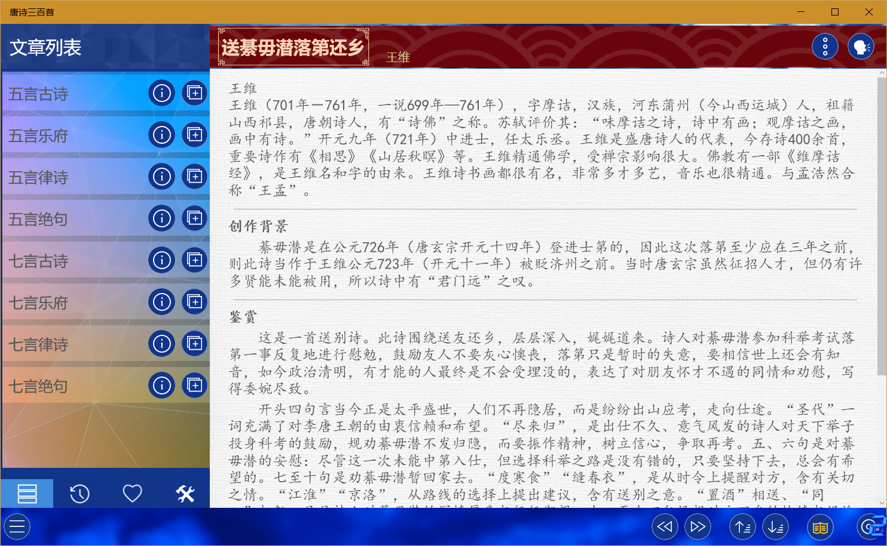

These apps include a range of educational apps that can be grouped into four categories:
* [Enlightenment education](./enlighten.md)
* [Knowledge expansion and improvement](./improve.md)
* [Language learning](./language.md)
* [Ancient Chinese Literature](./chinese.md)
  
Each category contains more than a dozen applications.

## Usage of audio apps
This kind of application includes a large number of audio applications, and their use methods are basically the same, here is a explanation of 《唐诗三百首》 as an example:
* After the app opens, the article list on the left will display all the content categories contained in the app, and the two buttons on the right are to view the category information (some apps do not have this function), add the content in the category to the playlist, you can click the category name to view the content in each category.

The other three menu functions at the bottom of the list are: Recent Playlist, Favourite List, and Settings Options (including settings for background music, pinyin, annotation, and translation).

* The right side of the app is the content display area, after selecting the article, you can display the content of the selected article, the first of the two buttons on the right side of the upper can switch to display pinyin, annotation, translation and add favourite, click the second button to switch to the browsing mode. In the browsing mode, you can click the button on the right side of each line of content to view the pinyin, annotation and translation of this line.

At the bottom of the app is the playback control area, in which you can control the playback pause, adjust the progress, adjust the volume, and switch between the previous and next track.

* After switching to browse mode, the bottom part will change to browsing control, and the buttons on the right will be switched to: previous article, next article, previous line, next line, and view article appreciation (some apps or articles do not have this function).

* Click the article appreciation button to view the author information, creative background, appreciation and other content, and click this button again or switch articles to close the appreciation interface.

* On the right of bottom is the playlist button, which can be clicked to open the playlist, where you can switch the playback content, remove the content, or clear the list.

## Special Instructions

* All of these apps can be used offline (Except for PWA app), without logging in, and without uploading personal information.

* The resources used in the application come from the Internet, the copyright belongs to the original author, and all applications do not provide the download function.

* Since the resources come from the network, it is inevitable that there will be errors, please understand, if you find a bug, you can leave a message in the Microsoft Store or submit details [here](https://github.com/IceSkyDev/AppDoc/issues), and the developer will try to fix it.
