## 经典国学

### [格言联璧](https://apps.microsoft.com/detail/9NVCXH9J3PVK) ###
Provide 《格言联璧》 with audio, pinyin, annotations, and translations.
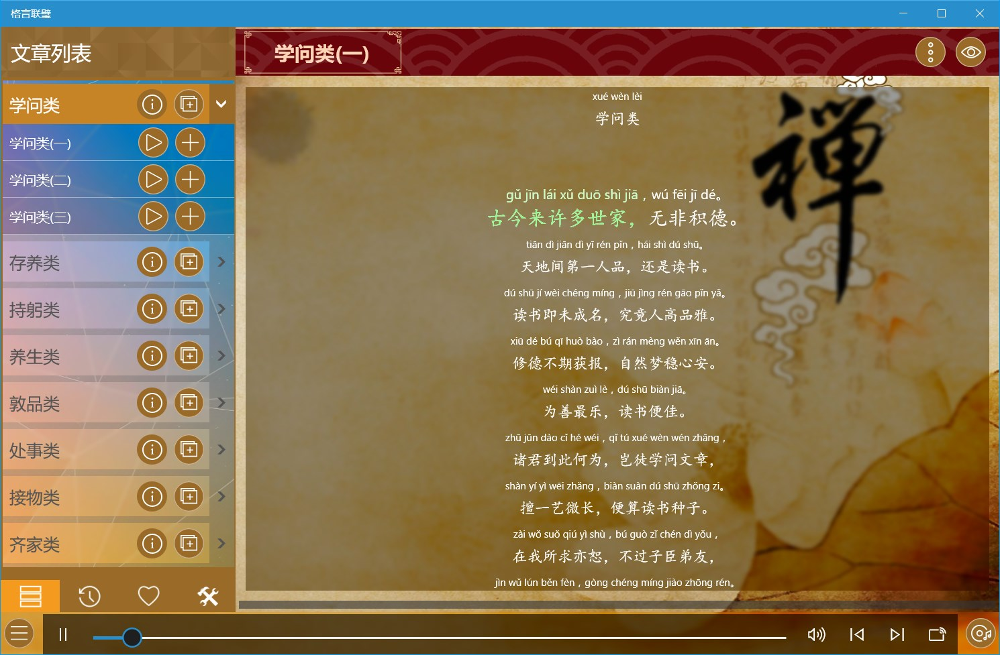

### [幼学琼林](https://apps.microsoft.com/detail/9P5210CX9TM6) ###
Provide 《幼学琼林》 with audio, pinyin, annotations, and translations.
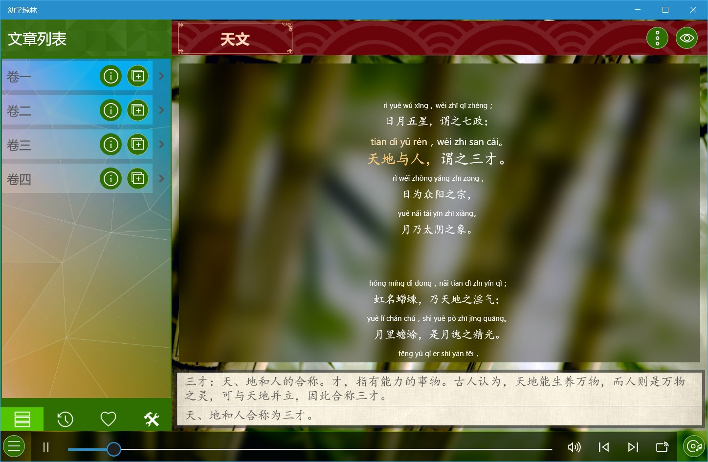

### [菜根谭](https://apps.microsoft.com/detail/9P6SP8KG3DR3) ###
Provide 《菜根谭》 with audio, pinyin, annotations, and translations.
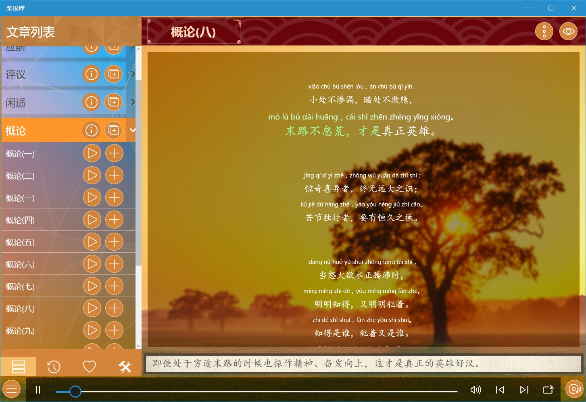

### [老子中庸大学](https://apps.microsoft.com/detail/9P0RKSNRRWFP) ###
Provide 《老子中庸大学》 with audio, pinyin, annotations, and translations.
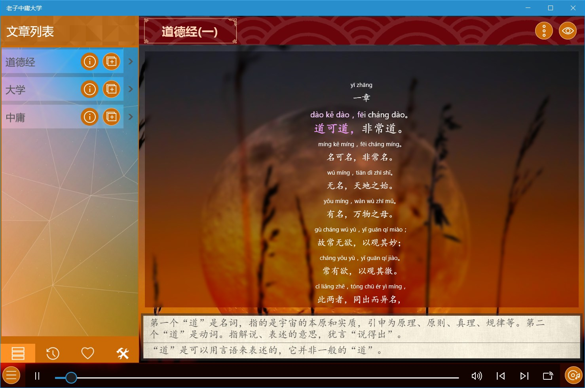

### [论语](https://apps.microsoft.com/detail/9NHW3JNP9V3K) ###
Provide 《论语》 with audio, pinyin, annotations, and translations.
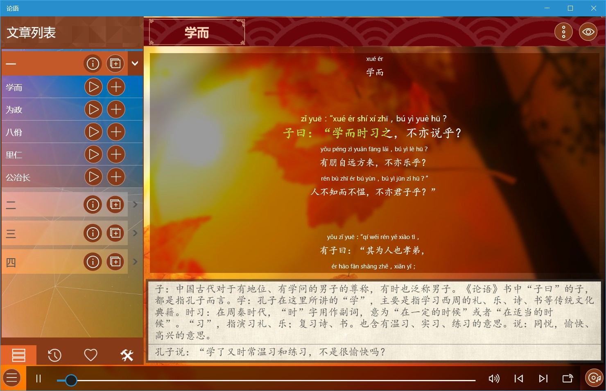

### [孟子](https://apps.microsoft.com/detail/9NT8GKQKQXHM) ###
Provide 《孟子》 with audio, pinyin, annotations, and translations.
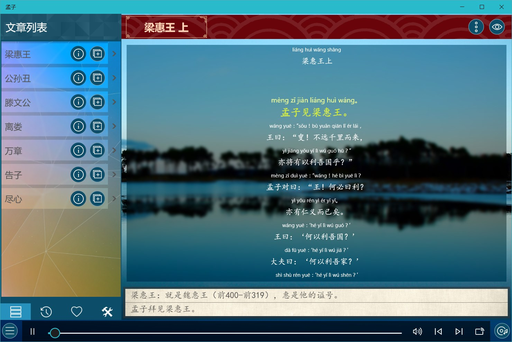

### [庄子](https://apps.microsoft.com/detail/9P8ZTX0BSWXJ) ###
Provide 《庄子》 with audio, pinyin, annotations, and translations.
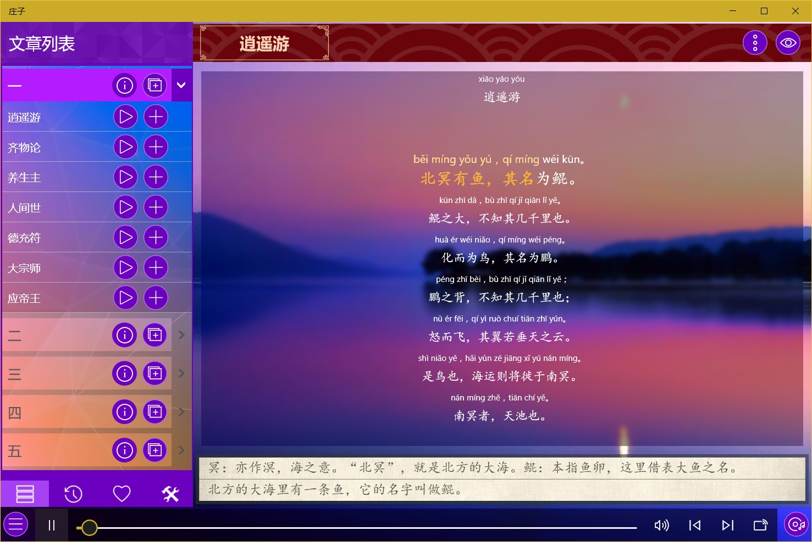

### [诗经](https://apps.microsoft.com/detail/9NLZW9RM17TQ) ###
Provide 《诗经》 with audio, pinyin, annotations, and translations.
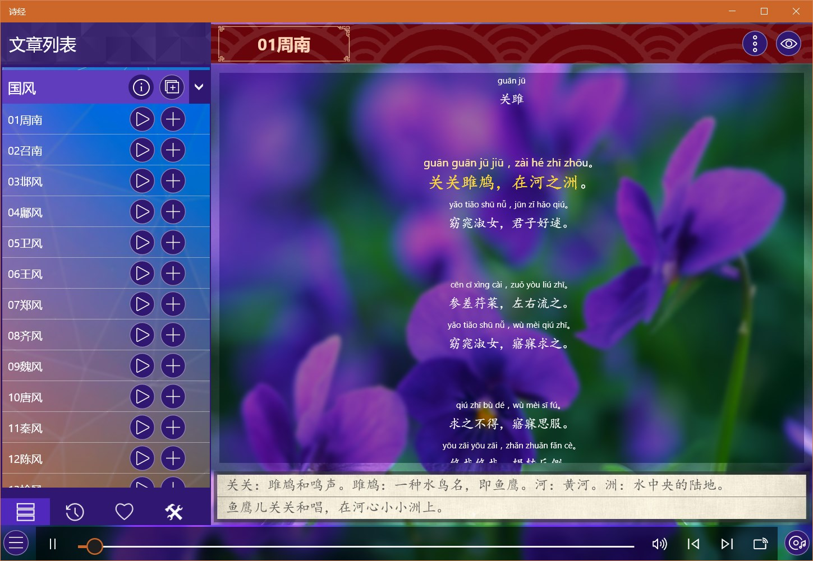

### [楚辞](https://apps.microsoft.com/detail/9P3B14JCBC7B) ###
Provide 《楚辞》 with audio, pinyin, annotations, and translations.
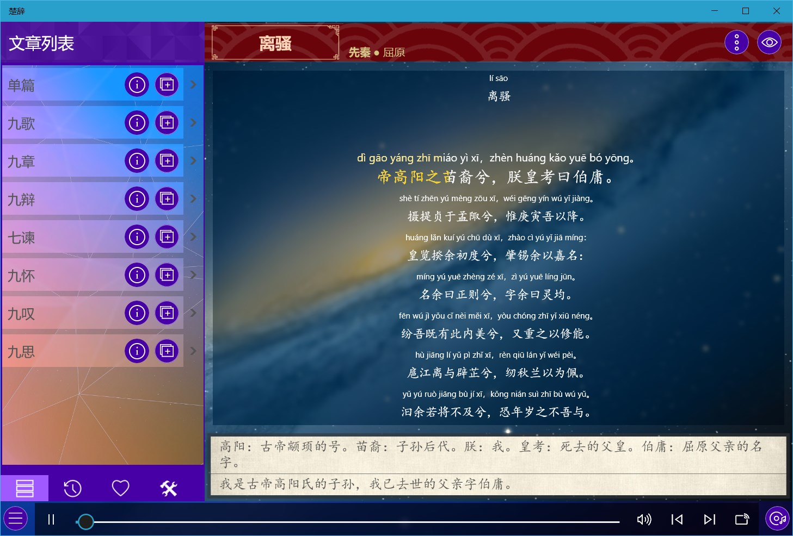

### [周易](https://apps.microsoft.com/detail/9N2CL5SMZ0ZS) ###
Provide 《周易》 with audio, pinyin, annotations, and translations.
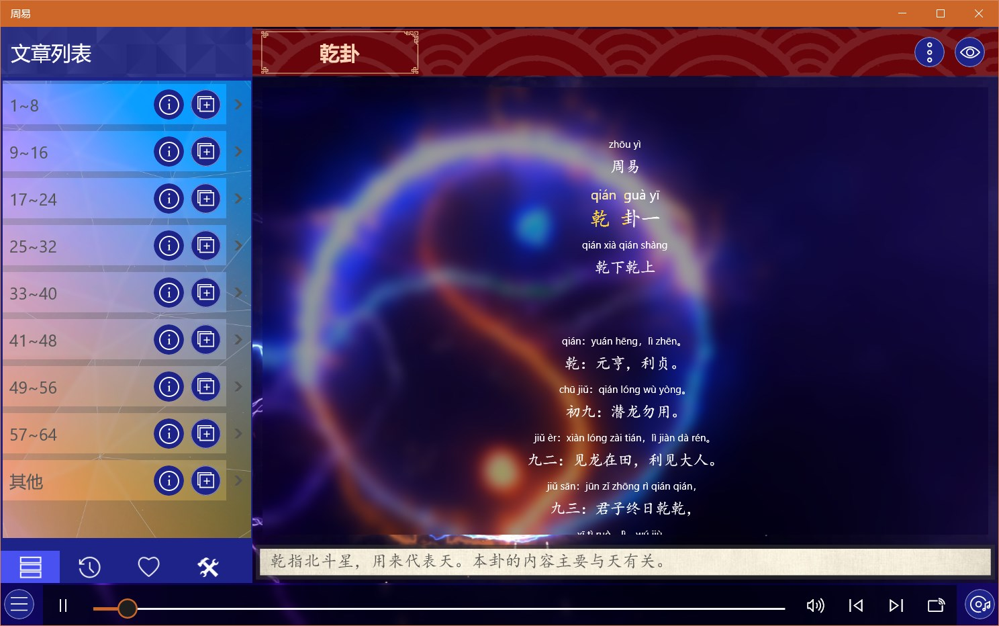

### [尚书](https://apps.microsoft.com/detail/9N6HNSBHMBFQ) ###
Provide 《尚书》 with audio, pinyin, annotations, and translations.
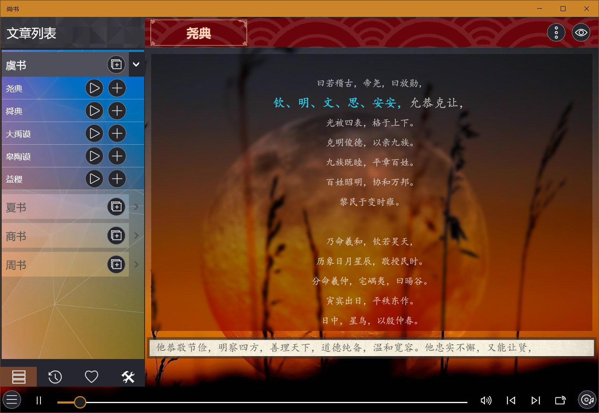

### [兵法谋略](https://apps.microsoft.com/detail/9MZ1HCPDLMF3) ###
Provide 《孙子兵法》 and 《三十六计》 with audio, pinyin, annotations, and translations
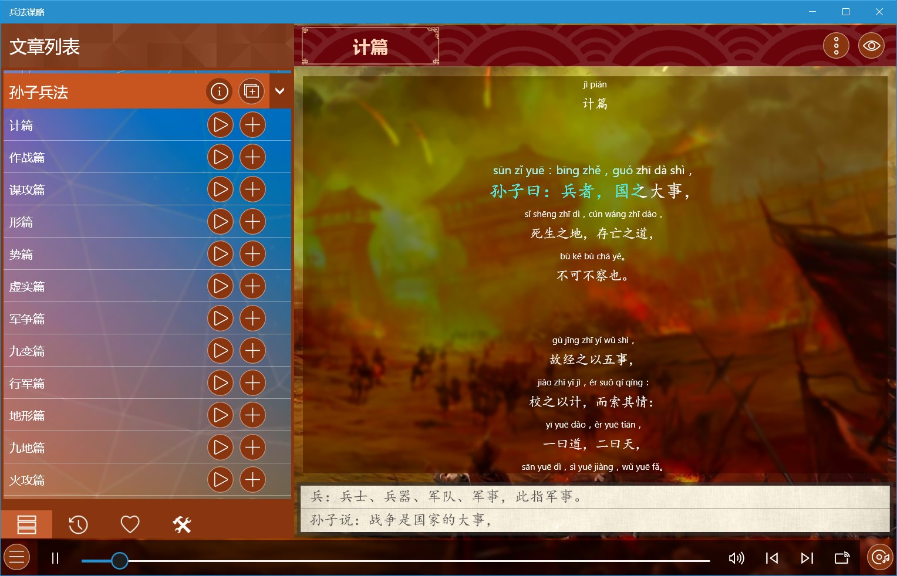

### [陶渊明文集](https://apps.microsoft.com/detail/9P1BTCD6KXP0) ###
Provide 《陶渊明文集》 with audio, pinyin, annotations, and translations.
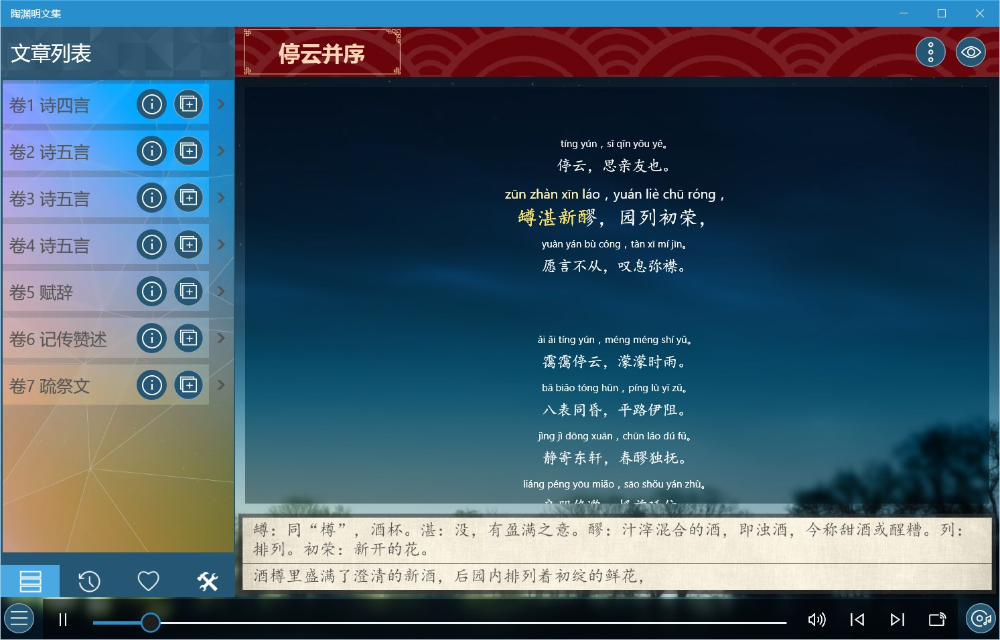

