## Enlightenment education

### [汉语拼音](https://apps.microsoft.com/detail/9MZX6CQ10SW7?hl=zh-cn&gl=CN) ###
It includes the introduction of Chinese initials, finals, overall recognition, pronunciation, writing stroke order, memory methods, etc.
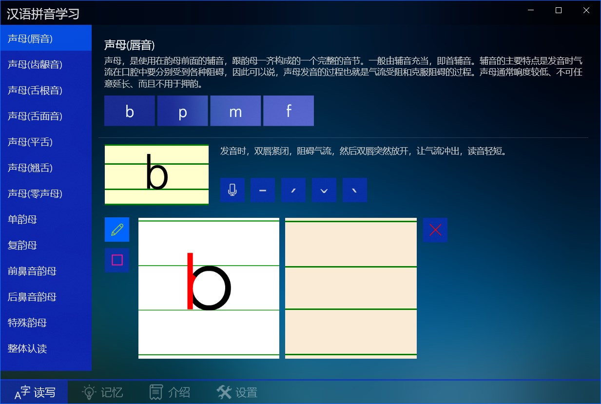

### [启蒙教育](https://apps.microsoft.com/detail/9NBLGGH425RC?hl=zh-cn&gl=CN) ###
Include 三字经、百家姓、千字文、弟子规、nursery rhymes, tongue twisters, stories.
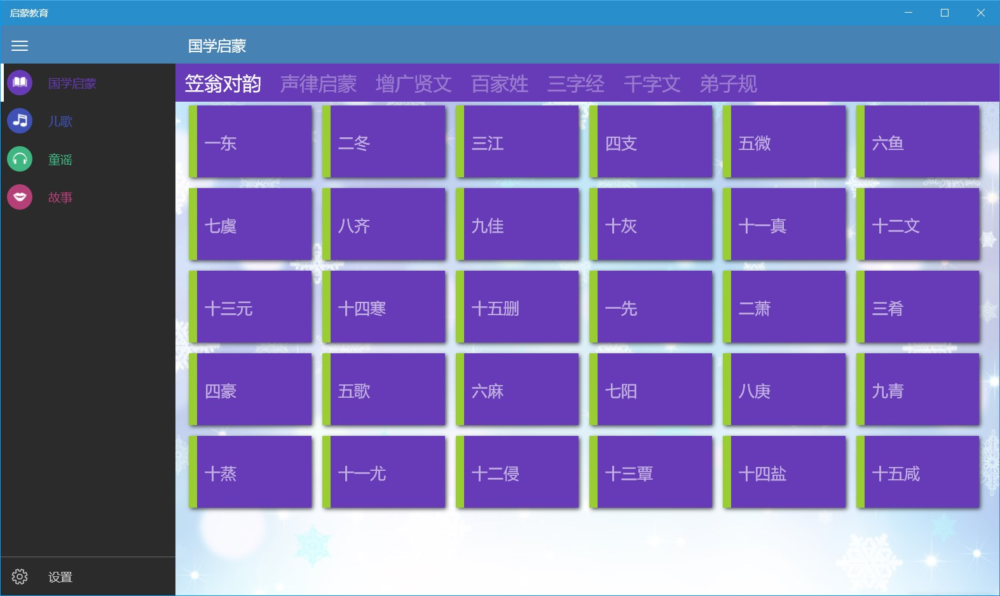

### [国学启蒙](https://apps.microsoft.com/detail/9NHSJH132S35?hl=zh-cn&gl=CN) ###
Include 《百家姓》、《三字经》、《千字文》、《弟子规》、《蒙求》、《神童诗》及《续神童诗》, with audio, pinyin, annotations, and translations.
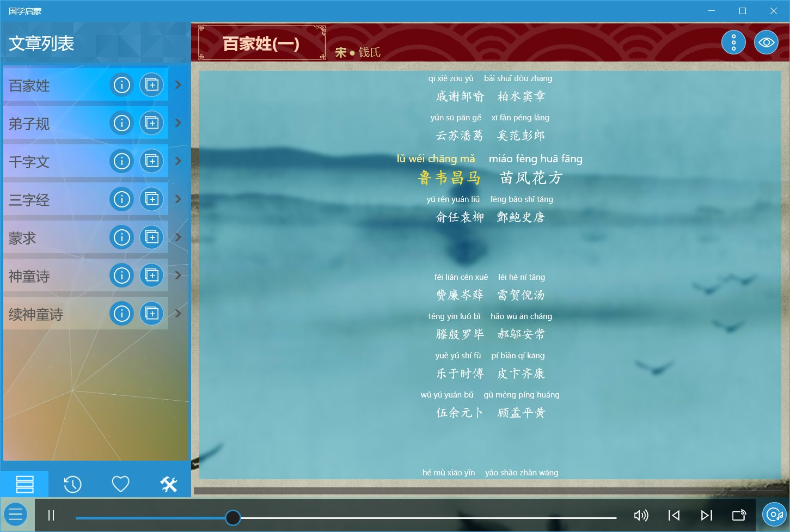

### [德育启蒙](https://apps.microsoft.com/detail/9NLLGXJP1ZTP?hl=zh-cn&gl=CN) ###
Include 《名贤集》、《增广贤文》、《孝经》、《二十四孝》, with audio, pinyin, annotations, and translations.
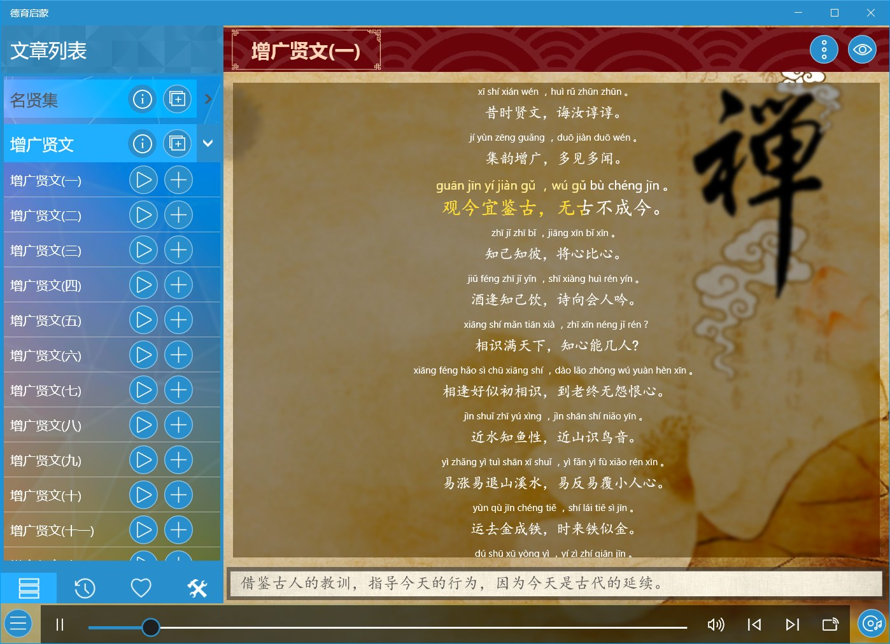

### [笠翁对韵](https://apps.microsoft.com/detail/9PDC01WZNBNT?hl=zh-cn&gl=CN) ###
Include 30 articles of 《笠翁对韵》 with audio, pinyin and annotations.
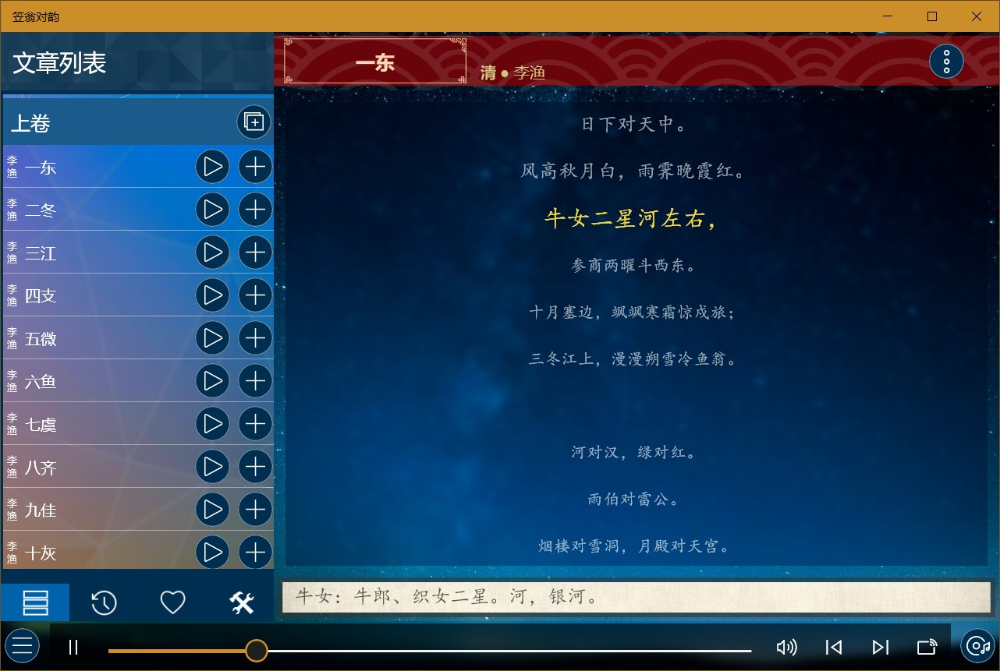

### [骈句启蒙](https://apps.microsoft.com/detail/9MW92HQL4FZ5?hl=zh-cn&gl=CN) ###
Include 30 articles each of 《龙文鞭影》，《声律启蒙》、《笠翁对韵》、《训蒙骈句》, with audio, pinyin and annotations.
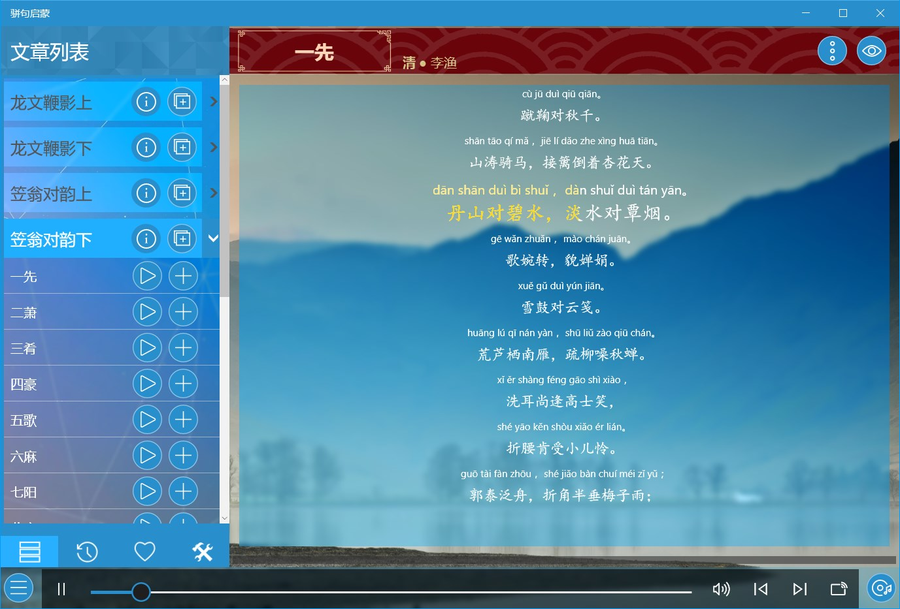

### [经典儿歌](https://apps.microsoft.com/detail/9NX45P7H18MD?hl=zh-cn&gl=CN) ###
Include Chinese classic children's songs, animated theme songs, ancient poetry children's songs, etc.
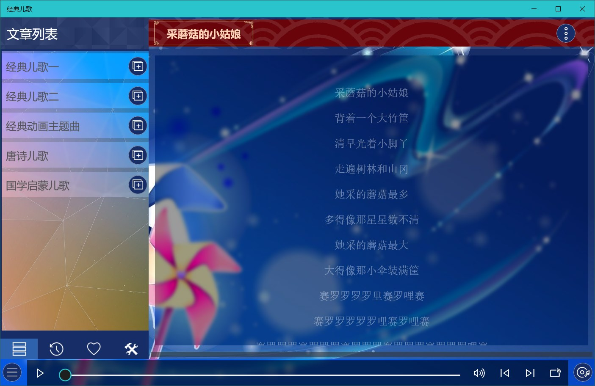

### [千家诗](https://apps.microsoft.com/detail/9NBLGGH42JP3?hl=zh-cn&gl=CN) ###
Include more than 200 ancient Chinese poems, and provides reading and search functions.
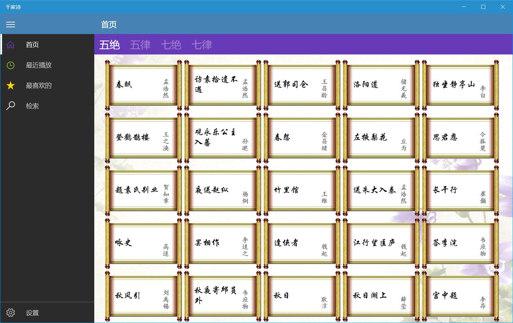

### [唐诗300首](https://apps.microsoft.com/detail/9NBLGGH424DD?hl=zh-cn&gl=CN) ###
Provide 《唐诗三百首》 audio and searching by author and title.
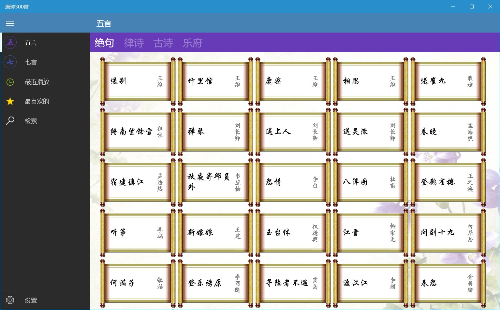

### [宋词300首](https://apps.microsoft.com/detail/9NBLGGH42JL6?hl=zh-cn&gl=CN) ###
Provide 《宋词三百首》 audio and searching by author and title.
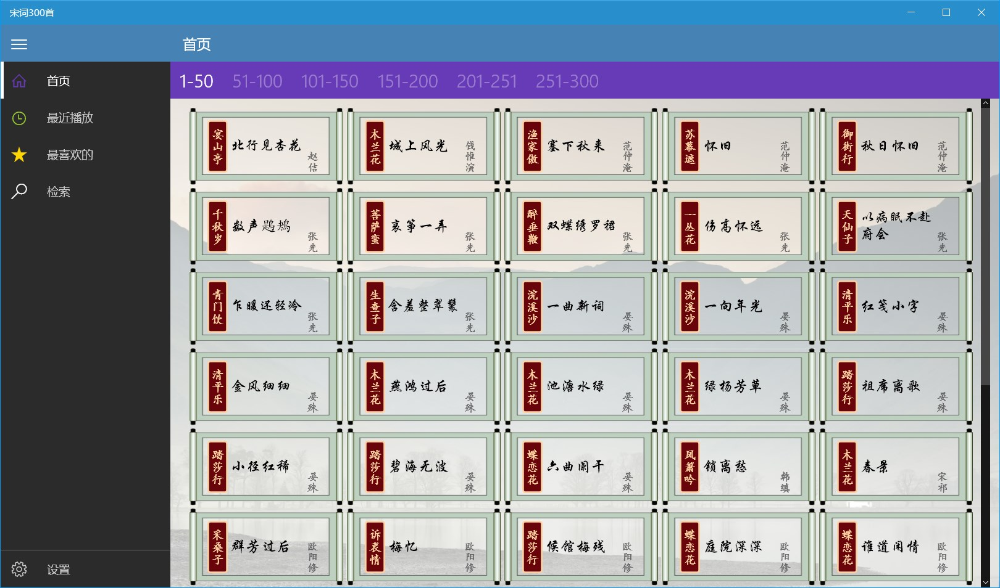

### [极简英文儿歌](https://apps.microsoft.com/detail/9NCZGGBPNNT6?hl=zh-cn&gl=CN) ###
Very simple English initiation nursery rhyme with audio and annotations.
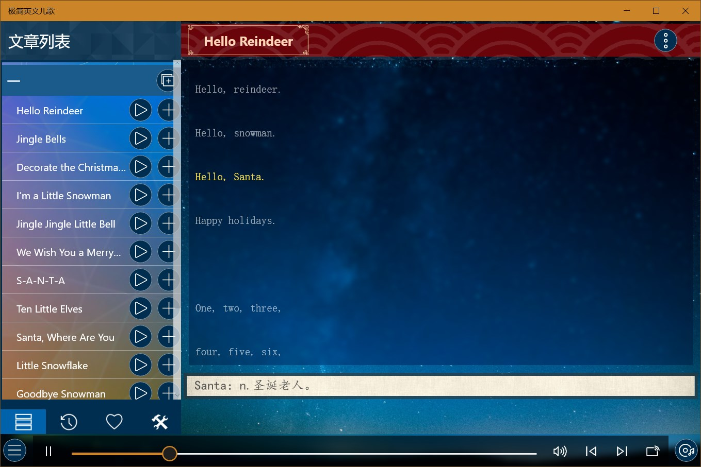

### [迪士尼英文儿歌](https://apps.microsoft.com/detail/9P5PR052N1DD?hl=zh-cn&gl=CN) ###
Contains 100 classic English children's rhymes with audio and annotations.
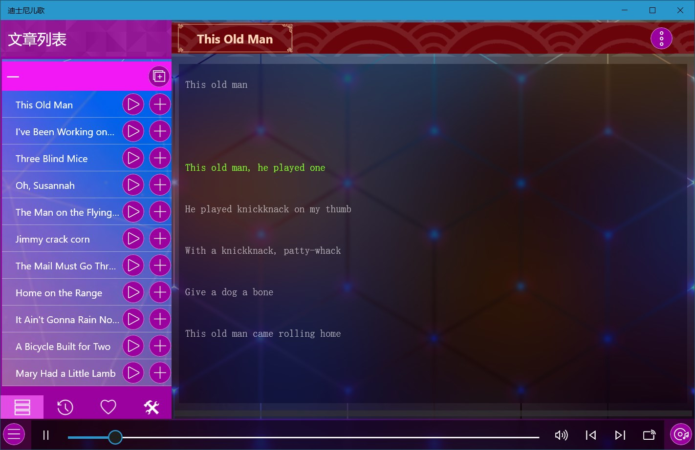

### [苏西托曼儿歌](https://apps.microsoft.com/detail/9PBMWG0RKQ3N?hl=zh-cn&gl=CN) ###
English nursery rhymes that contain the pleasant sounds of a variety of instruments.
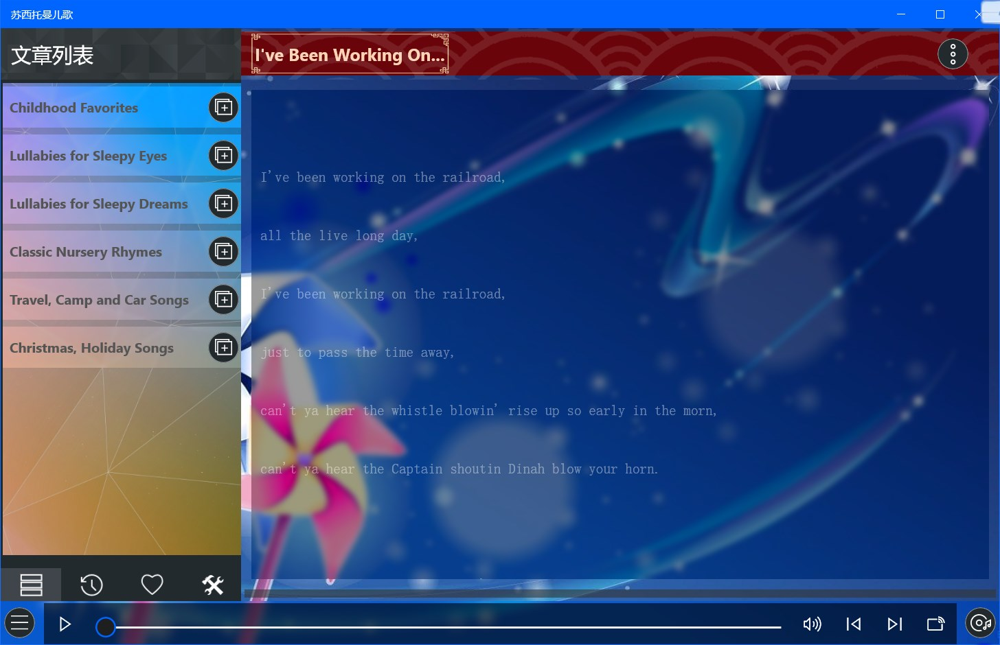

### [鹅妈妈童谣](https://apps.microsoft.com/detail/9PHBW0MJM92H?hl=zh-cn&gl=CN) ###
A collection of English nursery rhymes, including nursery rhymes, riddles, lullaby, alphabet songs, animal songs, etc., with audio and annotations.
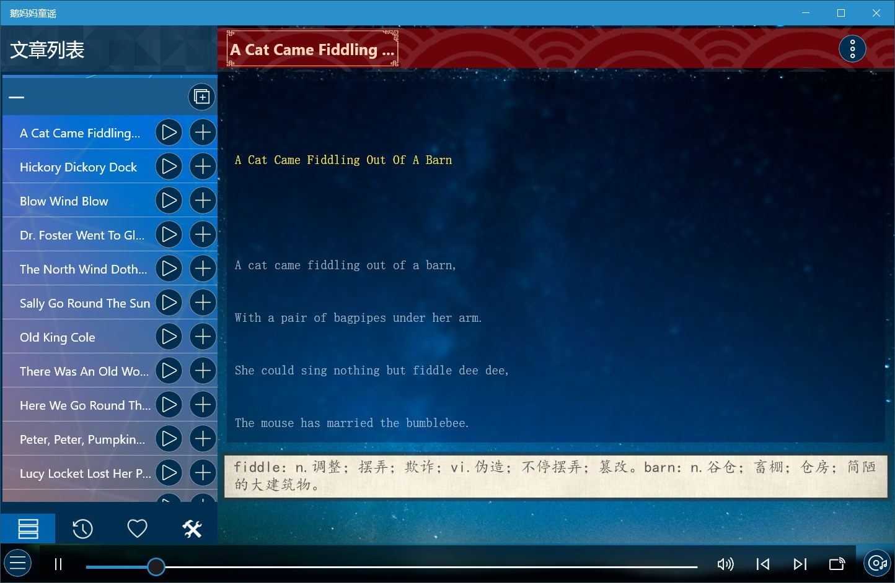

### [英文儿歌合集](https://apps.microsoft.com/detail/9MZBJ01MGN1C?hl=zh-cn&gl=CN) ###
It contains more than 160 classic English nursery rhymes, with audio and annotations.
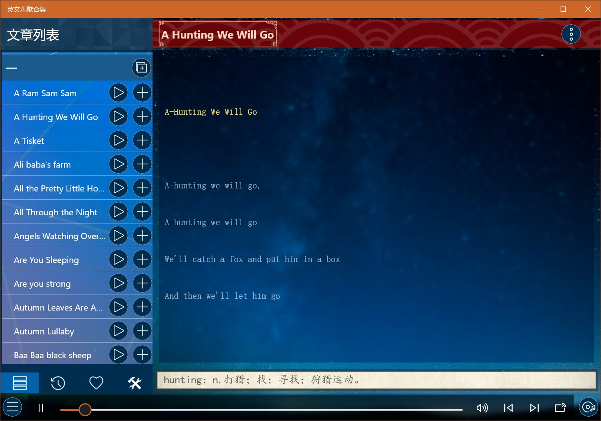

