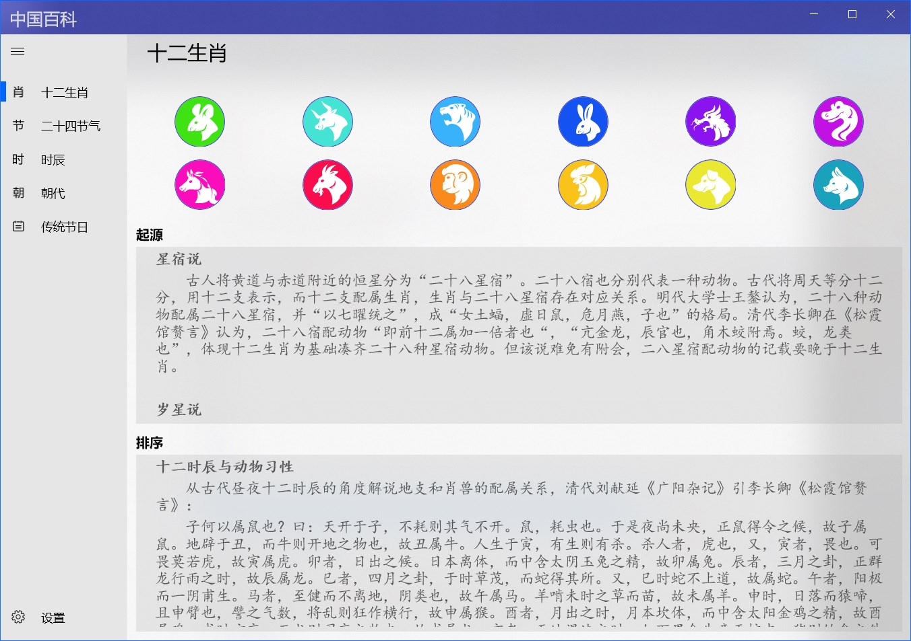

## Knowledge expansion and improvement

### [诗词散文](https://apps.microsoft.com/detail/9NBLGGH42RL7) ###
It contains more than 140 classic Chinese ancient poems, with reading and children's songs.

### [唐诗300首+](https://apps.microsoft.com/detail/9NWSJ79860Q0) ###
Provide 《唐诗三百首》 with audio, pinyin, annotations and translations, you can view the author's introduction, creative background and poetry appreciation.

### [宋词300首+](https://apps.microsoft.com/detail/9N80M3VMVBXK) ###
Provide 《宋词三百首》 with audio, pinyin, annotations and translations, you can view the author's introduction, creative background and poetry appreciation.

### [元曲300首](https://apps.microsoft.com/detail/9NBLGGH42JP4) ###
Provide 《元曲三百首》 audio and searching by author and title.

### [小学必背古诗文](https://apps.microsoft.com/detail/9NCJSGBVLWWT) ###
Provide ancient poems that need to be memorized in Chinese primary school, with audio, pinyin, annotations, and translations.

### [中学必背古诗文](https://apps.microsoft.com/detail/9P5B3C3R6GHP) ###
Provide ancient poems that need to be memorized in Chinese middle school, with audio, pinyin, annotations, and translations.

### [高中必背古诗文](https://apps.microsoft.com/detail/9PCD7LCS18DK) ###
Provide ancient poems that need to be memorized in Chinese high school, with audio, pinyin, annotations, and translations.

### [成语大全](https://apps.microsoft.com/detail/9P8DZNDDBTR4) ###
This app contains more than 30,000 idioms, of which nearly 4,000 are tagged as commonly used idioms.

#### View Info ####
Click on an idiom in the list on the left to view the idiom information, including pinyin, source, explanation, examples, etc.

#### Idiom Search ####
The search function supports query by text or pinyin, fuzzy matching, and wildcards ‘\_’ and ‘\*’.

> '\_' and '\*' have the same effect, and each '\_' or '\*' represents a Chinese character or the pinyin of a Chinese character
>
> You can filter common idioms by selecting the Common Idioms check box.

* Text search, which can query all idioms that contain the specified text. For example, if you enter "爱", you can query all idioms that contain the word "爱", and the position is arbitrary;
* Text location query, you can query idioms for a specific location of a specified text. For example, if you enter "\*一", you can query all idioms whose second character is "一";
* Pinyin query, which can query all idioms that contain the specified pronunciation, including homophones. For example, enter "li" to query the idioms containing "li" in pinyin, and the position is arbitrary;
* Pinyin position query, you can query all idioms, including homophones, that the package specifies the pronunciation in a specific position. For example, if you enter "yi * yi", you will search for idioms that are pinyin "yi" in the second and fourth positions, such as "不以为意", "时移世异", etc.

  > Pinyin queries do not contain tones, and pinyin is separated by spaces

#### Special types ####
Select the special menu below to query idioms with different char types, including AABB, AABC, ABAC, ABCA, ABBC, ABCB, and ABCC idioms.

#### Idiom solitaire ####
* Method: Forward connection and reverse connection are supported.
* Matching rules: the same Chinese character, the same pinyin (including different tones), and the same tone (the same tone and the same tone).
* How to start:
  1. Enter an idiom as the first word
  2. Directly click [Start] to randomly select an idiom to start.
* Solitaire Steps:
  * Forward connection: Click on the last word as the beginning to select the next idiom
  * Reverse connection: Click on the first word as the last word to select the next idiom

  > Actions on the last idiom can be added later, and if the operation is on the previous idiom, the following idioms will be cleared and re-added.
  
* End method: Click the [End] button to clear the solitaire result, and you can start again.

> You can choose to search for all idioms or commonly used idioms.
>
> You can select an idiom to view pinyin, source, explanation, and examples.

### [成语接龙诵读](https://apps.microsoft.com/detail/9NP4LCJPZNNM) ###
Provide adult and children's pronunciation and follow-read functions of Chinese idiom.

### 简笔画 ###
There are five levels of apps: Kids' Stick Figures, Beginner Stick Figures, Intermediate Stick Figures, Advanced Stick Figures, and Stick Figure Masters, and can be used for children and drawing enthusiasts of all ages and drawing levels.

These applications can be used for children's basic painting auxiliary education, including free drawing, copying painting, painting coloring, picture coloring, nursery rhyme step learning, etc., you can open local picture files for copying, and you can also save the drawn pictures and coloring results as pictures.

How to use:

1. Painting:
* Free Drawing: Click on the blank canvas on the left above to create a new canvas and draw freely on it.
* Copying Paintings: Select an image as the background in the upper navigation area to copy.
* Menu Description:
  1. Toggle the navigation bar display status
  2. Switch to coloring mode
  3. Set the brush size
  4. Set the brush color
  5. Undo the last step
  6. Clear the canvas

2. Coloring:
Click the second button in the middle menu below to switch to the fill mode.
* Fill in the picture: Switch to the fill mode when you are not drawing, you can color the background image.
* Paint Fill: Switch to Fill mode after painting to fill in the picture you have drawn.
* Menu Description:
  1. Toggle the navigation bar display status
  2. Switch to painting mode
  3. Set the fill color
  4. Undo the last step
  5. Clear all fill
   
  >! When you return to Paint mode from Fill mode, all fill will be cleared

3、Step or artwork:

In the steps or artwork interface, you can view the simple steps of painting or enjoy the artwork, click the picture to view the larger picture, and click again to close it.

[少儿简笔画](https://apps.microsoft.com/detail/9MSNH6TTWMHT)
[初级简笔画](https://apps.microsoft.com/detail/9NB3LRCRQ36G)
[中级简笔画](https://apps.microsoft.com/detail/9NDDFLMN19H6)
[高级简笔画](https://apps.microsoft.com/detail/9NBVHHCS2GWW)
[简笔画大师](https://apps.microsoft.com/detail/9NRLNP19TV4R)

> The open/save button for children's and beginner stick figures is in the middle menu below, other apps are in the lower left corner of the interface, and other apps have a canvas zoom button in the bottom right corner.

### [填色](https://apps.microsoft.com/detail/9PP861LBHWDB) ###
Contains more than 100 line drawing pictures, supports opening local files to fill in and export coloring pictures.
The operation is similar to that of stick figures.

### [中国百科](https://apps.microsoft.com/detail/9NHFV6M0VMX3) ###
It contains knowledge of the 12 zodiac signs, 24 solar terms, hours, dynasties, traditional festivals, etc., which can help understand traditional Chinese culture and understand Chinese history.

On the left side of the application is the function menu, which can be clicked to switch to different knowledge interfaces:

* 十二生肖：
  
  At the top of the interface is the zodiac icon, and below it shows the origin of the zodiac and the basis for sorting.
  
  Click on the zodiac icon to view the English name, hour and detailed description of each zodiac sign in the pop-up interface.
 

* 二十四节气：
  
  At the top of the interface is the solar term icon, and below it is the origin of the 24 solar terms and the various versions of the solar term songs.

  Click the solar term icon to view the detailed introduction of each solar term in English, date, meaning and other details on the pop-up interface.

* 时辰：
  
  At the top of the interface is the hour icon, and below it is the meaning of the twelve hours and related knowledge.

  Click the hour icon to view the detailed introduction of the time, alias, and health knowledge of each hour in the pop-up interface.

* 朝代：
  
  At the top of the screen is a list of dynasties divided by period, and at the bottom is a list of dynasty songs used to memorize dynasties.

  Click on different periods to list the names of dynasties belonging to that period, and click on the names of dynasties to view detailed information such as the beginning and end years of dynasties, founders, capitals, the origin of dynasty names, and emperor information.

* 传统节日：
  
  The top of the interface shows the name of the traditional festival, and the bottom shows the relevant knowledge of the traditional Chinese festival.

  Click on the name of the festival to view the detailed description of the festival's English name, time, nickname and customs.

### [中国省级地图](https://apps.microsoft.com/detail/9P1WCC4N8ZLT) ###
It can be used to learn and memorize the shape and location of China's provincial-level administrative regions, including map memory, province profile, map and name correspondence test, etc.

#### View Info
The home page can learn the basic information of each province, click on the province to display the introduction interface, including the province name, abbreviation, administrative center and introduction, click again to close the introduction interface.

#### Test 1
You can test the correspondence between province names and map graphics, and there are two levels: easy and hard.

Steps:
1. Select the difficulty, the difficulty is divided into normal and hard levels, and the difficulty level icon will rotate by a random angle
2. Select the quantity
3. Click Start to automatically generate training questions, with questions at the top and result options at the bottom.
4. Answer the question, for each question above, select the correct province icon at the bottom; After selecting an answer, it will automatically jump to the next unanswered question, or you can click on it in the upper question area to switch between them.
5. End, it will automatically end after all questions are answered, or you can click the end button to end the answer.

#### Test 2
You'll need to select the correct name for the highlighted area on the map from the names below.

After clicking Start, the map area will be highlighted randomly, and the next highlighted area will be automatically displayed when the answer is selected.

The correct area will be filled with green, otherwise it will be filled with red, and the answer will end when it is full.

### [世界各国概况](https://apps.microsoft.com/detail/9P65BSZH61RM) ###
This app can be used to learn about maps and basic fact sheets of countries around the world, and can help memorize flags and capitals.

You can learn the basic information of each country on the home page, click the country on the map to display the introduction interface, and click again to close the introduction interface.

On the profile page, you can view the images of the national flag and national emblem and their meanings, English names, capitals, land areas, time zones, ethnicities, and other information.

Enter the country name or domain code in the text box above to filter. The bottome menu buttons contain the functions of clearing, showing introduction, and filtering.

The filter button allows you to filter countries by continent, and click on the country name to highlight the country's location on the map.

#### Memory tests
The test screen allows you to test the correspondence between the national flag or the capital and the country.

After selecting the type and quantity in the interface, clicking Start will automatically generate test questions, with questions at the top and result options at the bottom.

For each of the above questions, you need to select the correct country name below; After selecting an answer, it will automatically jump to the next unanswered question, or you can click on it in the upper question area to switch between them.

### [中国诗词大全](https://apps.microsoft.com/detail/9P3432W9K924) ###
This app contains more than 330,000 ancient Chinese poems from the pre-Qin to the Qing Dynasty, and supports querying and memorizing.

By default, the homepage displays a page of random poems, and you can switch between random poems by clicking the green button. Enter the name, author, word brand name or content in the query condition according to the combination of the conditions, the home page display content is the first 2~4 lines of the poem, you can click the poem to view the complete content.

Click on the poem to view the complete content of the poem when it supports the conversion of simplified and traditional Chinese to display, supports the display of pinyin, due to the existence of polyphonic words, this syllable may not be correct, polyphonic words display the first syllable by default, you can select polyphonic words to view other pronunciations.

#### Poetry recitation
Click the memory button on the view content page to memorize, and you can prompt the first word, last word, and punctuation when reciting. When reciting, you can choose the word choice mode and input mode.

* Word choice mode: The default way, select the position on the left, and then select the text in the position from the right side to fill in, if the text is correct, it will be displayed in green and automatically jump to the next position, and if it is wrong, it will be displayed in red.
* Input mode: Click the input button to switch to the input mode, which can quickly fill in the content of the poem.
In the input mode, you need to select the starting matching line on the left, and click the confirm button on the right to verify the input method.
During verification, it will be automatically filled in and compared from the first word of the selected line, and the comparison result will be prompted with a color, and the input content can be modified for multiple verifications.

### [古诗文背诵](https://apps.microsoft.com/detail/9NSJ6FNW6F8N) ###
It contains more than 1,500 ancient poems such as Tang poems, Song poems, and Yuan songs, and supports desktop notification mode.
The homepage of the app will initially display all starred poems, and the initial star categories are "seven-character quatrains" and "five-character quatrains", and all starred poems will be added to the desktop notification.

You can click the button in the menu bar to switch categories to view all the poems in selected category, and click on a poem to view the full content of the poem.

The poem viewing interface displays the full content of the poem, and the poem can be marked or unmarked through the star button in the menu bar, and the marked poem will be added to the desktop notification list.

#### Memorization mode
The menu bar allows you to switch to memorization mode to recite poems, or check the memorization effect.

In memorization mode, you need to complete each verse word by word by selecting each character in the correct position from the options below, and each completed sentence will be displayed on the left side and automatically switch to the next sentence until the entire poem is completed.

#### Desktop notification settings

> If desktop notifications are not turned on initially, you can enable the automatic notification feature through [Auto Start] in the configuration interface.

Settings include:
* Display position: You can set the upper right corner, lower right corner, upper left corner, lower left corner, top center, bottom center, and center of the screen
* Duration: can be set from 3 seconds to 1 minute, when [Manual] is selected, desktop notifications will not be automatically turned off, and will only be turned off after a mouse click.
* Background and text color
* Font size of text: You can set a value between 16 and 40
* Split to line: When checked, you can split a poem into multiple reminders according to the specified number of lines, otherwise the full poem will be displayed at the time of notification.
* Auto-start: Select to automatically turn on desktop notifications when you open an app.
* Notification category settings: Click on the star on the right category to add or remove the entire category from the notification list.
* Click [Apply] to save the settings, and [Close] to close the dialog box but not save the settings.  
* Play/Stop button to preview settings and also control the current desktop notification.

>! Settings when you don't click Apply will not be saved, and you can preview the changes when you click the play button, but they will be lost when you reopen the configuration screen or app.

Desktop Notification:

#### Taskbar icon actions
When you close a window, you can choose to hide it to the taskbar icon, left-click the taskbar icon to restore the window, and click the context menu of icon to start or stop desktop notifications.

### [元素周期表 +](https://apps.microsoft.com/detail/9NJKL858L4VS) ###
It contains the basic information of all 118 elements that have been discovered, and the basic information is displayed by default: atomic number, element symbol, and different categories are distinguished by different colors.
After hovering the mouse, the Chinese name and atomic weight are displayed.
When hovering over the family and period numbers and classifications, the elements of the corresponding categories will be highlighted.

After clicking, you can view the detailed information of the element, including: atomic number, element symbol, Chinese and English name, family, period, region, proton number, neutron number, electron number, mass number, type, physical and chemical properties, abundance, history, use, characteristics, discovery time, discoverer, discovery country, etc.

#### Elements Compare
After view by group, you can select 2-4 elements to compare the information of them

>! Only [元素周期表 +] supports group view and comparison

[元素周期表PWA](https://apps.microsoft.com/detail/9PCQBHB8R04G)

[Use it online](https://periodictableblazor.azurewebsites.net)

