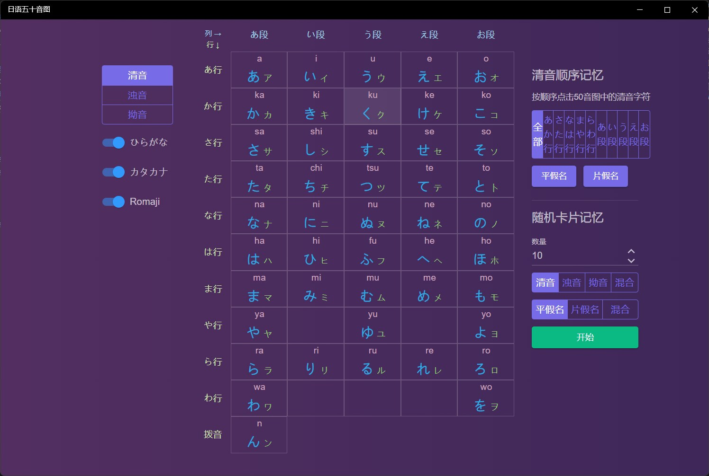

## English learning

### [千万别学英语](https://apps.microsoft.com/detail/9N1LDB3LP7NK?hl=zh-cn&gl=CN) ###
Provide 《千万别学英语》 with audio and annotations.

### [小学英语听力](https://apps.microsoft.com/detail/9N097LX5NH27?hl=zh-cn&gl=CN) ###
Provide 《小学英语听力》 with audio and annotations.

### [小学英语听力100篇](https://apps.microsoft.com/detail/9P55LZ1VSR5S?hl=zh-cn&gl=CN) ###
Provide 《小学英语听力100篇》 with audio and annotations.

### [小学英语晨读](https://apps.microsoft.com/detail/9MXRXDHZ8CVT?hl=zh-cn&gl=CN) ###
Provide 《小学英语晨读》 with audio and annotations.

### [小学英语阅读](https://apps.microsoft.com/detail/9NDVPQHR9J2M?hl=zh-cn&gl=CN) ###
Provide 《小学英语阅读》 with audio and annotations.

### [小学英语会话](https://apps.microsoft.com/detail/9P4HJ8KDZ0L1?hl=zh-cn&gl=CN) ###
Provide 《小学英语会话》 with audio and annotations.

### [英文故事100篇](https://apps.microsoft.com/detail/9NCSXGKG8CJK?hl=zh-cn&gl=CN) ###
Provide 100 English stroies with audio and annotations.

### [英文日常会话](https://apps.microsoft.com/detail/9PBGXLTJZNR8?hl=zh-cn&gl=CN) ###
Provide 《英语日常会话》 with audio and annotations.

### [英语900句 基础篇](https://apps.microsoft.com/detail/9MVKPKF9B1ZS?hl=zh-cn&gl=CN) ###
Provide 《英语900句 基础篇》 with audio and annotations.

### [英语900句 生活篇](https://apps.microsoft.com/detail/9PPJHZDFWDD0?hl=zh-cn&gl=CN) ###
Provide 《英语900句 生活篇》 with audio and annotations.

### [英语口语3000句](https://apps.microsoft.com/detail/9NQK8N5B10LL?hl=zh-cn&gl=CN) ###
Provide 《英语口语3000句》 with audio and annotations.

### 英语日常口语 ###
Provide 《英语日常口语》 with audio and annotations.

### [英语职场口语](https://apps.microsoft.com/detail/9P2FZQ13G1JS?hl=zh-cn&gl=CN) ###
Provide 《英语职场口语》 with audio and annotations.

### [雅思口语900句](https://apps.microsoft.com/detail/9NCH3P5K41S9?hl=zh-cn&gl=CN) ###
Provide 《雅思口语900句》 with audio and annotations.

## Other language learning

### [韩语字母表](https://apps.microsoft.com/detail/9PMK5CMKZZTK?hl=zh-cn&gl=CN) ###
It includes functions such as pronunciation learning, stroke order learning, writing practice, and memory training of Korean letters.

### [日语50音图](https://apps.microsoft.com/detail/9NC8KSMB6W44?hl=zh-cn&gl=CN) ###
It includes functions such as pronunciation learning, stroke order learning, writing practice, and memory training for Japanese 50 phonetic charts.

### [日语900句](https://apps.microsoft.com/detail/9PGGP3J4MXXZ?hl=zh-cn&gl=CN) ###
It includes four categories: basic sentence patterns, daily topics, communicative expressions, and mood expressions.

### [日语基础会话](https://apps.microsoft.com/detail/9NWK38NF9XQH?hl=zh-cn&gl=CN) ###
It includes four categories: basic sentence patterns, communicative language, daily topics, and mood expressions

### [50音图](https://apps.microsoft.com/detail/9NHZ8R1QFXR2?hl=zh-cn&gl=CN) ###
A learning tool for 50 phonetic charts in Japanese, supports sorting and memorizing by row and column and sequential testing.

