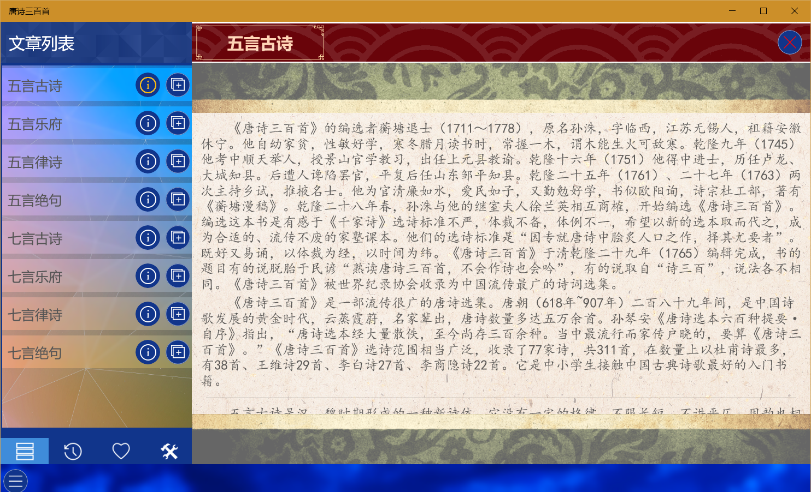
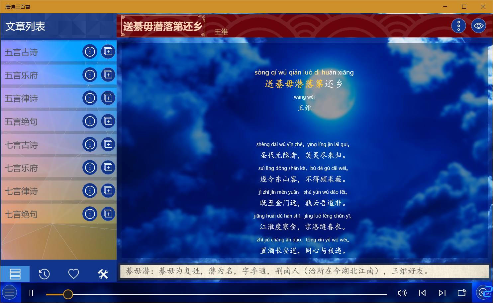
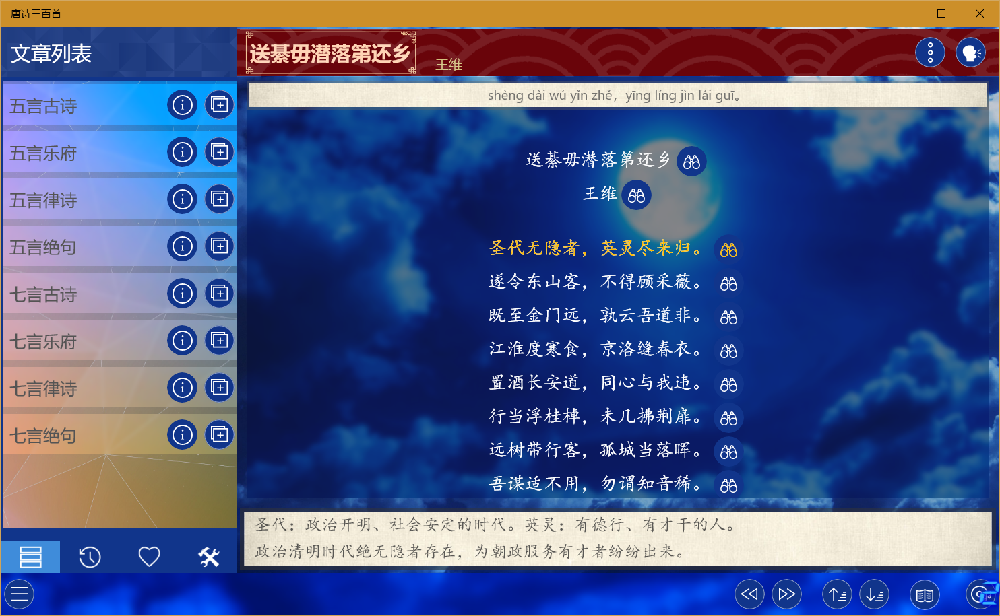
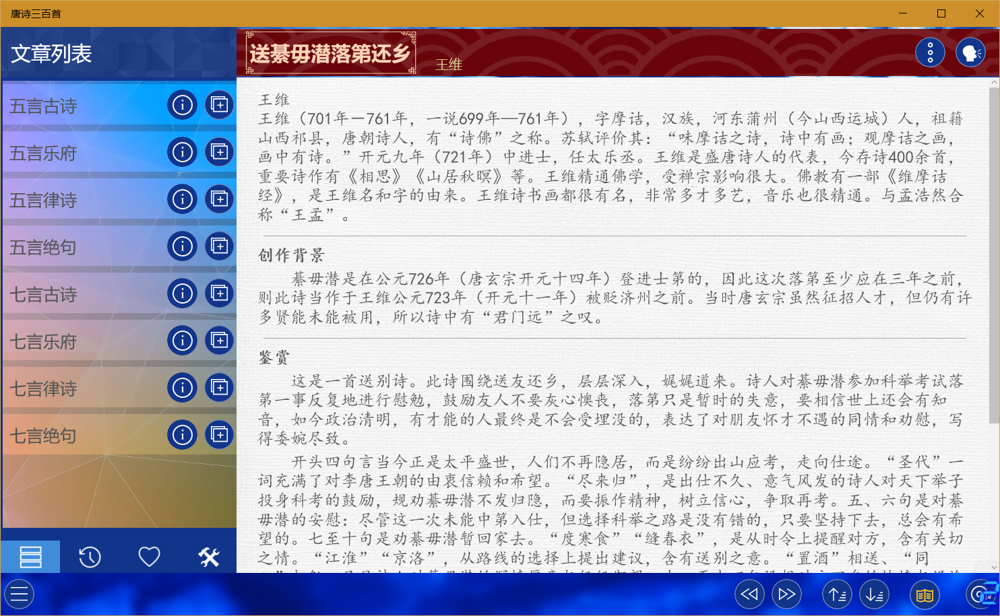

此类应用包含一系列教育类应用，可以分为四大类：
* [启蒙教育](/docs/edu/zh/enlighten.md)
* [拓展提高](/docs/edu/zh/improve.md)
* [语言学习](/docs/edu/zh/language.md)
* [经典国学](/docs/edu/zh/chinese.md)
  
每类都包含十余个应用，内容涵盖国学启蒙、四书五经、儿歌童谣、英日韩语学习、百科知识等。

## 音频类应用使用方法
此类应用中包含一大部分音频类应用，其使用方法基本一致，在此以《唐诗三百首》为例做统一说明：
* 应用打开后左侧文章列表会显示应用所包含的所有内容分类，右侧两个按钮功能分别为查看分类信息（部分应用没有此功能）、添加分类中的内容到播放列表，点击分类名称可以查看每个分类中的内容。

列表向下方的另外三个菜单功能分别为：最近播放列表、favourite列表和设置选项（包括背景音乐、拼音、注释、翻译的设置）。

* 应用右侧为内容显示区，选择文章后可以显示所选文章内容，上方右侧两个按钮中的第一个可以切换显示拼音、注释、翻译及添加favourite，点击第二个按钮可以切换为浏览模式，在浏览模式下可以点击每行内容右侧按钮查看此行的拼音、注释和翻译。

应用下方为播放控制区，在播放模式下可以控制播放暂停、调整进度、调节音量、切换上一首和下一首。

* 切换为浏览模式后下方会变为浏览控制，右侧按钮切换为：上一首、下一首、上一行、下一行和查看文章鉴赏（部分应用或文章没有此功能）功能。

* 点击文章鉴赏按钮可以查看作者信息、创作背景及鉴赏等内容，再次点击此按钮或切换文章可以关闭鉴赏界面

* 下方最右侧是播放列表按钮，点击可以打开播放列表，其中可以进行切换播放内容、移除内容或清空列表的操作。

## 特别说明

* 此类应用都可以离线使用(PWA应用例外)，无需登录，不会上传个人信息。

* 应用内的所用资源来源于网络，版权归原作者所有，所有应用不提供下载功能。

* 由于资源来源于网络，所以难免会有错误，敬请谅解，如果发现错误可以在微软商店留言或者[在此](https://github.com/IceSkyDev/AppDoc/issues)提交详细信息，开发者会尽量进行修复。

