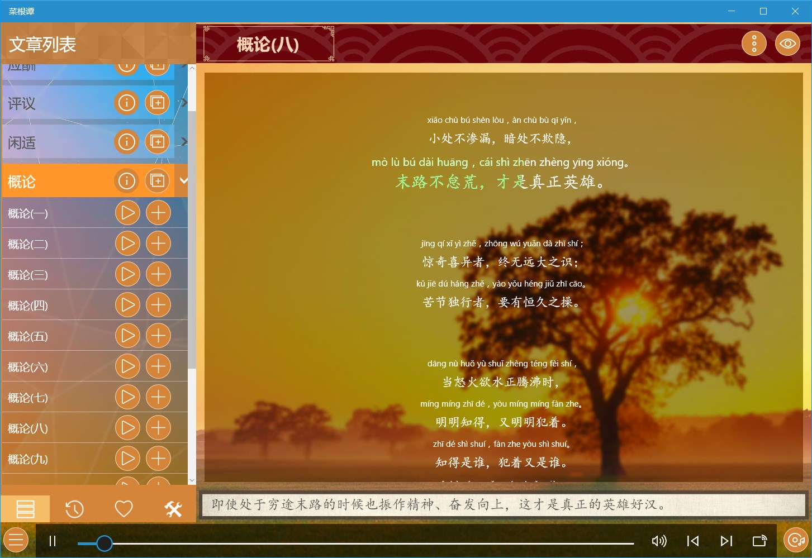
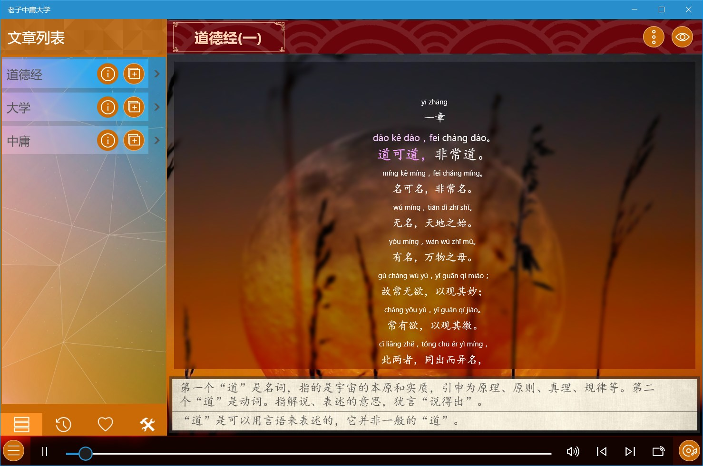
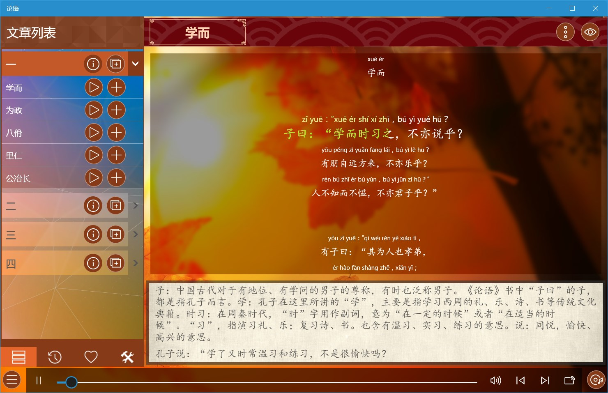
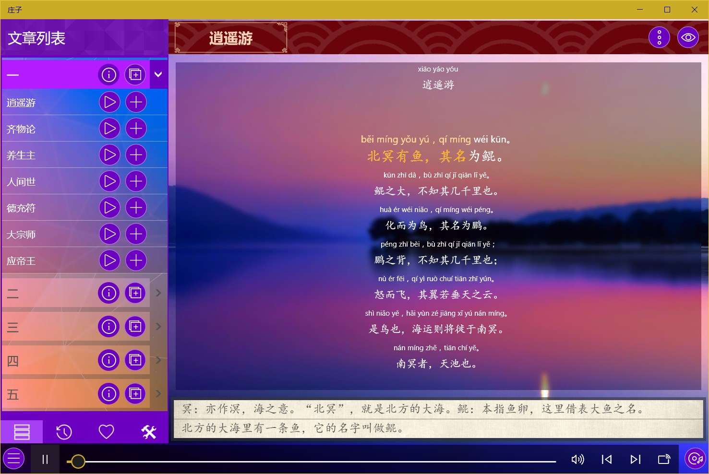
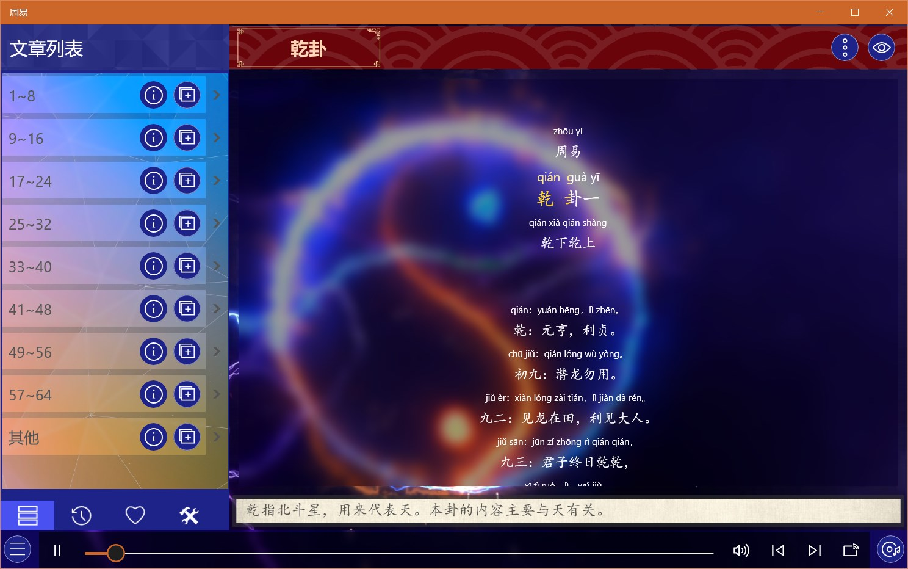
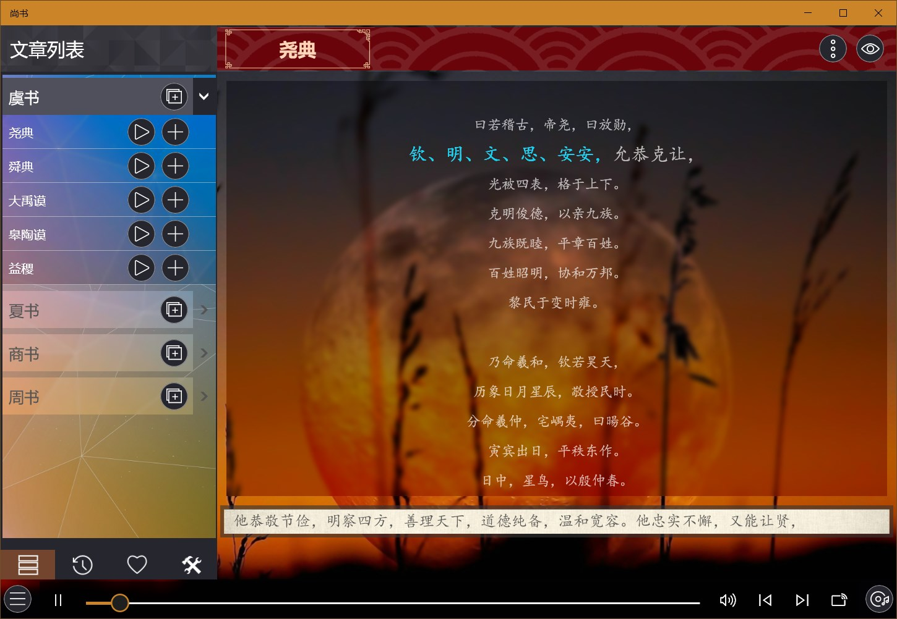

## 经典国学

### [格言联璧](https://apps.microsoft.com/detail/9NVCXH9J3PVK?hl=zh-cn&gl=CN) ###
《格言联璧》包括学问类、存养类、持躬类、养生类、敦品类、处事类、接物类、齐家类、从政类、惠吉类、悖凶类，带有拼音、注释及解说。

### [幼学琼林](https://apps.microsoft.com/detail/9P5210CX9TM6?hl=zh-cn&gl=CN) ###
《幼学琼林》是骈体文写成的，全书全部用对偶句写成，容易诵读，便于记忆，带有拼音、注释及解说。应用带有拼音、注释及翻译。

### [菜根谭](https://apps.microsoft.com/detail/9P6SP8KG3DR3?hl=zh-cn&gl=CN) ###
《菜根谭》包括修身、应酬、评议、闲适、概论，带有拼音、注释及翻译。

### [老子中庸大学](https://apps.microsoft.com/detail/9P0RKSNRRWFP?hl=zh-cn&gl=CN) ###
包括《老子》、《中庸》、《大学》三部著作，带有拼音、注释及翻译。

### [论语](https://apps.microsoft.com/detail/9NHW3JNP9V3K?hl=zh-cn&gl=CN) ###
论语全书共20篇492章，一万余字，各篇都以每篇开始的两字或三字为篇名，应用将论语20篇分为四组，每组5篇，带有拼音、注释及翻译。

### [孟子](https://apps.microsoft.com/detail/9NT8GKQKQXHM?hl=zh-cn&gl=CN) ###
包含《孟子》的七篇著作：梁惠王、公孙丑、滕文公、离娄、万章、告子、尽心，每篇都分为上下两卷，带有拼音、注释及翻译。

### [庄子](https://apps.microsoft.com/detail/9P8ZTX0BSWXJ?hl=zh-cn&gl=CN) ###
包含庄子的著作三十余篇，其中包含比较有名的《逍遥游》、《齐物论》、《秋水》、《知北游》、《渔父》等，带有拼音、注释及翻译。

### [诗经](https://apps.microsoft.com/detail/9NLZW9RM17TQ?hl=zh-cn&gl=CN) ###
《诗经》现存305篇（此外有目无诗的6篇，共311篇），分《风》《雅》《颂》三部分。《风》出自各地的民歌。《雅》分《大雅》《小雅》，多为贵族祭祀的诗歌，祈丰年、颂祖德。《颂》则为宗庙祭祀的诗歌。

应用包含了国风、小雅、大雅、颂，带有拼音、注释及翻译。

### [楚辞](https://apps.microsoft.com/detail/9P3B14JCBC7B?hl=zh-cn&gl=CN) ###
《楚辞》是中国文学史上第一部浪漫主义诗歌总集。
应用包含了单篇、九歌、九章、九辩、七谏、九怀、九叹及九思，带有拼音、注释及翻译。

### [周易](https://apps.microsoft.com/detail/9N2CL5SMZ0ZS?hl=zh-cn&gl=CN) ###
八卦指乾，坤，震，巽，坎，离，艮，兑。八卦最基本的象是八种自然物：乾为天、坤为地、震为雷、巽为风、艮为山、兑为泽、坎为水、离为火。应用将周易六十四卦分成了八组，带有拼音、注释及翻译。

### [尚书](https://apps.microsoft.com/detail/9N6HNSBHMBFQ?hl=zh-cn&gl=CN) ###
《尚书》就是上古的书，涉及政治、宗教、思想、哲学、艺术、法令、天文、地理、军事等诸多领域，它是中国上古历史文献和部分追述古代事迹著作的汇编。应用包含虞书、夏书、商书、周书，带有拼音、注释及翻译。

### [兵法谋略](https://apps.microsoft.com/detail/9MZ1HCPDLMF3?hl=zh-cn&gl=CN) ###
包含孙子兵法及三十六计包含的六套内容：胜战计、敌战计、攻战计、混战计、并战计和败战计，带有拼音、注释及翻译。

### [陶渊明文集](https://apps.microsoft.com/detail/9P1BTCD6KXP0?hl=zh-cn&gl=CN) ###
包含陶渊明集的四大类诗四言、诗五言、赋辞、记传赞述、疏祭文，带有拼音、注释及翻译。

