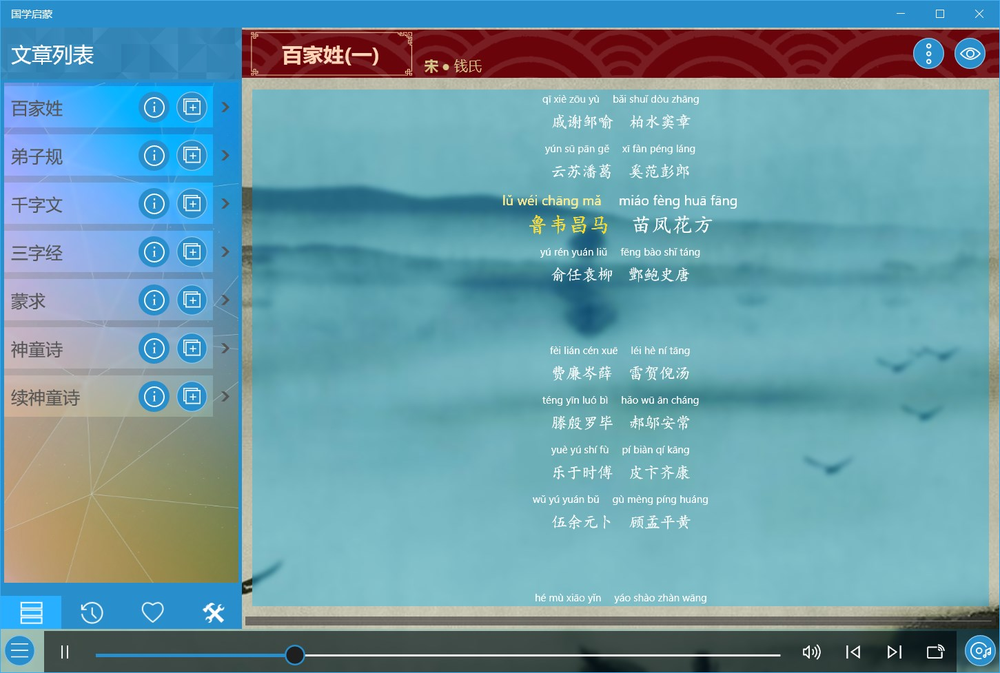
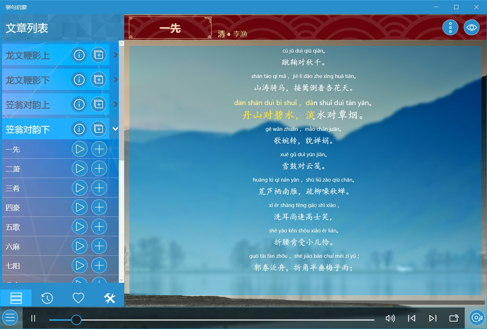
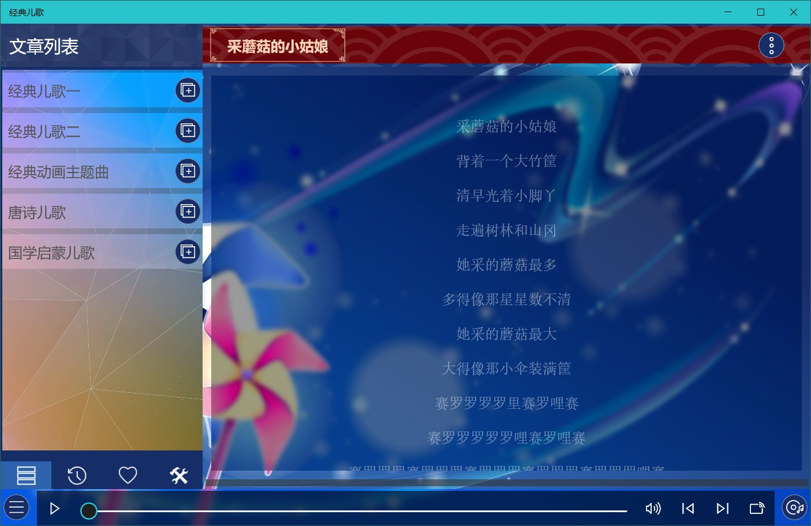
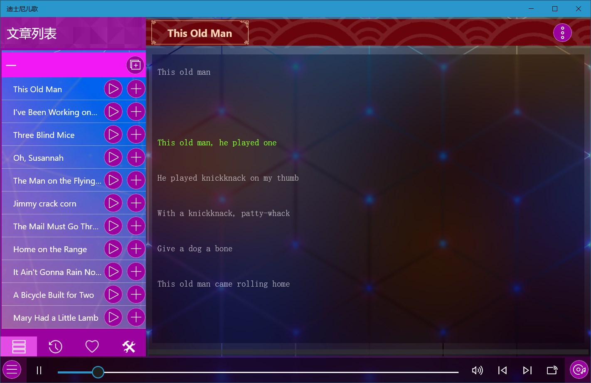
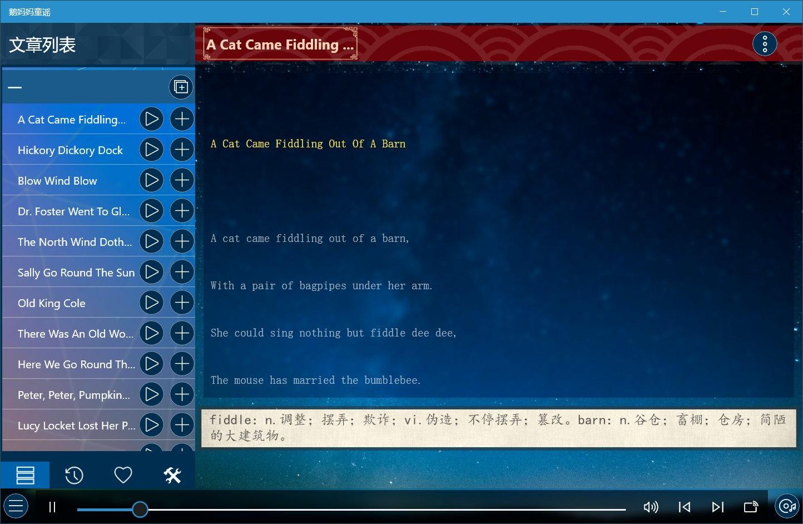

## 启蒙教育

### [汉语拼音](https://apps.microsoft.com/detail/9MZX6CQ10SW7?hl=zh-cn&gl=CN) ###
可以用来进行基础的汉语拼音教育，包含拼音介绍、发音、书写笔顺、记忆方法等功能，还具有书写功能，可以练习拼音书写。

### [启蒙教育](https://apps.microsoft.com/detail/9NBLGGH425RC?hl=zh-cn&gl=CN) ###
分为国学启蒙（包含笠翁对韵、声律启蒙、增广贤文、百家姓、三字经、千字文、弟子规）、儿歌（包含三字儿歌、经典动画主题曲、经典儿歌等）、童谣（包含童谣和绕口令）、故事四大类近400个音频。

### [国学启蒙](https://apps.microsoft.com/detail/9NHSJH132S35?hl=zh-cn&gl=CN) ###
包含《百家姓》、《三字经》、《千字文》、《弟子规》、《蒙求》、《神童诗》及《续神童诗》七大经典篇章，提供朗读音频、拼音、注释或者翻译。

### [德育启蒙](https://apps.microsoft.com/detail/9NLLGXJP1ZTP?hl=zh-cn&gl=CN) ###
包含中国古代经典德育著作四部：《名贤集》、《增广贤文》、《孝经》、《二十四孝》，提供朗读音频、拼音、注释或者翻译。

### [笠翁对韵](https://apps.microsoft.com/detail/9PDC01WZNBNT?hl=zh-cn&gl=CN) ###
包含《笠翁对韵》上下两卷共30篇，提供朗读音频、拼音及注释。

### [骈句启蒙](https://apps.microsoft.com/detail/9MW92HQL4FZ5?hl=zh-cn&gl=CN) ###
包含《龙文鞭影》，《声律启蒙》、《笠翁对韵》、《训蒙骈句》四大骈句启蒙著作，每部包含上下两卷，每卷15篇，总共120篇，提供朗读音频、拼音、注释及书籍介绍。

### [经典儿歌](https://apps.microsoft.com/detail/9NX45P7H18MD?hl=zh-cn&gl=CN) ###
包含经典儿歌、动画主题曲、唐诗儿歌、三字经儿歌、笠翁对韵儿歌等百余首儿歌。

### [千家诗](https://apps.microsoft.com/detail/9NBLGGH42JP3?hl=zh-cn&gl=CN) ###
包括李白、杜甫、王维、孟浩然、苏轼、王安石等作者的五绝、五律、七绝、七律四类诗歌共计两百余篇，提供朗读音频、收藏及按标题/作者搜索功能。

### [唐诗300首](https://apps.microsoft.com/detail/9NBLGGH424DD?hl=zh-cn&gl=CN) ###
包含了《唐诗三百首》的全部诗作，根据唐诗类型分为五言和七言两大类，每类包括绝句、律诗、古诗、乐府四类，提供朗读音频、收藏及按标题/作者搜索功能。

### [宋词300首](https://apps.microsoft.com/detail/9NBLGGH42JL6?hl=zh-cn&gl=CN) ###
基本包含了《宋词三百首》的全部诗作，提供朗读音频、收藏及按标题/词牌/作者搜索功能。

### [极简英文儿歌](https://apps.microsoft.com/detail/9NCZGGBPNNT6?hl=zh-cn&gl=CN) ###
非常简单的英语启蒙儿歌，歌词非常简单，音调也易学，曲风欢乐、旋律轻快、歌词简单，提供音频及单词注释。

### [迪士尼英文儿歌](https://apps.microsoft.com/detail/9P5PR052N1DD?hl=zh-cn&gl=CN) ###
包含100首经典英文童谣，提供音频及单词注释。

### [苏西托曼儿歌](https://apps.microsoft.com/detail/9PBMWG0RKQ3N?hl=zh-cn&gl=CN) ###
苏西托曼Susie Tallman是美国著名女歌唱家，专注演唱儿童歌曲。包含音频和单词注释，可以用来哄宝宝入眠同时潜移默化的熟悉英语环境。

### [鹅妈妈童谣](https://apps.microsoft.com/detail/9PHBW0MJM92H?hl=zh-cn&gl=CN) ###
英国民间的童谣集，包含儿歌、谜语、催眠曲、字母歌、绕口令、动物歌等，提供音频及单词注释。

### [英文儿歌合集](https://apps.microsoft.com/detail/9MZBJ01MGN1C?hl=zh-cn&gl=CN) ###
包含经典英文儿歌及童谣160余首，提供音频及单词注释。

