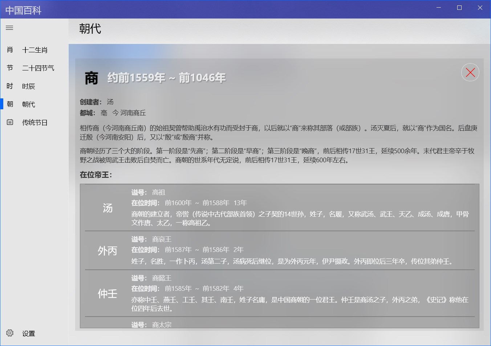
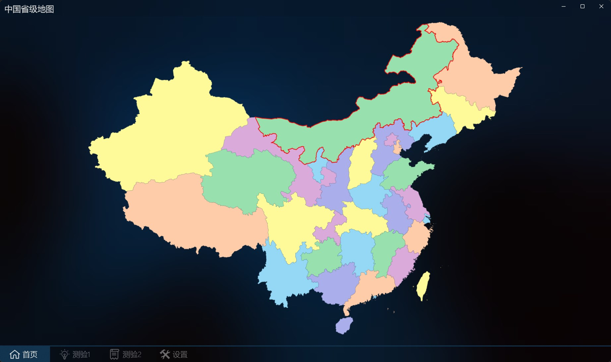
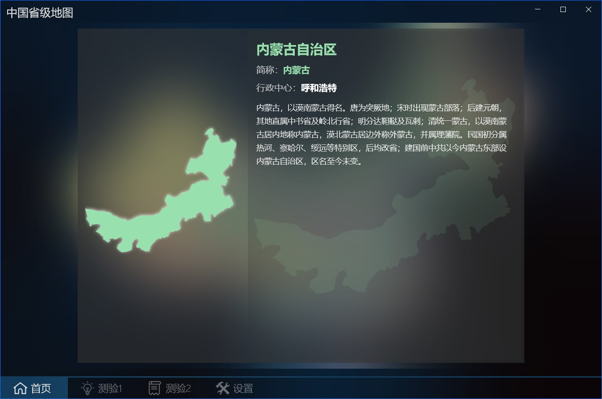
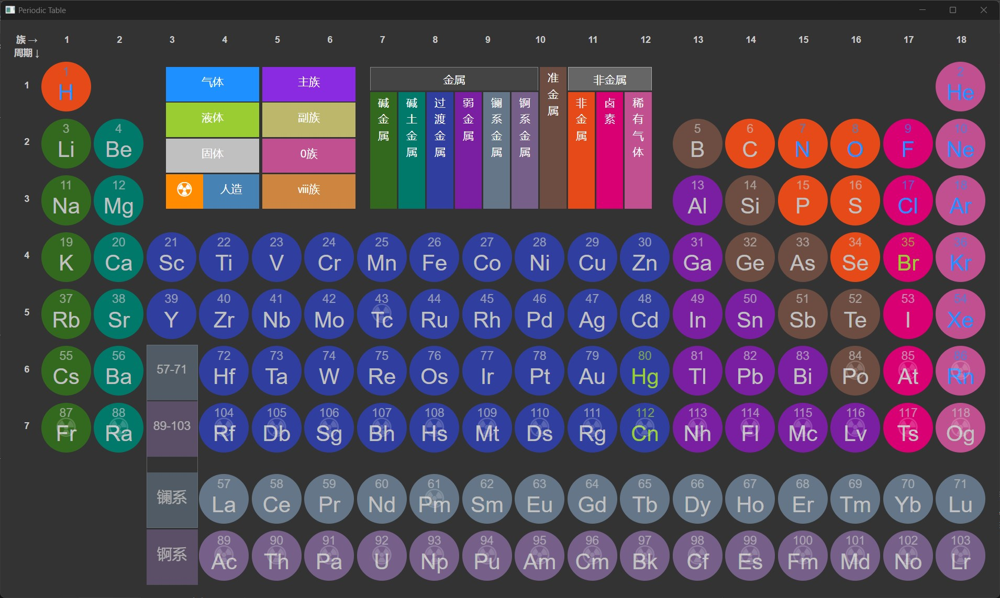
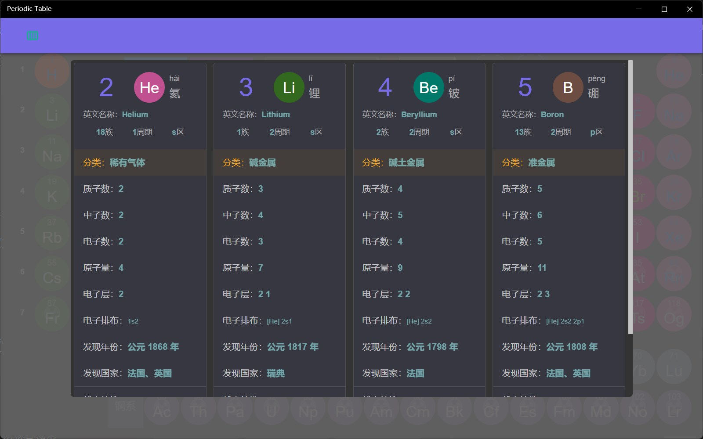

## 拓展提高

### [诗词散文](https://apps.microsoft.com/detail/9NBLGGH42RL7?hl=zh-cn&gl=CN) ###
包含中国从魏晋南北朝到明清时期经典诗歌散文一百四十余首，具有朗读和儿歌形式。包括两汉乐府、南北朝民歌、历代诗歌散文。

### [唐诗300首+](https://apps.microsoft.com/detail/9NWSJ79860Q0?hl=zh-cn&gl=CN)+ ###
包含五言、七言唐诗共计三百余首，分为绝句、律诗、古诗、乐府四类。提供音频、拼音、注释及翻译，可以查看作者介绍、创作背景及诗文鉴赏。

### [宋词300首+](https://apps.microsoft.com/detail/9N80M3VMVBXK?hl=zh-cn&gl=CN) ###
包含宋词三百余首，提供音频、拼音、注释及翻译，可以查看作者介绍、创作背景及诗文鉴赏。

### [元曲300首](https://apps.microsoft.com/detail/9NBLGGH42JP4?hl=zh-cn&gl=CN) ###
包含元曲300首，提供朗读及按照曲牌、作者、标题搜索功能。

### [小学必背古诗文](https://apps.microsoft.com/detail/9NCJSGBVLWWT?hl=zh-cn&gl=CN) ###
小学阶段需要背诵的古代诗文，提供音频、拼音、注释及翻译。

### [中学必背古诗文](https://apps.microsoft.com/detail/9P5B3C3R6GHP?hl=zh-cn&gl=CN) ###
初中阶段需要背诵的古代诗文，提供音频、拼音、注释及翻译，可以查看作者介绍、创作背景及诗文鉴赏。

### [高中必背古诗文](https://apps.microsoft.com/detail/9PCD7LCS18DK?hl=zh-cn&gl=CN) ###
高中阶段需要背诵的古代诗文，提供音频、拼音、注释及翻译，可以查看作者介绍、创作背景及诗文鉴赏。

### [成语大全](https://apps.microsoft.com/detail/9P8DZNDDBTR4?hl=zh-cn&gl=CN) ###
此应用包含三万余条成语，其中标记为常用成语的近四千条。

#### 信息查看 ####
在左侧列表点击一条成语即可查看成语信息，信息包含拼音、出处、解释、示例等。

#### 成语检索 ####
检索功能支持文字和拼音查询，支持模糊匹配，支持通配符‘\_’和‘\*’.
>[!NOTE]
>‘\_’和‘\*’作用相同，每个‘\_’或‘\*’代表一个汉字或一个汉字的拼音
>
>可以通过选中常用成语复选框来过滤常用成语。

* 文字检索，可以查询包含指定文本的所有成语。比如：输入“爱”可以查询包含“爱”字的所有成语，位置任意；
* 文字位置查询，可以查询指定文本在特定位置的成语。比如：输入“\*一”可以查询第二个字是“一”的所有成语；
* 拼音查询，可以查询包含指定读音的所有成语，包括同音字。比如：输入“li”可以查询拼音中包含“li”的成语，位置任意；

* 拼音位置查询，可以查询包指定读音在特定位置的所有成语，包括同音字。比如：输入“ yi * yi”将查询第二和第四个位置拼音为“yi”的成语，如“不以为意”、“时移世异”等。
  >[!NOTE]
  >拼音查询不包含声调，拼音间用空格分隔

#### 特殊类型 ####
选择下方特殊菜单可以查询不同字型的成语，包括AABB、AABC、ABAC、ABCA、ABBC、ABCB、ABCC型的成语。

#### 成语接龙 ####
* 方式：支持顺接和逆接。
* 匹配规则：相同汉字、相同拼音（包含不同声调）、相同声调（同音同调）三种方式。
* 开始方式：
  1. 输入一个成语作为第一个词
  2. 直接点击【开始】随机选择一个成语开始。
* 接龙步骤：
  * 顺接：点击最后一个字作为开始来选择下个成语
  * 逆接：点击第一个字作为最后一个字来选择下个成语
  >[!NOTE]
  >在最后一个成语上进行操作可以在之后进行添加，如果在之前的成语上操作将清除其后的成语重新添加。
  
* 结束方式：点击【结束】按钮将清空接龙结果，可以重新开始。

>[!TIP]
>可以选择检索全部成语或常用成语。
>
>可以选中成语查看拼音、出处、解释及示例。

### [成语接龙诵读](https://apps.microsoft.com/detail/9NP4LCJPZNNM?hl=zh-cn&gl=CN) ###
提供成语接龙的成人和儿童语音的诵读和跟读功能。

### 简笔画 ###
这一系列应用包含五个级别：少儿简笔画、初级简笔画、中级简笔画、高级简笔画和简笔画大师，可用于不同年龄段和绘画水平的儿童和绘画爱好者。

这些应用可用于儿童绘画基础辅助教育，功能包括自由绘画、临摹绘画、绘画填色、图片填色、儿歌步骤学习等，可以打开本地图片文件进行临摹，也可以将画好的图及填色结果保存成图片。

使用方法：

1、绘画：
* 自由绘画：点击上方最左侧空白画布可以新建一张画布在上面自由绘制。
* 临摹绘画：在上方导航区选择一张图片作为背景进行临摹。
* 菜单说明：
  1. 切换导航栏显示状态
  2. 切换为填色模式
  3. 设置画笔尺寸
  4. 设置画笔颜色
  5. 撤销最后一步
  6. 清除画布

2、填色：
点击下方中间菜单的第二个按钮可以切换到填色模式。
* 图片填色：没有绘制时切换到填色模式可以对背景图片进行填色。
* 绘画填色：绘画后切换到填色模式可以对所绘制的图片填色。
* 菜单说明：
  1. 切换导航栏显示状态
  2. 切换为绘画模式
  3. 设置填充颜色
  4. 撤销最后一步
  5. 清除所有填充
   
  >[!WARNING]
  >从填色模式回到绘画模式时所有填色将会被清除

3、步骤或作品：

在步骤或作品界面可以查看绘画简单步骤或欣赏作品，图片点击可以后查看大图，再次点击即可关闭大图。

[少儿简笔画](https://apps.microsoft.com/detail/9MSNH6TTWMHT?hl=zh-cn&gl=CN)
[初级简笔画](https://apps.microsoft.com/detail/9NB3LRCRQ36G?hl=zh-cn&gl=CN)
[中级简笔画](https://apps.microsoft.com/detail/9NDDFLMN19H6?hl=zh-cn&gl=CN)
[高级简笔画](https://apps.microsoft.com/detail/9NBVHHCS2GWW?hl=zh-cn&gl=CN)
[简笔画大师](https://apps.microsoft.com/detail/9NRLNP19TV4R?hl=zh-cn&gl=CN)

>[!TIP]
>少儿简笔画和初级简笔画的打开/保存按钮在下方中间菜单，其他应用在界面左下角，另外其他应用右下角有画布缩放按钮。

### [填色](https://apps.microsoft.com/detail/9PP861LBHWDB?hl=zh-cn&gl=CN) ###
包含一百多张线条画图片，支持打开本地文件填色和导出填好色的图片。
操作方式和简笔画类似。

### [中国百科](https://apps.microsoft.com/detail/9NHFV6M0VMX3?hl=zh-cn&gl=CN) ###
包含十二生肖、二十四节气、时辰、朝代、传统节日等知识，可以帮助了解中国传统文化和认识中国历史。

应用左侧是功能菜单，点击后可以切换到不同的知识界面：

* 十二生肖：
  
  界面上方为十二生肖图标，下方显示了十二生肖的起源和排序依据。
  
  点击生肖图标可以在弹出界面查看各个生肖的英文、时辰和详细介绍。
 

* 二十四节气：
  
  界面上方为节气图标，下方显示了二十四节气的起源和各个版本的节气歌。

  点击节气图标可以在弹出界面查看各个节气的英文、日期、含义等详细介绍。

* 时辰：
  
  界面上方为时辰图标，下方显示了十二时辰的含义和相关知识。

  点击时辰图标可以在弹出界面查看各个时辰的时刻、别名和养生知识等详细介绍。

* 朝代：
  
  界面上方为按时期划分的朝代列表，下方显示了用于记忆朝代的朝代歌。

  点击不同时期可以列出属于该时期的朝代名称，点击朝代名称可以查看朝代的起止年代、创建者、都城，朝代名称来源以及帝王信息等详细介绍。

* 传统节日：
  
  界面上方为传统节日名称，下方显示了中国传统节日的相关知识。

  点击节日名称可以查看节日的英文名称、时间、别称和习俗等详细介绍。

### [中国省级地图](https://apps.microsoft.com/detail/9P1WCC4N8ZLT?hl=zh-cn&gl=CN) ###
可以用于学习记忆中国省级行政区形状及位置，功能包括地图记忆、省份简介、地图和名称对应测试等。

#### 信息查看
首页可以了解各省基本信息，点击省份后显示简介界面，包括省份名称、简称、行政中心和简介，再次点击可以关闭简介界面。

#### 测验1
可以测验省份名称和地图图形对应关系，有简单和困难两种级别。

步骤：
1. 选择难度，难度分为正常和困难级别，困难级别图标将随机旋转一个角度
2. 选择数量
3. 点击开始，自动生成训练题目，上方为题目，下方为结果选项。
4. 答题，对于上方每个题目，在下方选择出正确的省份图标；选择答案后会自动跳到下个未解答题目，也可以在上方题目区域点击来进行切换。
5. 结束，所有题目答完自动结束，也可以点击结束按钮结束答题。

#### 测验2
需要从下方名称中选择地图上高亮区域的正确名称。

点击开始后会随机对地图区域高亮，选择答案后会自动显示下个高亮区域。

答题正确区域会填充绿色，否则填充红色，全部填充满答题结束。

### [世界各国概况](https://apps.microsoft.com/detail/9P65BSZH61RM?hl=zh-cn&gl=CN) ###
此应用可以用于了解世界各国地图和基本概况介绍，并可以帮助记忆各国国旗和首都。

首页可以了解各国基本信息，在地图上点击国家后显示简介界面，再次点击可以关闭简介界面。

在简介界面可以查看国旗和国徽的图像及其含义、英文名称、首都、国土面积、时区、民族等信息。

上方的文本框中输入国家名称或域名代码可以进行筛选。下方菜单按钮包含清除、显示简介、筛选功能。

通过筛选按钮可以按洲对国家进行筛选，点击国家名称可以在地图上高亮显示国家位置。

#### 记忆测试
测验界面可以测验国旗或者首都和国家对应关系。

界面中选择类型、数量后，点击开始会自动生成测试题目，上方为题目，下方为结果选项。

对于上方每个题目，需要在下方选择出正确的国家名称；选择答案后会自动跳到下个未解答题目，也可以在上方题目区域点击来进行切换。

### [中国诗词大全](https://apps.microsoft.com/detail/9P3432W9K924?hl=zh-cn&gl=CN) ###
此应用包含中国古代从先秦到清朝的诗词33万余首，支持查询及背诵记忆。

首页默认显示一页随机诗词，点击绿色按钮可以切换随机诗词。在查询条件输入名称、作者、词牌名或内容可以根据条件进行组合查询，首页展示内容为诗词前2~4行，可以点击诗词查看完整内容。

点击诗词查看诗词完整内容时支持简体和繁体转换显示，支持显示拼音，由于存在多音字，此音节不一定正确，多音字默认显示第一个音节，可以选中多音字来查看其他读音。

#### 诗词背诵
在查看内容页点击记忆按钮可以进行背诵记忆，背诵时可以提示首字、尾字、标点。背诵时可以选择选字方式和输入方式。

* 选字方式：默认方式，在左侧选择位置，再从右侧选择该位置的文字填入，文字正确会显示绿色并自动跳到下个待填位置，错误提示红色。
* 输入方式：点击输入按钮可以切换为输入方式，此方式可以快速填入诗词内容。
输入方式需要先在左侧选择起始匹配行，输入完成点击右侧确认按钮进行验证。
验证时会从选择行第一个字开始自动填入并进行对比，会以颜色提示对比结果，可以修改输入内容多次验证。

### [古诗文背诵](https://apps.microsoft.com/detail/9NSJ6FNW6F8N?hl=zh-cn&gl=CN) ###
包含唐诗、宋词、元曲等1500余首古诗文，支持桌面通知模式。
应用首页初始会显示所有星标的诗文，初始星标类别为“七言绝句”和“五言绝句”，所有星标的诗文会加入到桌面通知中。

可以点击菜单栏的按钮切换类别查看此类的所有诗文，点击一篇诗文可以查看诗文的完整内容。

诗文查看界面显示诗文完整内容，可以通过菜单栏的星标按钮将诗文标记或取消标记，标记的诗文会加入到桌面通知列表。

#### 背诵模式
通过菜单栏可以切换到背诵模式背诵诗文或检验记忆效果。

背诵模式需要逐字完成每句诗文的内容，方式为从下方选项中选择每个位置正确的汉字，每完成一句会显示在左侧并自动切换到下一句，直至完成整篇诗文。

#### 桌面通知设置
>[!NOTE]
>初始时桌面通知未打开，可以通过配置界面中的【自动开始】启用自动通知功能。

设置项包括：
* 显示位置：可以设置右上角、右下角、左上角、左下角、顶部中间、底部中间、屏幕中央
* 持续时间：可以设置为3秒到1分钟，选择【手动】时，桌面通知将不会自动关闭，需要鼠标点击后才会关闭。
* 背景和文字颜色
* 文字的字号：可以设置16到40之间的值
* 分行提示：选中后可以将一篇诗文按指定行数拆分成多个提示通知，否则会在通知时显示完整诗文。
* 自动开始：选中后可以在打开应用时自动开启桌面通知。
* 通知类别设置：点击右侧各类别的星标可以在通知列表中添加或删除整个类别的内容。
* 点击【应用】可以将设置保存下来，【关闭】可以关闭对话框但不保存设置。  
* 播放/停止按钮可以预览设置，也可以控制当前的桌面通知。

>[!TIP]
> 没有点击【应用】的设置不会保存，此时的修改在点击播放按钮时可以预览，但是在重新打开配置界面或应用时将会丢失。

桌面通知效果：

#### 任务栏图标操作
关闭窗口时可以选择隐藏到任务栏图标，任务栏图标左键单击可以还原窗口，右键菜单可以开始或停止桌面通知。

### [元素周期表+](https://apps.microsoft.com/detail/9NJKL858L4VS?hl=zh-cn&gl=CN) ###
包含已发现的全部118种元素的基本信息，默认显示基本信息：原子序数、元素符号，以不同颜色区分不同分类。
鼠标悬停后增加显示中文名称和原子量。
鼠标悬停在族和周期编号以及分类上时，可以高亮显示对应类别的元素。

点击后可以查看元素的详细信息，包括：原子序数、元素符号、中英文名称、族、周期、区、质子数、中子数、电子数、质量数、类型、物理化学性质、丰度、历史、用途、特点、发现时间、发现者、发现国等。

#### 元素比较
查看分组后可以选择2-4中元素比较元素信息
>[!NOTE]
>仅【元素周期表 +】支持分组查看及比较功能

[元素周期表PWA](https://apps.microsoft.com/detail/9PCQBHB8R04G?hl=zh-cn&gl=CN)

[在线使用](https://periodictableblazor.azurewebsites.net)

