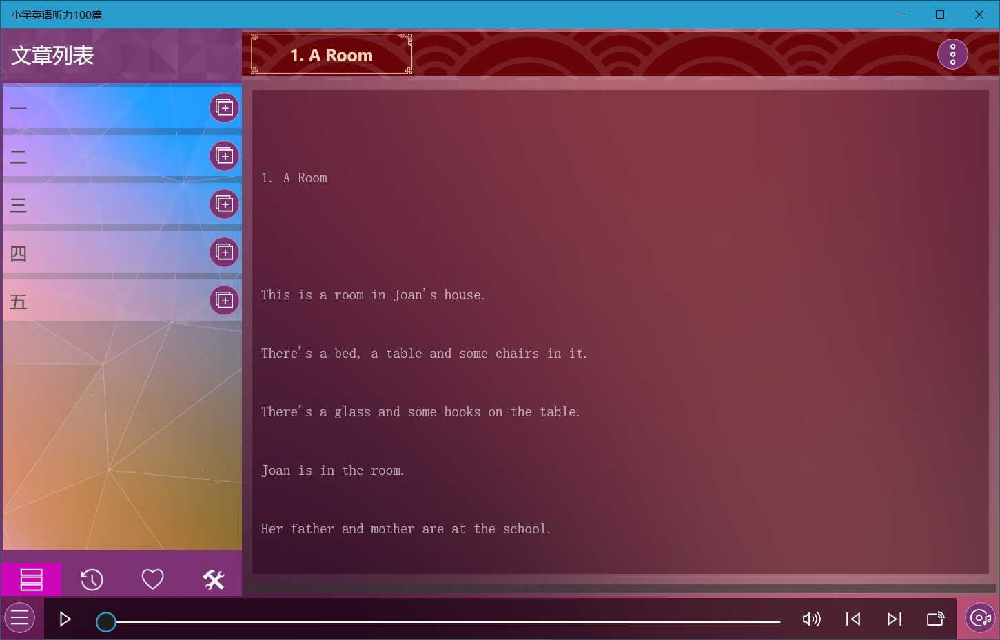
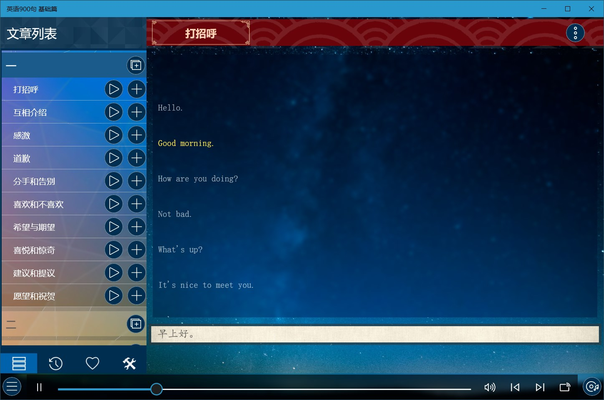
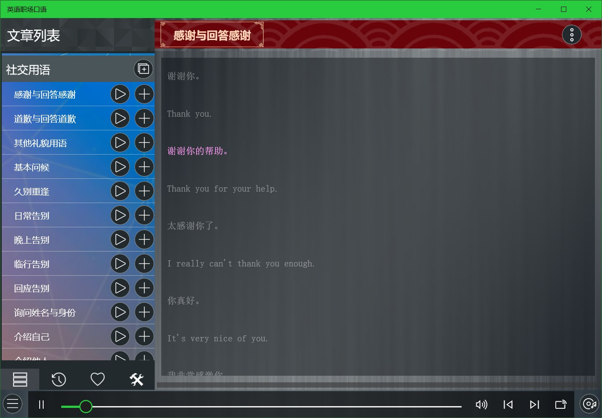
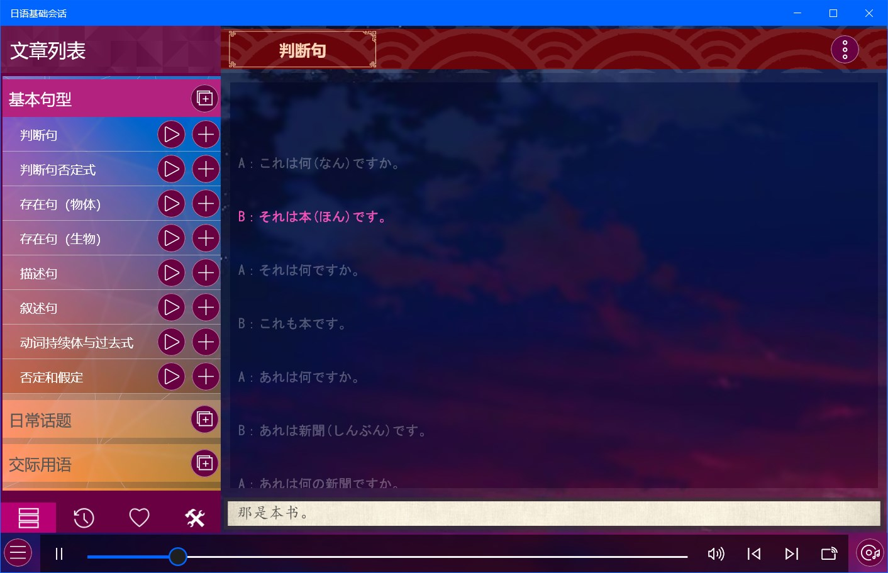

## 英语学习

### [千万别学英语](https://apps.microsoft.com/detail/9N1LDB3LP7NK?hl=zh-cn&gl=CN) ###
提供《千万别学英语》的音频及单词注释。

### [小学英语听力](https://apps.microsoft.com/detail/9N097LX5NH27?hl=zh-cn&gl=CN) ###
提供《小学英语听力》的音频及单词注释。

### [小学英语听力100篇](https://apps.microsoft.com/detail/9P55LZ1VSR5S?hl=zh-cn&gl=CN) ###
提供《小学英语听力100篇》的音频及单词注释。

### [小学英语晨读](https://apps.microsoft.com/detail/9MXRXDHZ8CVT?hl=zh-cn&gl=CN) ###
提供《小学英语晨读》的音频及单词注释。

### [小学英语阅读](https://apps.microsoft.com/detail/9NDVPQHR9J2M?hl=zh-cn&gl=CN) ###
提供《小学英语阅读》的音频及单词注释。

### [小学英语会话](https://apps.microsoft.com/detail/9P4HJ8KDZ0L1?hl=zh-cn&gl=CN) ###
提供《小学英语会话》的音频及单词注释。

### [英文故事100篇](https://apps.microsoft.com/detail/9NCSXGKG8CJK?hl=zh-cn&gl=CN) ###
提供《英文故事100篇》的音频及单词注释。

### [英文日常会话](https://apps.microsoft.com/detail/9PBGXLTJZNR8?hl=zh-cn&gl=CN) ###
提供《英文日常会话》的音频及单词注释。

### [英语900句 基础篇](https://apps.microsoft.com/detail/9MVKPKF9B1ZS?hl=zh-cn&gl=CN) ###
提供《英语900句 基础篇》的音频及单词注释。

### [英语900句 生活篇](https://apps.microsoft.com/detail/9PPJHZDFWDD0?hl=zh-cn&gl=CN) ###
提供《英语900句 生活篇》的音频及单词注释，精选60个不同日常生活的场景，包括从学校与教育，工作和职业，购物等等各个情景会话。

### [英语口语3000句](https://apps.microsoft.com/detail/9NQK8N5B10LL?hl=zh-cn&gl=CN) ###
提供《英语口语3000句》的音频及单词注释。

### 英语日常口语 ###
提供《英语日常口语》的音频及单词注释，包括家庭生活、日常生活、餐厅用餐、美容美发、恋爱婚姻和节日庆祝的6大场景口语对话及句子表达。

### [英语职场口语](https://apps.microsoft.com/detail/9P2FZQ13G1JS?hl=zh-cn&gl=CN) ###
提供《英语职场口语》的音频及单词注释，包括社交用语、面试问答、面试实战、初入职场、身在职场、医护人员英语和警察英语的7大场景口语对话及句子表达。

### [雅思口语900句](https://apps.microsoft.com/detail/9NCH3P5K41S9?hl=zh-cn&gl=CN) ###
提供《雅思口语900句》的音频及单词注释。

## 其他语言学习

### [韩语字母表](https://apps.microsoft.com/detail/9PMK5CMKZZTK?hl=zh-cn&gl=CN) ###
功能包括读音学习、笔顺学习、书写练习、记忆训练等。

### [日语50音图](https://apps.microsoft.com/detail/9NC8KSMB6W44?hl=zh-cn&gl=CN) ###
功能包括读音学习、笔顺学习、书写练习、记忆训练等。

### [日语900句](https://apps.microsoft.com/detail/9PGGP3J4MXXZ?hl=zh-cn&gl=CN) ###
包含日语中常用的900个句子，提供音频及翻译。

### [日语基础会话](https://apps.microsoft.com/detail/9NWK38NF9XQH?hl=zh-cn&gl=CN) ###
包含基本句型、交际用语、日常话题、心情表达四大部分的日语基础情景会话表达，提供音频及翻译，可用于学习日语的基础日常表达。

### [50音图](https://apps.microsoft.com/detail/9NHZ8R1QFXR2?hl=zh-cn&gl=CN) ###
日语50音图的学习工具，支持按行列分类记忆及顺序测试。

