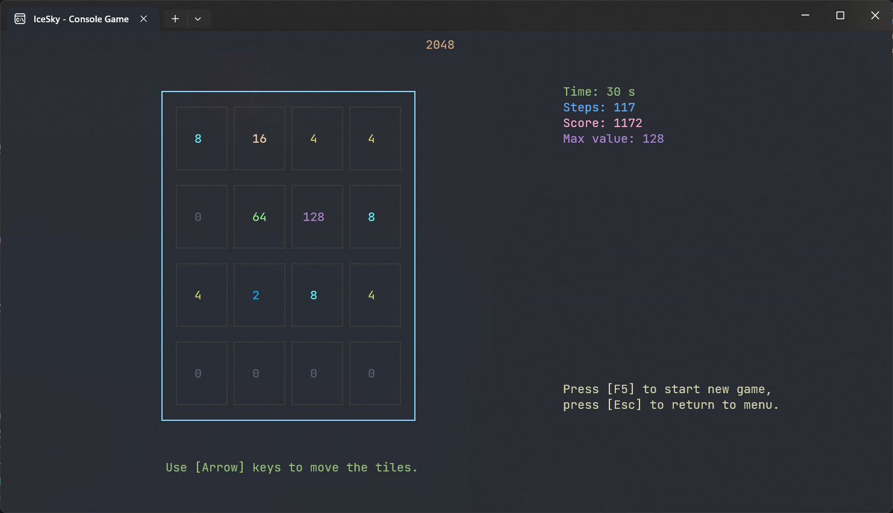
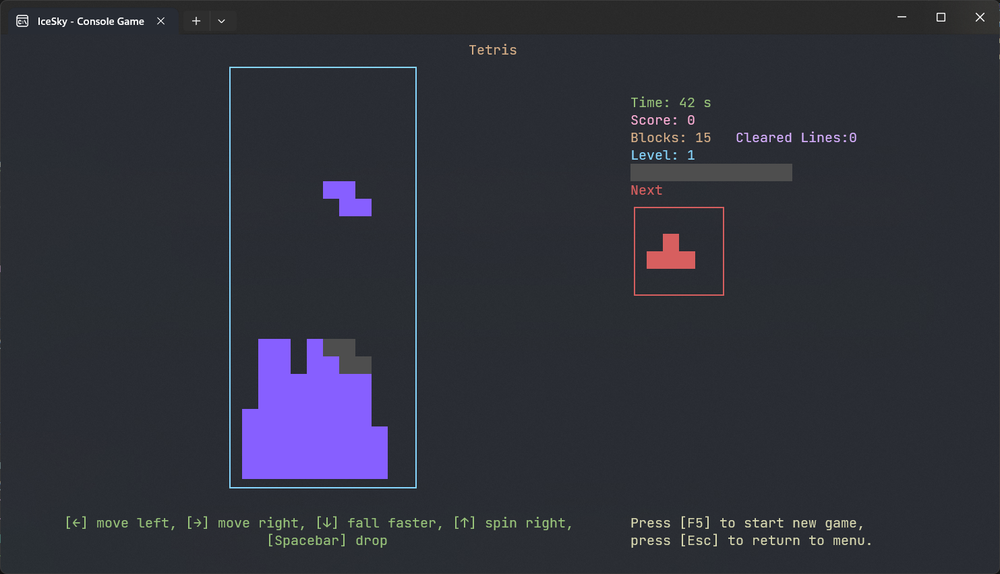

This app is a collection of console games, it include 12 classic games with a simple interface and keyboard controls.

### How to play 

Use the [Arrow] keys on the home page to select the game, select the game and press the [Enter] key to enter the game.
> In all games, you can press [F5] to start a new game, and press the [Esc] key to return to the home page.

#### 2048
Use the [Arrow] keys to control and get the highest score possible

#### Drive
Use the [Arrow] keys to control, and if you hit a wall, the game will end

#### Light On
The goal is to turn off all lights, use the [Arrow] keys to move the cursor, the [Enter] key to toggle the switch state, the [Backspace] key to restart the game, and the [F1/F2/F3] toggle number to 4x4/5x5/6x6

#### Memory
Find all the paired numbers by flipping, use the [Arrow] keys to move the cursor, [Enter] to flip, and [F1/F2/F3] to switch the number to 4x4/5x5/6x6

#### Number Guess
Guess a given number within 6 times, use the [Arrow] keys to move the cursor, [1~9] to enter the number, [Enter] to confirm, [F1/F2] to switch between 4 or 5 digits

#### PingPang
Play PingPang with the computer, and the first to score 3 points wins. Use the [↑/↓] keys to move

#### Reversi
Play with the computer, and in the end, the player with the most pieces wins. Use [↑/↓] keys to move the cursor, and press [Enter] to confirm

#### Rythm
Press the corresponding [Arrow] keys when the color block lands within the gray area, and 10 mistakes will fail.

#### Sliding
Use the [Arrow] keys to move the numbers until all the numbers are in order from left to right and top to bottom. [F1/F2/F3] toggle the number of numbers to 8/15/24 images

#### Tetris
A classic Tetris game, use the [←/→] keys to move the block, the [↑] key to rotate the block, the [↓] key to accelerate the fall, and the [Spacebar] to drop directly

#### TicTacToe
Play a tic-tac-toe game with the computer, and the first to play a horizontal/vertical/diagonal triple wins. Use the [Arrow] keys to move the cursor, and press [Enter] to confirm

#### Wordle
Guess a given English word within 6 times. Use the [Arrow] keys to move the cursor, [A~Z] to enter letters, [Enter] to confirm, [F1/F2/F3] to switch 4/5/6 letter words, and [Backspace] to delete letter

[Microsoft Store](https://apps.microsoft.com/detail/9NHD6FTW9WSN)