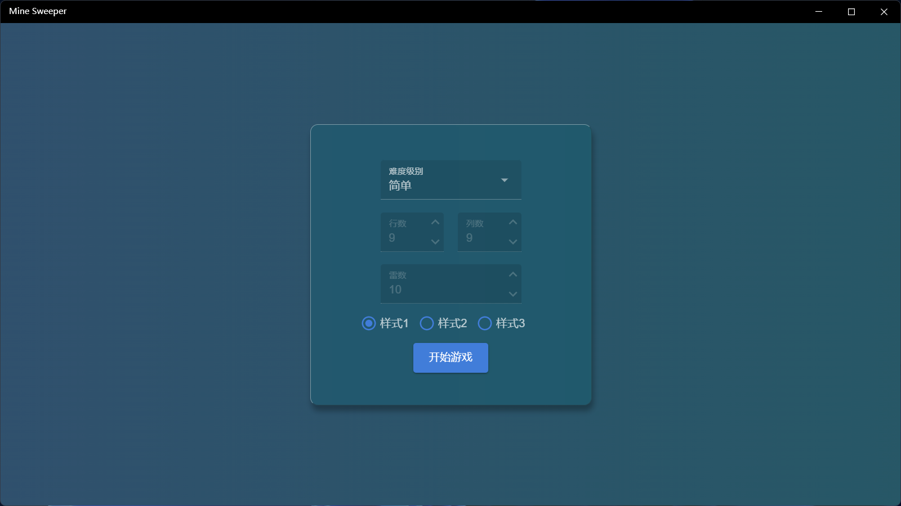
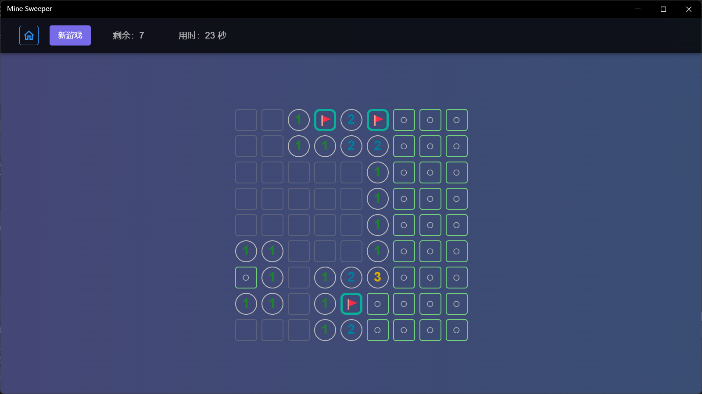
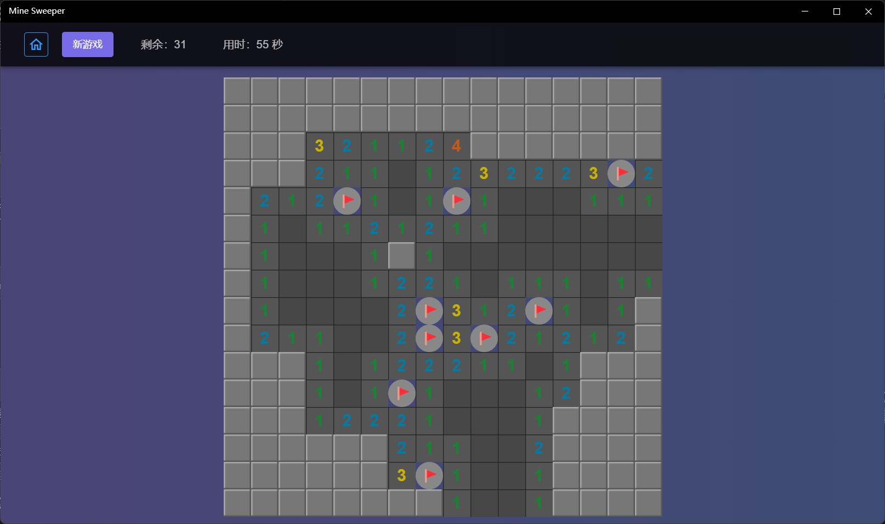
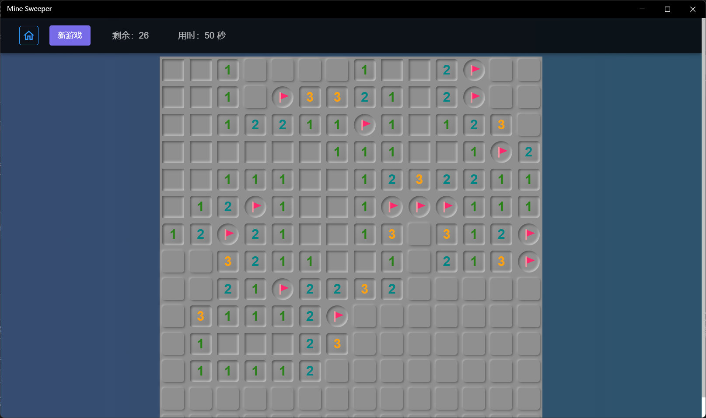

This app implements the classic Minesweeper gameplay, with 3 predefined styles to choose.

### How to play 

1. On the home page, select the difficulty level, you can choose from 3 predefined levels, or you can choose to customize to set the number of rows, columns and mines.

2. You can choose one of the three predefined styles and click Start Game to enter the game.
3. Mode switching: After entering the game, the button on the right side of the [New Game] in the top menu bar can switch between the flip mode and the flag mode.
4. Flip operation: Left-click the unflaged grid in flip mode to flip it open, in flag mode use right-click to flip it open.
5. Flag operation: Right-click the grid in flip mode to switch flag, and left-click in flag mode to do this.
6. Quick flip: Click on the number (left or right click), if the number of 3x3 range flags around this grid is the same as the number, will quickly open all unflaged grids in the 3x3 range.
7. Result determine: All non-mine grid are turned over is success, and turning over any one mine grid is failure.
8. After entering the game, click the [New Game] button in the top menu bar can start a new game, and the mine position will be rearranged.
9. Click the leftmost button on the top menu bar to return to the home page.

### Style 1

### Style 2

### Style 3
