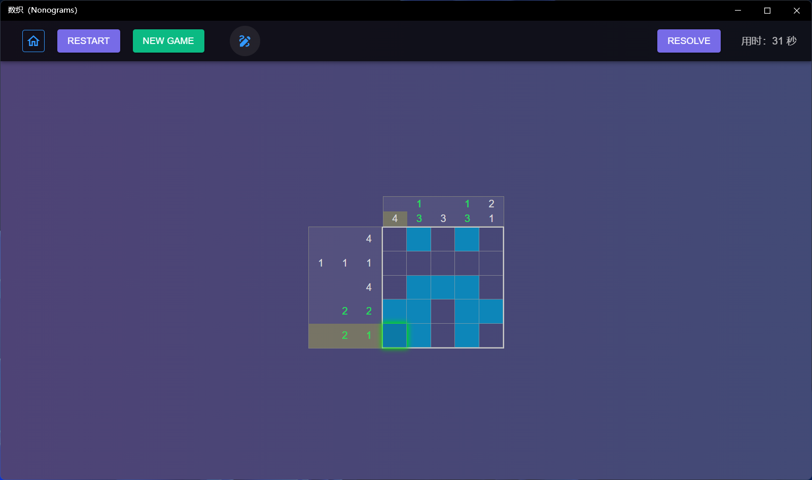
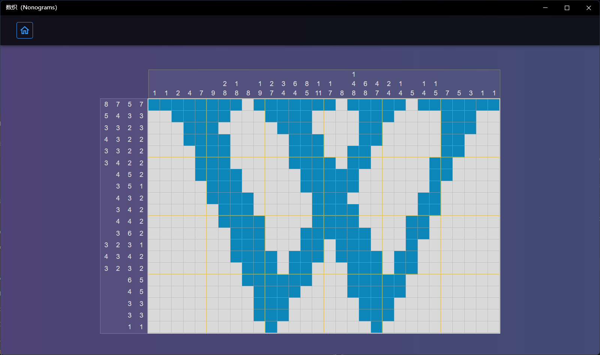

Include normal version and solve version, random mode supports custom number of rows and columns, the range is 3x3~50x50, the solve version has automatic solving function, contains more levels and professional modes.

### How to play 

1. Select the game mode, the game includes random mode, level mode, char mode, symbol mode, and expert mode (**Unique to the Solve Version**).

2. The random mode can choose the number of rows and columns, and the other modes can choose the level.
3. Click "Start" to enter the game.
   There are three states for cells in the game:
   * Blank state: The initial state, no fill and no marker, no background color
   * Fill Status: The numbers on the left and above are calculated for this state, with a blue background
   * Marking Status: Mark non-filled cells with a white background
  

4. Toggle the operation mode: Click the toggle button in the middle of the top toolbar to switch between the draw mode and the clear mode.
   In draw mode, use left-click to toggle cell fill and blank state, and right-click to toggle marking and blank state.
   Left and right button function swaped in clear mode.
   > Supports continuous drawing or clearing when mouse button pressed and dragging

5. Restart: Click the [Restart] button to clear the grid and restart the game.
6. New Game: Click [New Game] to start a new game.
   >! Available only in random mode

7. Automatic solving: In random mode, you can click the [Resolve] button on the right side of the top toolbar to display the results directly.

8. To exit the game: Click the [Home] button on the top toolbar to return to the home page.

### Automatic solve puzzle

>! Unique to the Solve Version

1. Click [Solve Puzzle] on the home page to enter the solve setting page.

2. Select the number of rows and columns, the minimum value is 3x3, and the maximum value is 50x50
3. Enter the row and column hints:
   
   Line hints are the numbers on the left side of the grid, enter each row hint in order from top to bottom, and the numbers in each row are separated by ",", and the lines are separated by a space.

   Column hints are the numbers above the grid, enter each column hint in order from left to right, and the numbers in each column are separated by ",", and the columns are separated by a space.
4. Click the [Solve] button will verify the hints, including the number of rows and columns and the format.
   
   After the verification is passed, try to solve the puzzle automatically, and the result will be displayed if it succeeds.

   Click the [Cancel] button to return to the home page.

>! Puzzles with more than one answers will pop up an error message, need to modify the hints value to continue.

1. Click the [Home] button on top of the result page to return to the home page.

[Microsoft Store](https://apps.microsoft.com/detail/9NP8GH864JTW)

[Solve Version](https://apps.microsoft.com/detail/9P9938FPD2MM)
