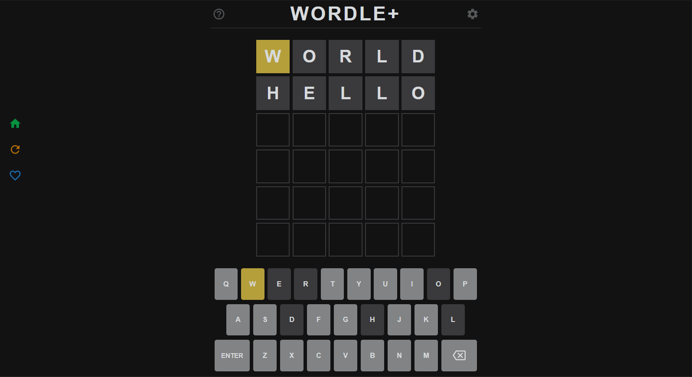

This app is a collection of urls for dozens of word guessing games, including guessing numbers, English words, Chinese characters, Chinese idioms, Japanese and Korean word guessing, and more.

### How to play
1. Select a category
   
   On the homepage of the game, select the game category you want to play, app contains 8 categories:
   * English Words: Contains a variety of English words of different lengths
   * English Names: English name containing country, animal, movie, car, etc
   * English Options: Contains multiple games with custom options, such as quantity, grouping, etc
   * English Others: Contains English word games with specific requirements
   * Chinese: Contains guessing idioms, pinyin, poetry, characters, Cantonese, etc
   * Other languages: Word guessing games in Japanese and Korean
   * Numbers: Contains different types of number guessing games
   * Miscellaneous: Contains a variety of other types of word guessing games, such as letters, pictures, emojis, etc
  
   Click on these category title to view the game list within the category.

2. Enter the game
   
   The category shows the name of the game in the form of a card, with the icon on the right indicating the feature of the game. Click on these cards to access the corresponding game.
   >! Some games may be inaccessible due to shutdowns or network issues
   
   

3. Play the game
   
   Once the game is loaded, the corresponding game page will be displayed, and you can play according to the instructions inside each game.

4. Exit the game
   
   After entering the game, there will be a menu on the left side of the page, click the first Home button to return to the home page, and the second button to refresh the page.

5. Favourite operate
   
   The first category on the homepage is the Favourite list, which can be used to quickly enter the game. The way to add is: After entering the game, click the third "♡" button on the left menu. If you want to remove it, you can click the delete button on the right side of the Favourite list, or you can click the third "♡" button in the menu again in the game page.

[Microsoft Store](https://apps.microsoft.com/detail/9NLX9V1X4MRL)

[PWA](https://apps.microsoft.com/detail/9N61ZN52ZCWC)

This app is also available on the web and can be used [online](https://xxxxlegame.azurewebsites.net)