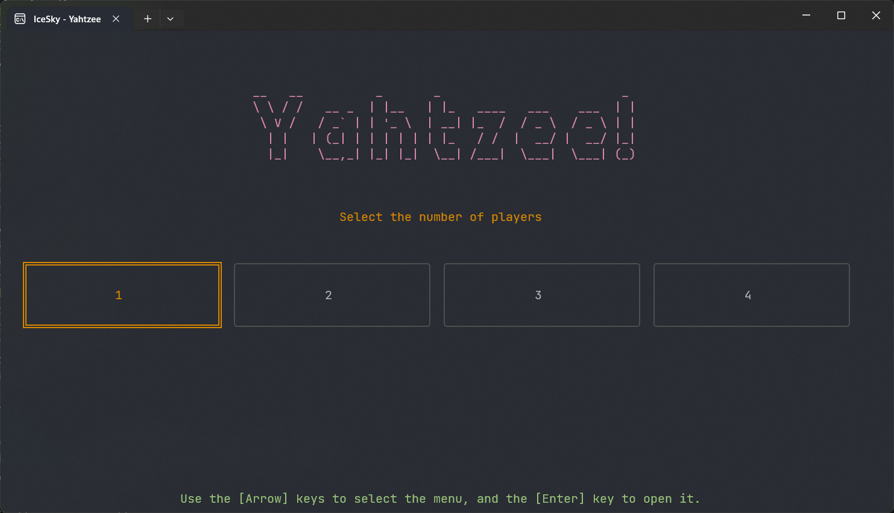
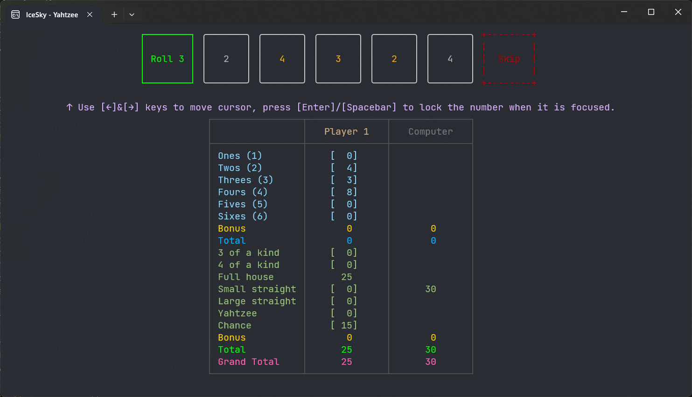

Yahtzee game running on the console, supporting play with computer and 2~4 player multiplayer game.

### How to play 

1. Use the [←/→] keys on the home page to select the number of players, press the [Enter] key to confirm, and select 1 player to play with the computer.
   

2. After entering the game, roll the dice above, use the [←/→] keys to select the operation, and the [Space] or [Enter] key to confirm. When the number is selected, you can toggle the lock state, green on the left to make a roll, and red on the right to skip the roll for scoring.
3. After rolling 3 times or skipping the roll, enter the scoring stage, use the [↑/↓] keys to select the scoring type, and the [Space] or [Enter] keys to confirm.
4. After the score is confirmed, the next player will roll, and multiple players will take turns in turn.
5. The game ends when each player's 13 points are filled up, and the player with the highest total score wins.

> When playing with a computer, the computer will operate automatically without the user's involvement.
> 
> You can use the [F5] key to start a new game during or after the game, and the [Esc] key to return to the home page.

[Microsoft Store](https://apps.microsoft.com/detail/9NXDKGM9RS97)