此应用是一款控制台游戏集合，包含12款经典游戏，界面简洁，使用键盘进行操作。

### 操作方法 

在首页使用【方向键】选择游戏，选中游戏后按【回车】键进入游戏。
> 所有游戏界面都可以按【F5】开始新游戏，按【Esc】键返回菜单。

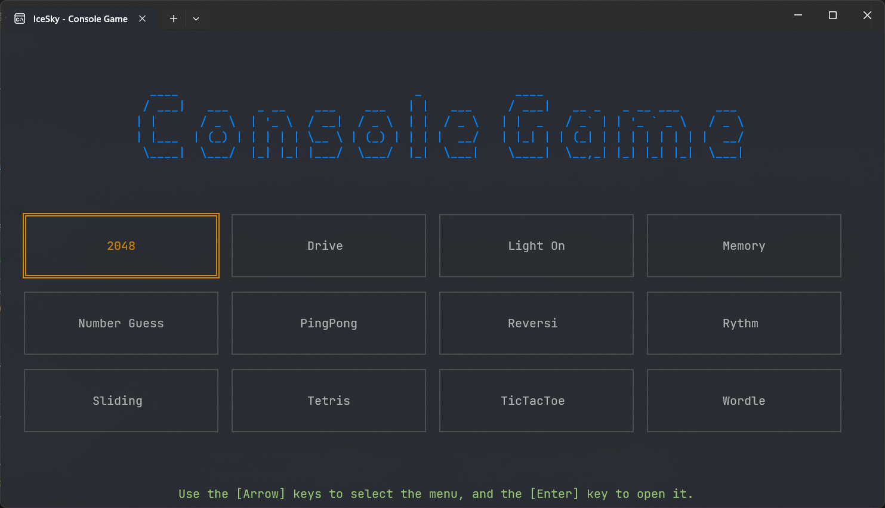

#### 2048
使用【方向键】进行操作，尽量取得最高分

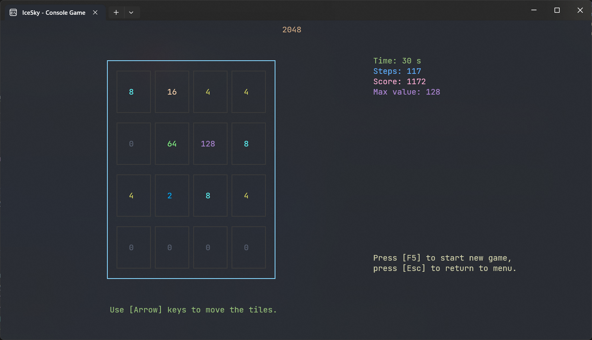

#### 模拟赛车（Drive）
使用【方向键】进行操作，撞击墙壁后游戏结束

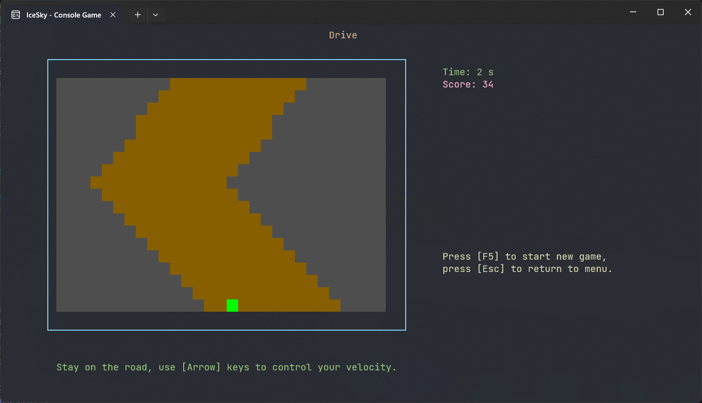

#### 关灯游戏（Light On）
目标是将所有灯关闭，使用【方向键】移动光标，【回车】键切换开关状态，【退格】键重新开始本局，【F1/F2/F3】切换数量为4x4/5x5/6x6

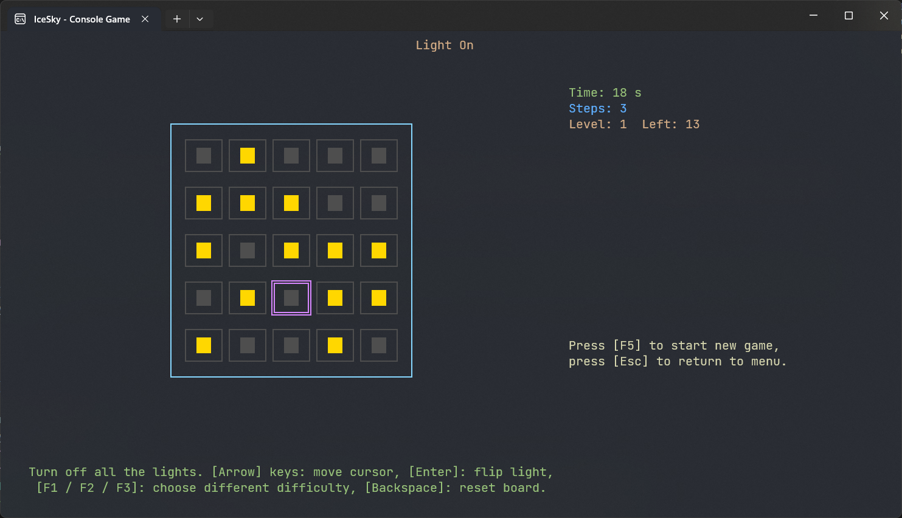

#### 记忆卡片（Memory）
通过翻转找出所有配对的数字，使用【方向键】移动光标，【回车】键进行翻转，【F1/F2/F3】切换数量为4x4/5x5/6x6

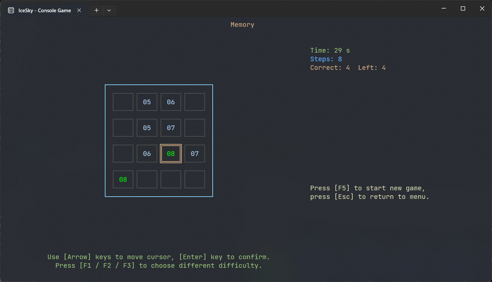

#### 猜数字（Number Guess）
在6次之内猜出给定的数字，使用【方向键】移动光标，【1~9】键输入数字，【回车】键进行确认，【F1/F2】切换4位或5位数字

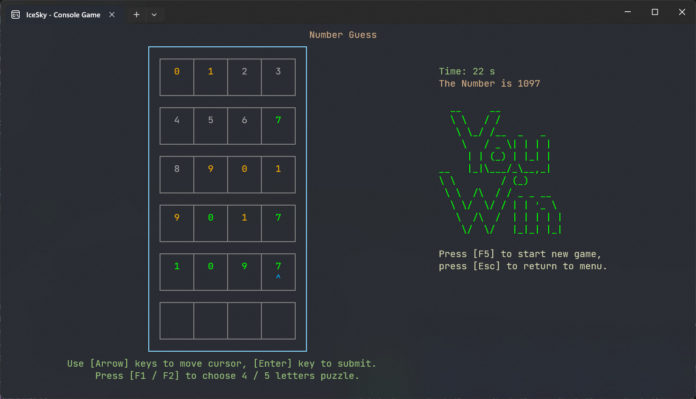

#### 乒乓球（PingPang）
和电脑进行乒乓球对战，先获得3分者胜出。使用【上下】键进行移动

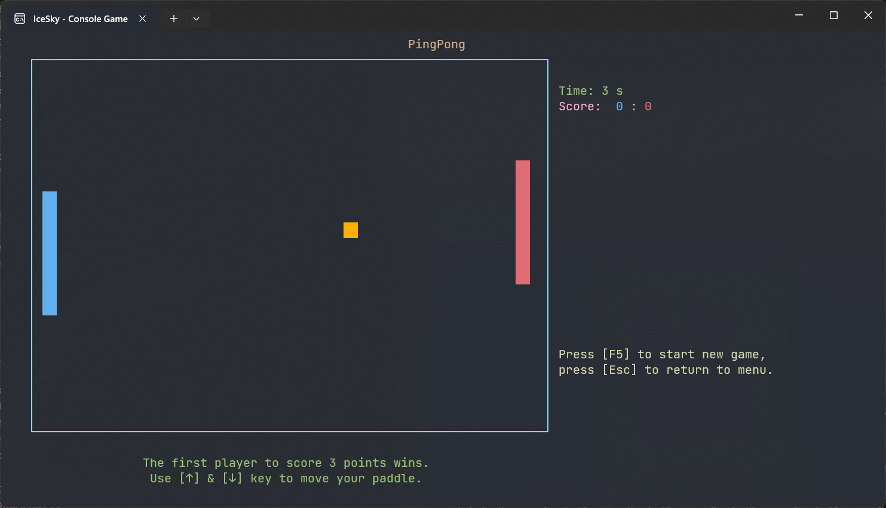

#### 翻转棋（Reversi）
和电脑进行比赛，最终棋子多者获胜。使用【方向键】移动光标，【回车】键进行确认

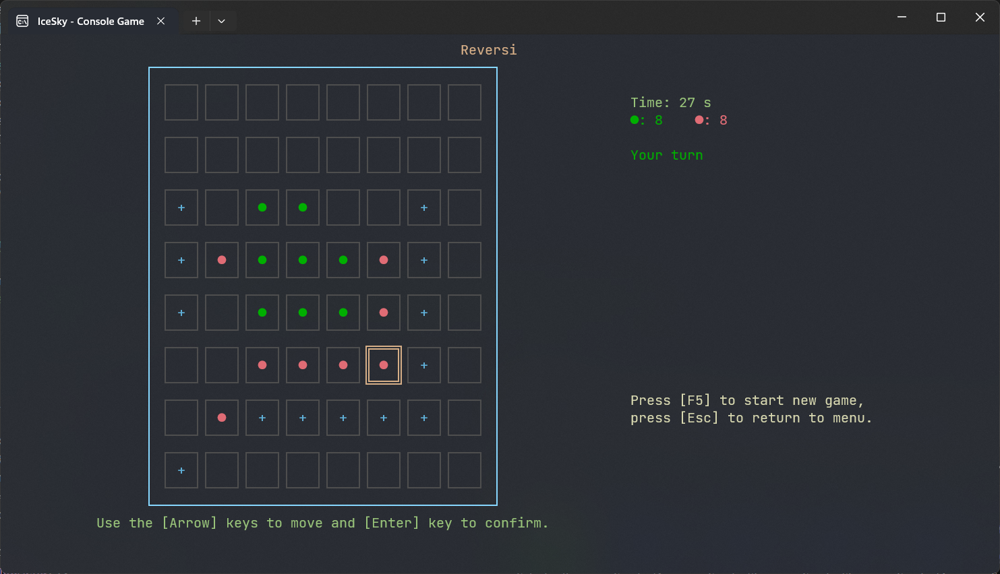

#### 节奏大师（Rythm）
在色块降落到灰色区域之内时按对应的方向键，失误10次将失败。使用【方向键】进行操作

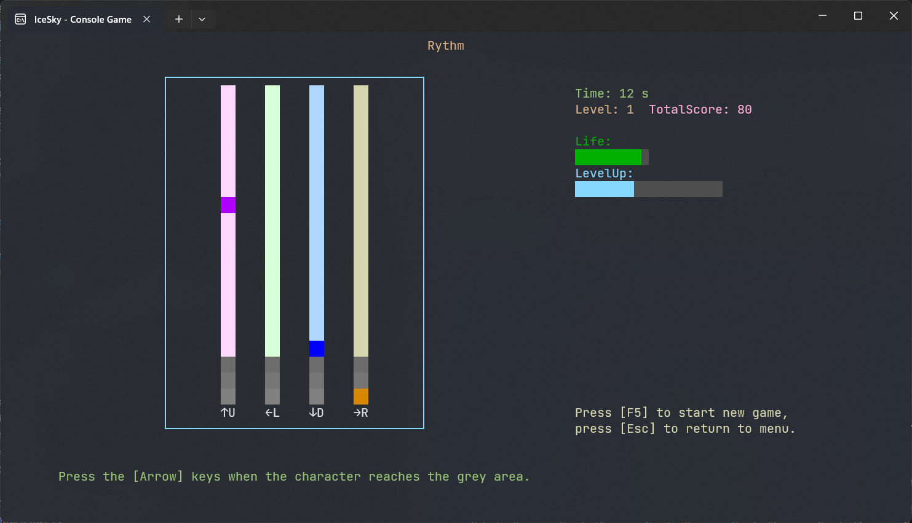

#### 数字拼图（Sliding）
使用方向键移动数字，直到所有数字按从左到右从上到下的顺序依次排列。使用【方向键】进行操作，【F1/F2/F3】切换数字数量为8/15/24图片

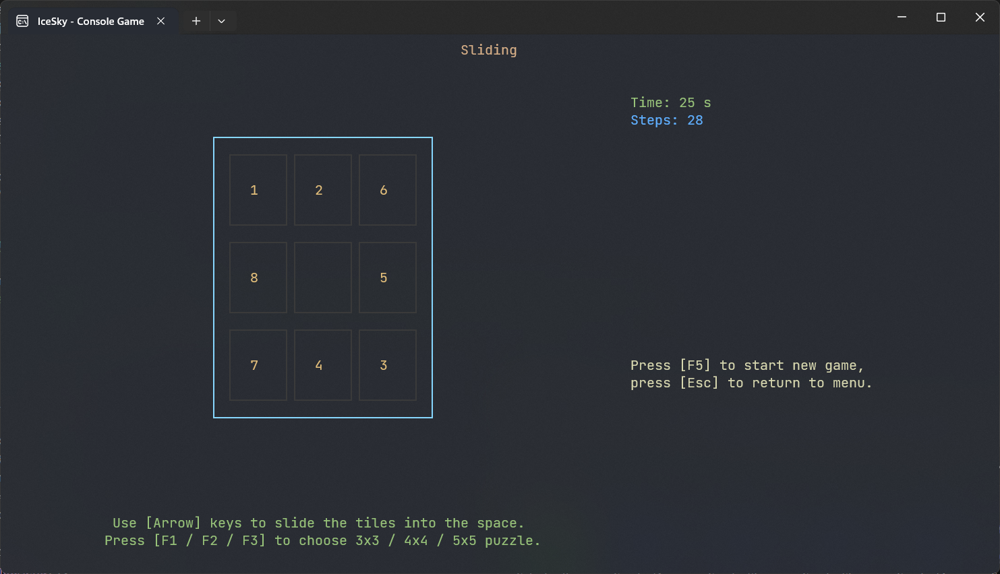

#### 俄罗斯方块（Tetris）
经典的俄罗斯方块游戏，使用【左右】键移动方块，【上】键旋转方块，【下】键加速下降，【空格键】直接下落

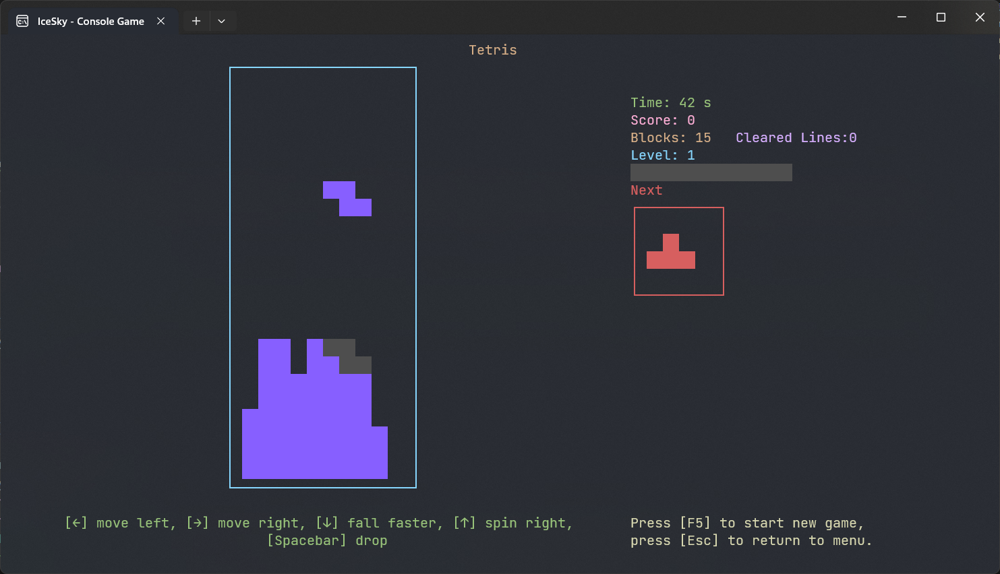

#### 井字棋（TicTacToe）
和电脑进行井字棋游戏，先下出横/竖/斜向三连者获胜。使用【方向键】移动光标，【回车】键进行确认

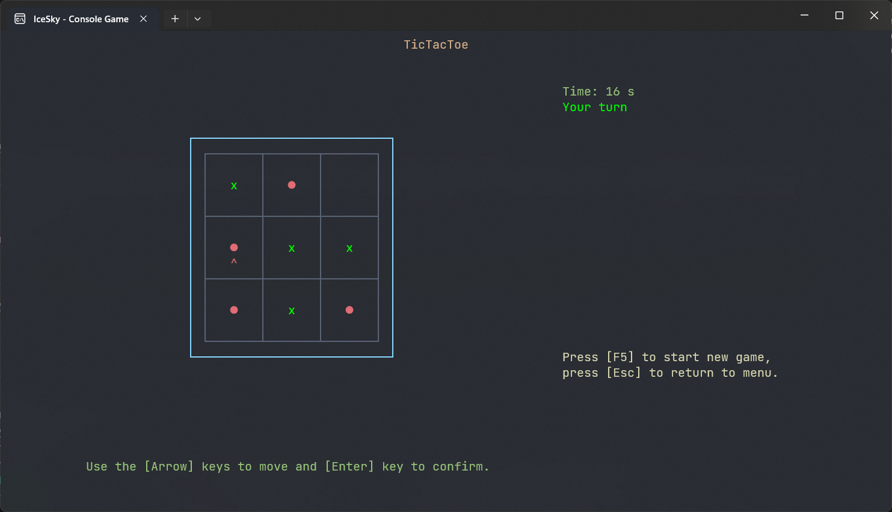

#### Wordle
在6次之内猜出给定的英文单词。使用【方向键】移动光标，【A~Z】键输入字母，【回车】键进行确认，【F1/F2/F3】切换4/5/6位字母的单词，【退格】键可以删除字母

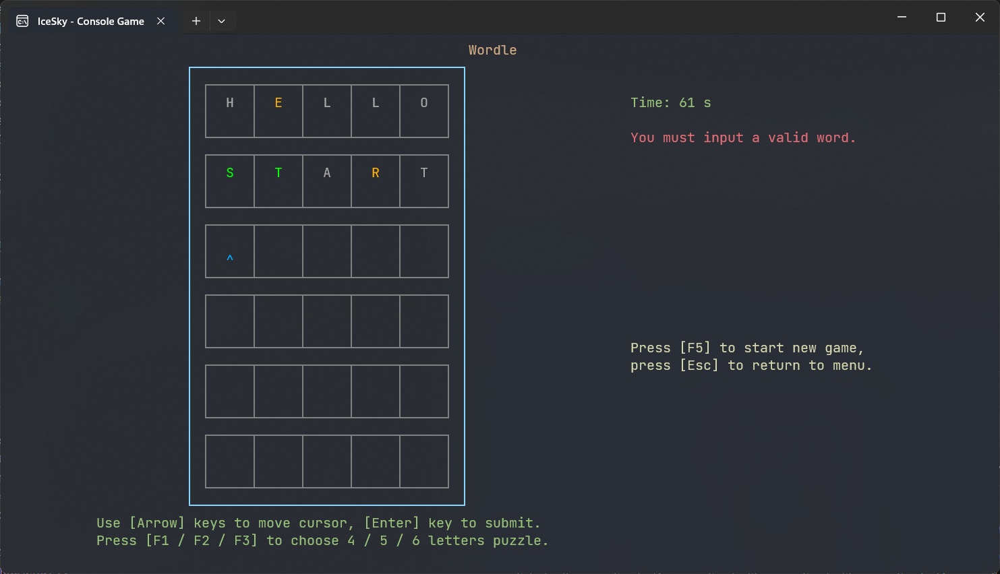

[商店下载](https://apps.microsoft.com/detail/9NHD6FTW9WSN)