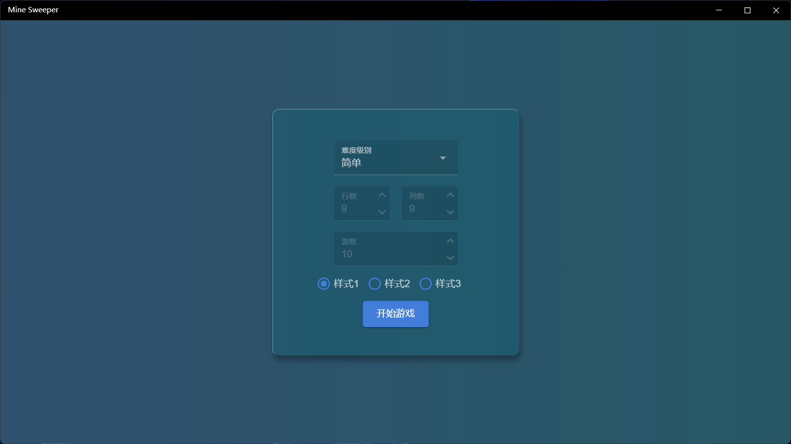

此应用实现了经典扫雷的玩法，有3种预定义样式以供选择。
### 操作方法 

1. 在首页选择难度级别，难度可选预定义的3个级别，也可以选择自定义，自定义可以设置行列数和雷数。

2. 可以选择三种预定义风格中的一种，点击开始游戏进入游戏。
3. 模式切换：进入游戏后，上方菜单栏【新游戏】右侧按钮可以切换翻开模式和标记模式。
4. 翻开操作：翻开模式下左键点击无标记格子会直接翻开，标记模式下右键点击执行翻开。
5. 标记操作：翻开模式下右键点击格子可以切换标记，标记模式下左键点击执行此操作。
6. 快速翻开：点击数字（左右键均可），若此格子周围3x3范围标记数量和数字一致，则可快速翻开3x3范围内的全部未标记格子。
7. 结果判定：所有非地雷格子全部翻开即为成功，翻开地雷即为失败。
8. 进入游戏后，上方菜单栏【新游戏】按钮可以开始新的游戏，地雷位置会重新布置。
9. 点击上方菜单栏最左侧按钮可以返回首页重新设置。

### 样式1

### 样式2

### 样式3

[商店下载](https://apps.microsoft.com/detail/9NCS89MQ8P5N)