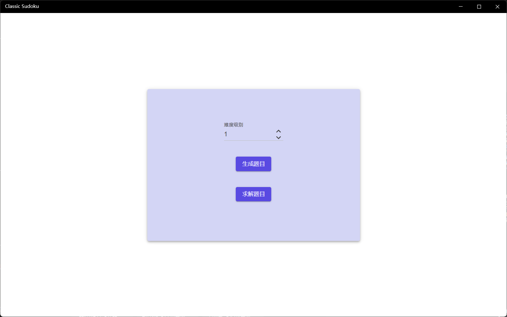
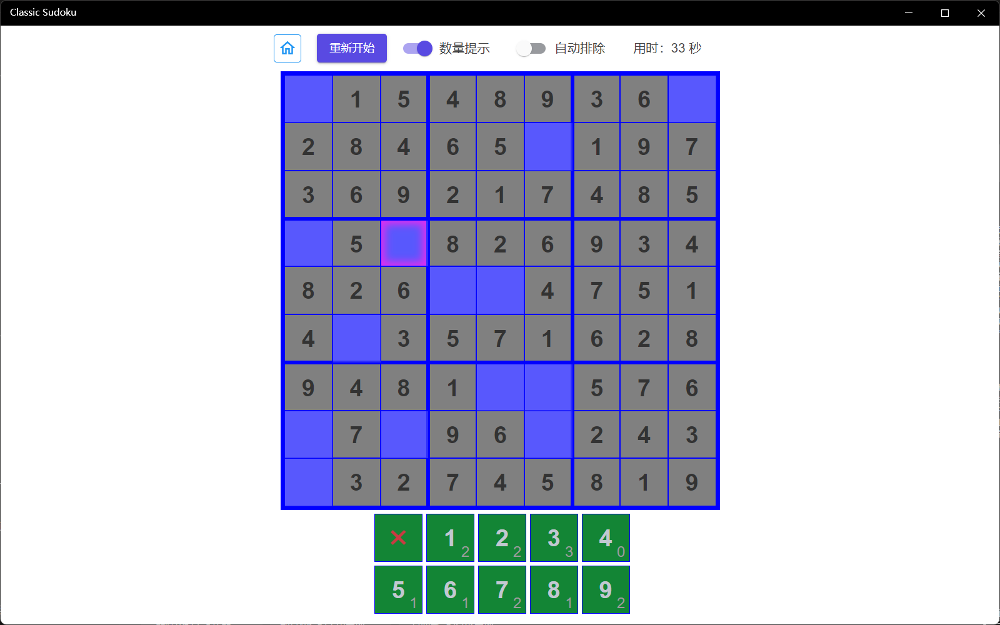
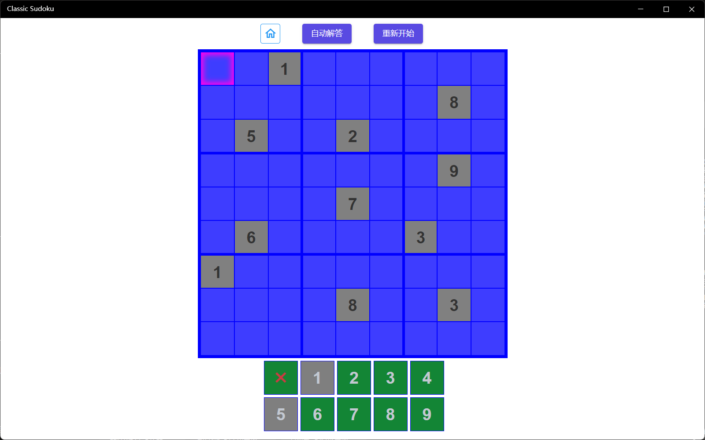

这是一款经典的数独游戏，支持9级难度选择，可以自动解答题目。

### 操作方法 

1. 选择难度级别，共分为9级，每高一级会减少预置数字。

2. 点击【生成题目】可以自动生成随机题目。

3. 解答，选中格子后在下方选择数字填入，点击“x”可以清除数字。
    > 开启【数量提示】可以提示单元格可填的数字个数和备选数字可用次数
    >
    > 开启【自动排除】可以自动排除备选数字中的不可用项。

4. 退出及重新开始：
点击首页按钮可以回到首页，点击重新开始可以清空当前数字重新作答。

### 自动求解
1. 在首页点击【求解题目】进入解题模式。
2. 解题界面默认为空，通过选中位置再点击数字填入已知值，填入已知值时会自动排除不可填入的数字。
3. 点击【自动解答】即可自动填入答案（自动解答只支持一个答案）。
4. 点击【重新开始】可以清空界面重新开始。

[商店下载](https://apps.microsoft.com/detail/9PDGSF0P8NT9)
