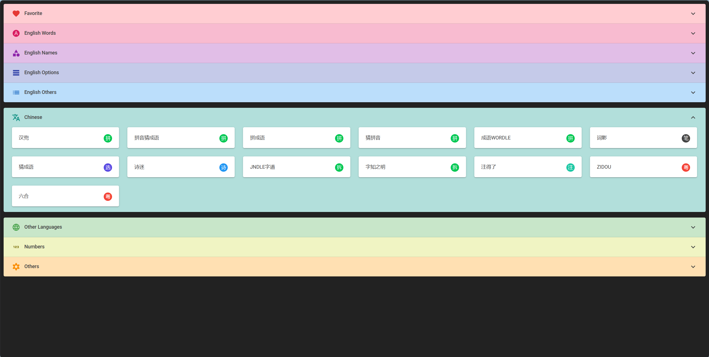
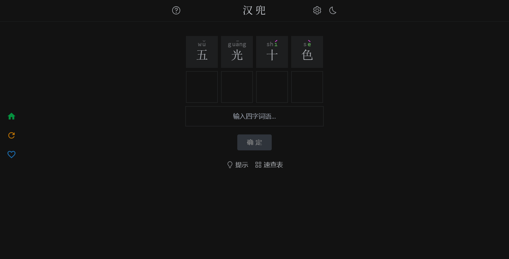

## 介绍

此应用集合了数十款猜词类游戏的地址，其中包括猜数字、英文单词、中文汉字、中文成语、日韩语猜词等。

### 操作方法
1. 选择分类
   在游戏首页选择想要进行的游戏分类，类别分为8种：
   * 英文单词类：包含各种不同长度的英文单词
   * 英文名称类：包含国家、动物、电影、车等的英文名称
   * 英文带选项类：包含多个具有自定义选项的游戏，比如数量、分组等
   * 英文其他类：包含具有特定要求的英文单词游戏
   * 中文类：包含猜成语、猜拼音、猜诗词、猜文字、猜粤语等
   * 其他语言类：包含日语和韩语的猜词游戏
   * 数字类：包含不同类型的猜数字游戏
   * 其他类：包含各种其他类型的猜词游戏，比如字母、图片、表情等
  
    点击这些分类标题可以查看分类中的目录。

1. 进入游戏
   
   分类目录中以卡片的形式展示了其中的游戏名称，右侧图标表示此游戏的特色。点击这些卡片就可以进入相应游戏。
   >! 有的游戏可能因为关闭或网络问题无法访问
   
   

2. 进行游戏
   
   游戏加载完成后会显示相应的游戏界面，可以根据各个游戏内部的说明进行游戏。

   大部分游戏操作方式都是点击下方选项卡选取内容后进行验证（部分游戏支持键盘输入），提示信息方式可能有所不同。

3. 退出游戏
   
   进入游戏后，界面左侧会有一个菜单，点击第一个Home按钮即可返回首页，第二个按钮可以刷新界面。

4. Favourite 操作
   
   首页第一个类别就是Favourite列表，可以将游戏添加到此列表的来快速进入。添加方式为：进入游戏后，点击左侧菜单的第三个“♡”按钮即可。想要移除时在Favourite列表点击右侧删除按钮即可，也可以在游戏界面再次点击菜单的第三个“♡”按钮。

[商店下载](https://apps.microsoft.com/detail/9NLX9V1X4MRL)

[PWA版](https://apps.microsoft.com/detail/9N61ZN52ZCWC)

此应用也有网页版，可以[在线使用](https://xxxxlegame.azurewebsites.net)