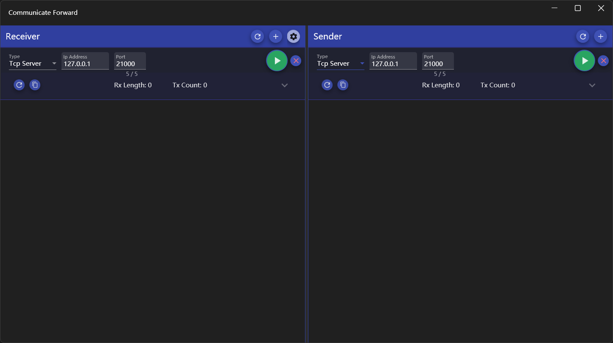
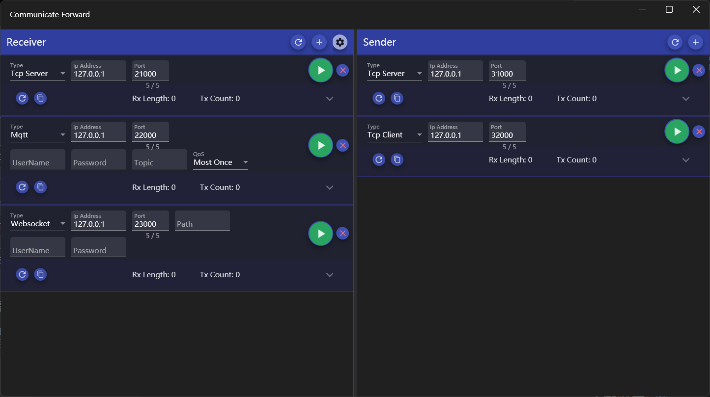
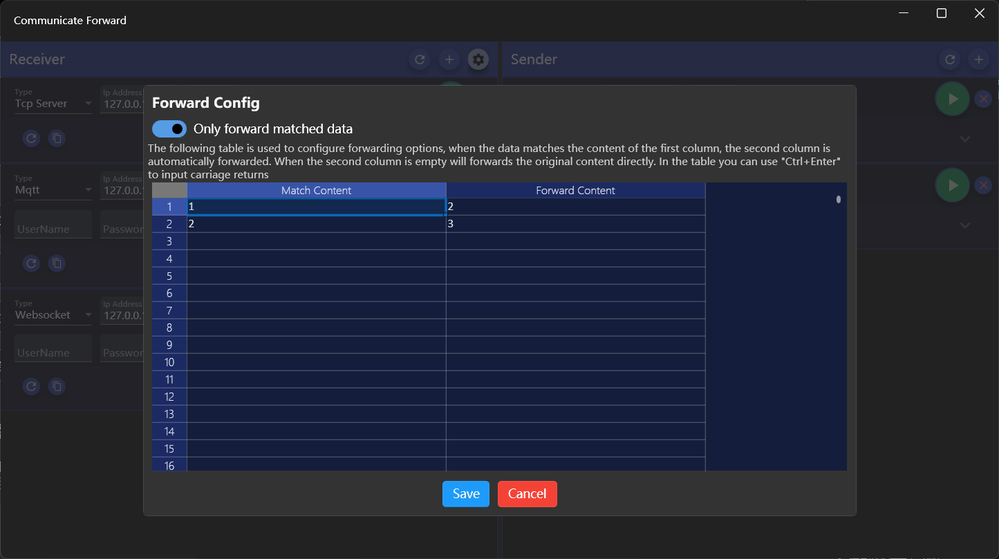
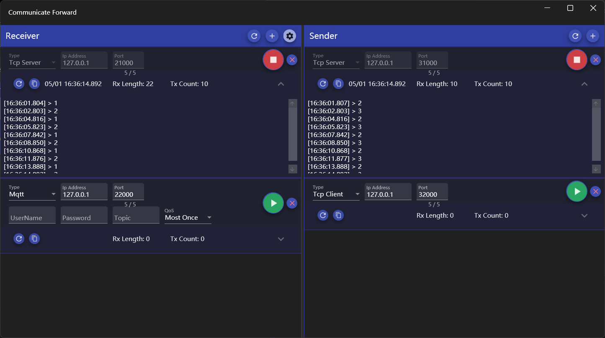

## Introduce
The communication data forwarding tool provides data forwarding between the Tcp server, Tcp client, Mqtt and Websocket, supports many-to-many forwarding, and forwards data according to custom mappings.

## How to use
The interface is divided into two parts: the left data receiver is used to connect the source of data; The data sender on the right is used to connect the destination of data sending.

### Data Forward Settings

1. Config receiver
   1. The app will add a receiver by default, and if you need to add it, you can click the [+] button on the right side of the area title to add it
   2. Select the receiver connection type
      * The available connection types for the receiver are Tcp Server, Tcp Client, Mqtt and Websocket
      * The Tcp server is used to receive data sent by other Tcp clients
      * Tcp Client is used to receive data from the Tcp Server to which it is connected
      * MQTT can receive data from a specified topic to which it is subscribed
      * Websockets can receive data from a specified path
   3. Connect the receiver
      * or TCP servers, you do not need to change the IP address, but can keep the default value of 127.0.0.1
      * To connect to the Tcp client, you need to specify the IP address and port
      * In addition to the IP and port, you also need to specify the topic and Qos to connect to Mqtt, and the username and password can be specified as needed
      * In addition to specifying the IP and port, you can also specify the path, username, and password as needed to connect to a websocket
      * After the parameters are set, click the [Start] button at the bottom, and the button will change to [Stop] after success
   4. Stop the receiver
      * Click the [Stop] button to stop
   5. Delete connection 
      * Click the [x] button on the right of the connection settings to delete it
  
2. Configure sender
   1. The app will add a sender by default, and if you need to add it, you can click the [+] button on the right side of the regional title bar to add it
   2. Select the sender connection type
      * The available connection types for the sender are Tcp Server, Tcp Client, Mqtt and Websocket
      * A TCP server broadcasts the received data to all clients connected to the server
      * A TCP client can send the received data to the server to which it is connected
      * MQTT sends the received data with specified topic
      * Websoctor will send the received data to the specified Path
   3. Connect the sender
      * It is the same as that of the receiver
   4. Stop the sender
      * Click the [Stop] button to stop
   5. Delete connection 
      * Click the [x] button on the right of the connection settings to delete it
3. Data forward test
   * Use tools or devices to connect the receiver and sender
   * Send data with the tool or device which is connected to the receiver
   * The data is received by the tool or device connected to the sender
   > If no mapping file is configured, the data sent is a full copy of the received data
   >
   > Multiple receivers can receive data at the same time and send data to all senders

### Configure mapping file

The data mapping file is used to configure the mapping between the receive and send data for forwarding
* Click the Configure button to the right of the receiver header to open the configuration window
* The switch at the top of the configuration window allows you to set the forwarding mode: if you turn it on, only the data that matches the first column will be sent, otherwise all data will be sent
* he grid below is used to configure the data mapping, the first column of data is used to match the received data, and if it matches, the corresponding data of the second column will be sent
* Click [Save] to close the window after saving to the file, and [Cancel] to close the window without saving the file

> The matching rule for the first column of the mapping file is an exact equality match
>
> The second column of data can be empty, and if it is empty, the data in the first column will be forwarded directly
> 
> You can use [Ctrl+Enter] to enter line break in cells
>
> The first column of data can be duplicated, and if duplicate data is matched, each matched mapping data is forwarded

### View data records

* During the data forwarding, the data sending and receiving records will be displayed below each connection, which records the time and content of each data sending and receiving record, and click the downward arrow on the right to expand and collapse
* The status bar for each connection records the count of data sent and received, the number of bytes, and the last time it was sent and received
* The two buttons on the left side of each connection status bar are used to clear records and copy records
* The first button on the right side of the receive and send areas used to reset the count of all connections in that area

> When the app is closing, you can choose quit or hide it to the taskbar icon, and the window can be displayed by click the taskbar icon when the window is hidden

[Microsoft Store](https://apps.microsoft.com/detail/9P8FJRT704DC)