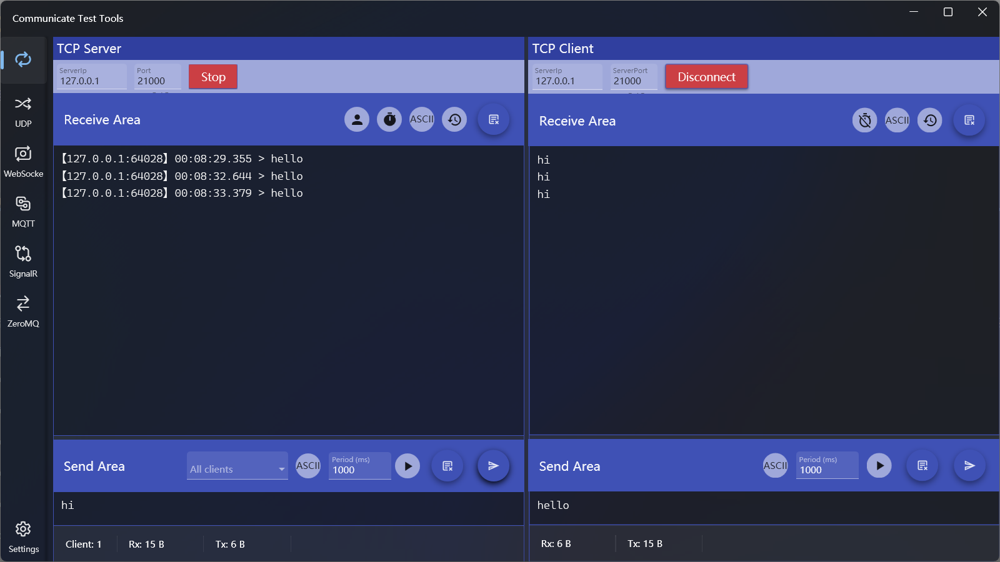
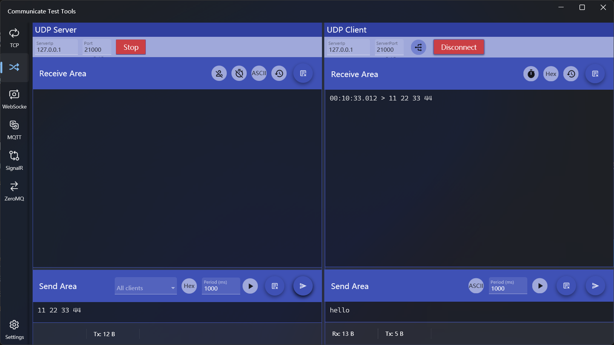
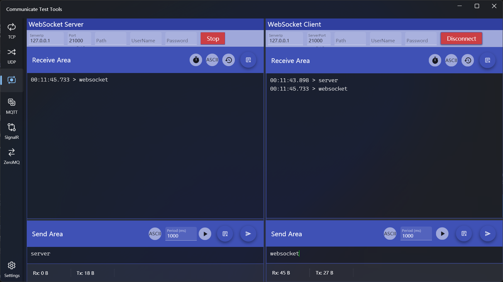
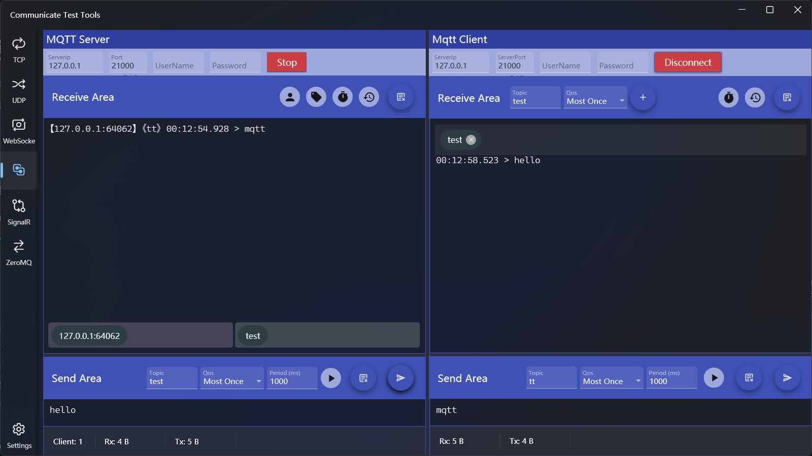
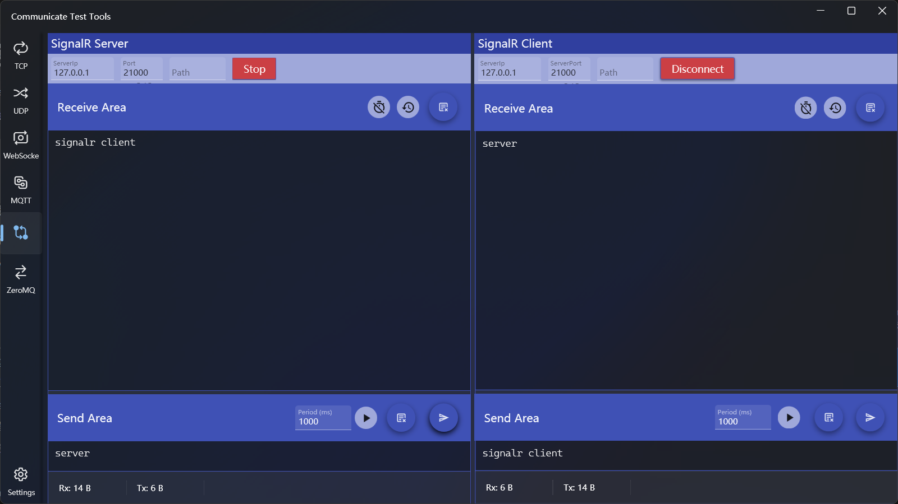
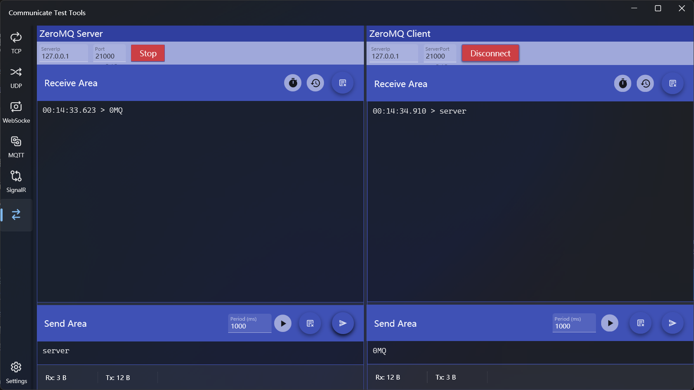
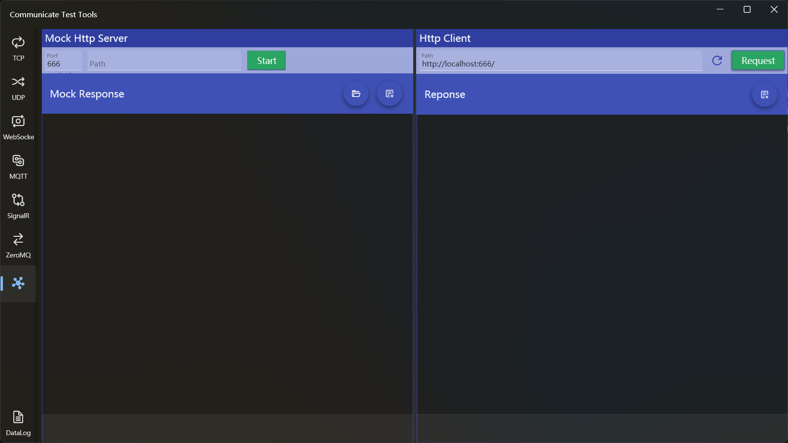
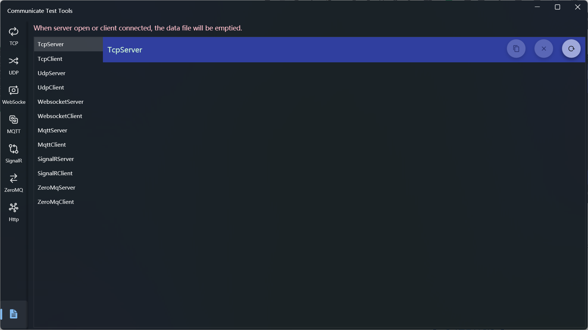

## Introduce
Communication testing tools, support server and client mode for a variety of communications, includ TCP, UDP, MQTT, Websocket, SignalR, ZeroMq, and support mock Http response, which can be used to test http requests or test WebApi.

The communication interface in the application is divided into two parts, the left side is the server area and the right side is the client area.

## How to use
### TCP Server and Client

#### TCP Server Settings
1. Connection Settings
  * Enter the IP and port, click the [Start] button, and the button will change to [Stop] after success.

2. Receive Area Options
  * The receive area is used to display the received data records, and the contents that can be displayed include: the IP and port of the data source, the receiving time, and the data content
  * The operation on the right side of the area header are:
    * IP mode switch: Used to toggle whether to show IP and port
    * Time mode switch: Used to toggle whether to show receiving time
    * Data encoding mode: You can switch between string and hexadecimal mode
    * Data display mode: Toggle to display all or the latest data
    * Clear data: You can clear the receiving area data, and if you want to view historical data after clearing, you can view it in the log
3. Send Area Options
  * The send area is used to send data, click Send after entering the content in the editing area, and there are two sending buttons: the left side is the scheduled period to send, and the right side is send ontime
  * The options that can be configured include:
    * Select Target: After the client is connected, it will be displayed in the client list, select one of the clients in the list to send data to the specified client, or select none to broadcast
    * Data format: String and hexadecimal are supported, and the default is string
    * Periodic send: You can enter the interval time in milliseconds, the default is 1000 milliseconds, and the minimum interval is 10 milliseconds, and you can click the periodic send button to send data according to the specified interval period. The button function will change to stop when the cycle of sending starts, and you can click it to stop the sending.
    * In the new version, you can open a txt file and Send in Lines, if switch [Split Lines] is open, you can split the data into lines and send them line by line.
  
      > If a single send is used when [Split Lines] is opened, it has no practical effect because it is sent at the same time; If you use periodic sending, the specified sending period is separated between each line when sending.
4. Disconnect: Click [Stop] to disconnect

#### TCP Client Settings
1. Connection Settings
  * Enter IP and port, click the [Connect] button, and the button will change to [Disconnect] when successful.

2. Receive Area Options
  * The receive area is used to display the received data record, and the contents that can be displayed include: receiving time and data content
  * The operation functions on the right side of the area header are:
    * Time mode switch: Used to toggle whether to show the receiving time
    * Data encoding mode: You can switch between string and hexadecimal mode
    * Data display mode: Toggle to display all or the latest data
    * Clear data: You can clear the receiving area data, and if you want to view historical data after clearing, you can view it in the log

3. Send Area Options
  * Except cannot specify client in the sending area, other settings are the same as those of the server
4. Disconnect: Click [Stop] to disconnect

### UDP Server and Client

#### UDP Server Settings
1. Connection Settings
  * This is the same as that of the TCP server 
2. Receive Area Options
  * This is the same as that of the TCP server 
3. Send Area Options
  * This is the same as that of the TCP server 
  
  > Once the UDP client is closed, it will not be removed from the client list, and data sent to it will not be received

#### UDP Client Settings
1. Connection Settings
  * The IP and port settings are the same as those of the server
  * A connection option has been added to the settings that needs to be set before connecting, and the options include:
    * Broadcast mode: Receives only the broadcast data sent by the server
    * Single mode: Receives only the data assigned to it by the server
2. Receive Area Options
  * This is the same as that of the TCP client

3. Send Area Options
  * This is the same as that of the TCP client

### Websocket Server and Client

#### Websocket Server Settings
1. Connection Settings
  * In addition to IP and port, you can also set Path, username, and password
2. Receive Area Options
  * Except that the IP is not displayed, it is the same as the TCP server
3. Send Area Options
  * Except that the destination can't be specified, it is the same as the TCP server

#### Websocket Client Settings
1. Connection Settings
  * In addition to IP and port, you can also set Path, username, and password

2. Receive Area Options
  * This is the same as that of the TCP client
3. Send Area Options
  * This is the same as that of the TCP client

### MQTT Server and Client

#### MQTT Server Settings
1. Connection Settings
  * In addition to IP and port, you can also set a username and password

2. Receive Area Options
  * Added a Topic display switch, removed the data encoding mode, and the other options are the same as those of the TCP server
  * The IP, port, and topic of the current subscription are displayed at the bottom of the receiving area

3. Send Area Options
  * Added Topic and QoS settings, removed the data encoding mode, and other optons are the same as those of the TCP server

#### MQTT Client Settings
1. Connection Settings
  * In addition to IP and port, you can also set a username and password

2. Receive Area Options
  * You can subscribe to multiple topics and QoS, the way is to enter a topic and selecte QoS, then click the [+] button on the right. To cancel a subscription, click the "x" icon to the right of the topic list item
  * The data encoding mode is removed, and the other options are the same as those of the TCP client

3. Send Area Options
  * Added Topic and QoS settings, removed the data encoding mode, and the other options are the same as those of the TCP client

### SignalR Server and Client

#### SignalR Server Settings
1. Connection Settings
  * In addition to IP and port, you can also set Path

2. Receive Area Options
  * Removed the data encoding mode, and the other options are the same as those of the Websocket server

3. Send Area Options
  * Removed the data encoding mode, and the other options are the same as those of the Websocket server

#### SignalR Client Settings
1. Connection Settings
  * In addition to IP and port, you can also set Path

2. Receive Area Options
  * Removed the data encoding mode, and the other options are the same as those of the Websocket client

3. Send Area Options
  * Removed the data encoding mode, and the other options are the same as those of the Websocket client

### ZeroMq Server and Client

#### ZeroMq Server Settings
1. Connection Settings
  * This is the same as that of the TCP server

2. Receive Area Options
  * This is the same as that of the SignalR server

3. Send Area Options
  * This is the same as that of the SignalR server

#### ZeroMq Client Settings
1. Connection Settings
  * This is the same as that of the TCP client

2. Receive Area Options
  * This is the same as that of the SignalR client

3. Send Area Options
  * This is the same as that of the SignalR client

### Http Server and Client

#### Http Server Settings
* Specify the port and path, and click [Start] to start the server
* Enter the mock response in the text box below, or click the Open File button on the right to load the content from the text file
* Click the [Clear] button on the right to clear the response

#### Http Client Settings
* Enter the full path of the request in the text box of path, and click the [Request] button to get the response content
  * Enter the web url can get the source code of the web page
  * Enter the Web Api path can get the Api response
* Click the button on the left side of [Request] to directly set the path to the mock server path
* Click the [Clear] button on the right to clear the response content

### View Log
Click the bottom menu in the left navigation bar to open the log viewing page

* On the left is a list of connection types, click the name to view the corresponding log records
* The three buttons on the right are used to:
  * Copy Records: Copies the log content to the clipboard
  * Clear Record: Clears the log file contents
  * Reload Records: Loads the latest log file

> The logs only retain the data after the last connection of each connection, and the previous log records will clear when the connection is opened

[Microsoft Store](https://apps.microsoft.com/detail/9MV2NK7FZ4CC)