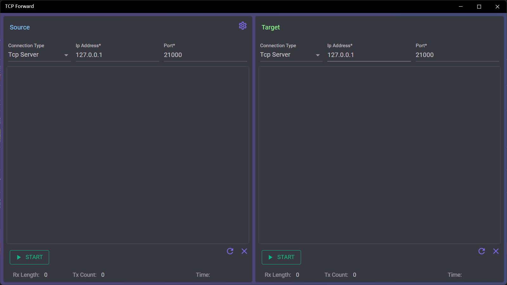

## Introduce
The TCP data forwarding tool supports connecting the TCP server and the client at the receiver, supports the TCP server, the TCP client, MQTT and Websocket at the forwarding destination, and supports custom mapping to forward data.

## How to use
The interface is divided into two parts, the left side is receive area, which is used to connect the source of the data; The right side is send area, which is used to connect to the destination of data sending.
### Data Forward Settings

1. Config receiver
   1. Select the receiver connection type
      * The available connection types for the receiver are TCP Server and TCP Client
      * The TCP server is used to receive data sent by other TCP clients, and the TCP client is used to receive data from the TCP server to which it is connected
   2. Connect the receiver
      * Enter the server IP and port in the text box
      * For TCP servers, you do not need to change the IP address, but can keep the default value of 127.0.0.1
      * After the parameters are set, click the [Start] button at the bottom, and the button will change to [Stop] after success
   3. Stop the receiver
      * Click the [Stop] button to stop
  
2. Configure sender
   1. Select the sender connection type
      * In addition to TCP Server and TCP Client, you can also select MQTT and WebSocket for the sender
      * A TCP server broadcasts the received data to all clients connected to the server
        > Use this way, you can forward multiple destination TCP clients
      * A TCP client can send the received data to the server to which it is connected
      * MQTT sends the received data with specified topic
      * Websoctor will send the received data to the specified Path
   2. Connect the sender
      * For TCP Server and TCP Client, the connection way is the same as that of the receiver
      * In addition to specifying the IP and port, you also need to specify the sending topic and Qos to connect to MQTT, and the username and password can be specified as needed
      * In addition to specifying the IP and port, you can also specify the path, username, and password as needed to connect to a websocket
      * After the parameters are set, click the [Start] button at the bottom, and the button will change to [Stop] after success
   3. Stop the sender
      * Click the [Stop] button to stop
3. Data forward test
   * Use tools or devices to connect the receiver and sender
   * Send data with the tool or device which is connected to the receiver
   * The data is received by the tool or device connected to the sender
   > If no mapping file is configured, the data sent is a full copy of the received data

### Configure mapping file

The data mapping file is used to configure the mapping between the receive and send data for forwarding
* Click the Configure button to the right of the receiver header to open the configuration window
* The switch at the top of the configuration window allows you to set the forwarding mode: if you turn it on, only the data that matches the first column will be sent, otherwise all data will be sent
* The grid below is used to configure the data mapping, the first column of data is used to match the received data, and if it matches, the corresponding data of the second column will be sent
* Click [Save] to close the window after saving to the file, and [Cancel] to close the window without saving the file

> The matching rule for the first column of the mapping file is an exact equality match
>
> The second column of data can be empty, and if it is empty, the data in the first column will be forwarded directly
> 
> You can use [Ctrl+Enter] to enter line break in cells
>
> The first column of data can be duplicated, and if duplicate data is matched, each matched mapping data is forwarded

### View data records

* During the data forwarding, data sending and receiving records are displayed below the connection configuration, which records the time and content of each data sending and receiving record
* The status bar at the bottom records the count of data sent and received, the number of bytes, and the last time it was sent and received
* The two buttons on the right side below the receive and send areas are used to reset the count and clear the sending and receiving records

> When the app is closing, you can choose quit or hide it to the taskbar icon, and the window can be displayed by click the taskbar icon when the window is hidden

[Microsoft Store](https://apps.microsoft.com/detail/9P8RD3LDT8TW)