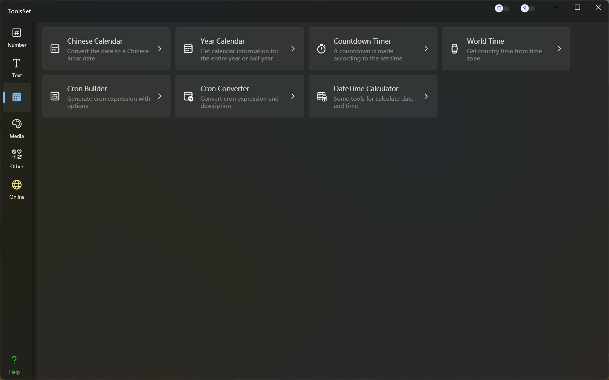

## Introduce

Features include: Chinese Calendar, Year Calendar, Countdown Timer, World Time, Cron Builder, Cron Converter, DateTime Calculator

## Features List

### Chinese Calendar
* Solar information
* Chinese Lunar information

### Year Calendar 
* Year-round or semi-annual calendar
* Chinese Lunar info, festivals

### Countdown Timer 
* Specify the time, minute, second

### World Time 
* You can choose the language
* Select a country or region
* Select a time zone
* Current real-time time
* Time comparison across multiple time zones

### Cron Builder 
* Specify the year, month, day, hour, minute, and second parameters to generate expressions
* Expressions are automatically converted to descriptions

### Cron Converter 
* Cron Expression Conversion description in 24 languages
* English description converts Cron expressions
* Gets a specified count of execution time

### DateTime Calculator 
* Solar calendar calculations
  * Calculate date shift
  * Calculate time shift
  * Calculate the date interval
  * Calculate the time interval
* Lunar calendar calculations
  * Calculate Lunar datetime shift
  * The lunar calendar is converted to the solar calendar
* Date Convert
  * Local time and UTC time conversion
  * Convert Julian Day
  * Convert Unix timestamps
  * Convert file time
  * Convert OADate
