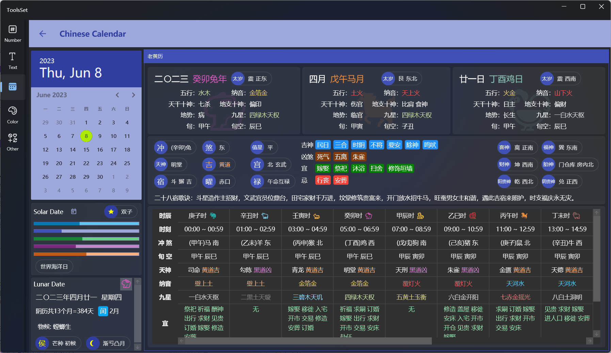

## Introduce

This tool allows you to view information about a given solar calendar date and its various information corresponding to the Chinese lunar calendar

## How to use

1. Select a date: Click date in the calendar at the top left
   > Click on the calendar title once to select the month, and click the left and right arrow icons to turn the page by year
   >
   > Click the calendar header twice to select the year, and click the left and right arrow icons to turn the page in ten-year increments
   >
   > Click the calendar icon below the calendar to jump to today

2. Solar date info: The solar area below the calendar includes:
   * Whether it is a leap year
   * Zodiac sign
   * Day of the year
   * Day of the month
   * Week of the year
   * Week of the month
   * Quarter of the year
   * Holidays
3. Lunar date info: The lunar area below the calendar includes:
   * 三九/三伏第几天
   * 生肖
   * 阴历日期
   * 阴历月数和天数
   * 阴历闰月信息
   * 物候、节气
   * 侯、月相
4. Chinese lunar info：On the right side, divided into three areas from top to bottom, including the following contents:
   1. 阴历年月日信息
      * 阴历中文名称
      * 天干地支
      * 生肖
      * 太岁
      * 五行
      * 纳音
      * 天干十神
      * 地支十神
      * 地势
      * 九星
      * 旬
      * 旬空
   2. 天神和吉凶
      * 冲煞
      * 值星
      * 天神
      * 吉凶
      * 四宫
      * 二十八星宿
      * 六曜
      * 禄
      * 吉神
      * 凶煞
      * 宜忌
      * 吉神方位
      * 胎神方位
      * 二十八星宿歌诀
   3. 时辰信息
      * 时辰名称
      * 时刻
      * 冲煞
      * 旬空
      * 天神
      * 纳音
      * 九星
      * 宜忌
