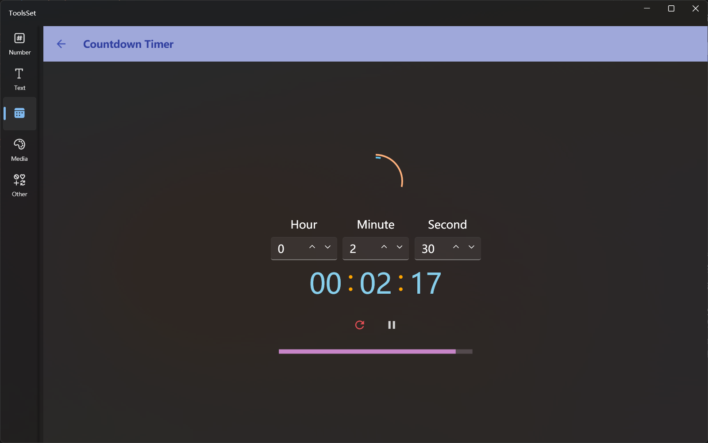

## Introduce

Count down to the specified time

## How to use

1. Set the time: Enter hours, minutes, and seconds in the middle three text boxes
   > The time can be automatically converted, e.g. input 1 minute and 90 seconds, will auto convert to 2 minutes and 30 seconds when starting or resetting
2. Operation: Click the start button below the time to start the timer, and the button will change to reset and pause after starting
3. Prompt message: An audible prompt will be issued when the timer ends
   > The ring icon at the top indicates the remaining of hours, minutes and seconds
   > The progress bar below indicates the total seconds remaining