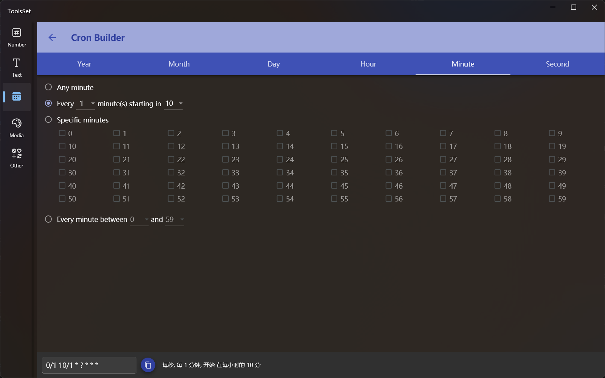

## Introduce

Generate cron expression based on the specified rules

## How to use

* Year setting
   * Any year
   * Annual cycle starting with the specified year
   * Specify the year
   * Every year within the specified range

* Month setting
   * Any month
   * A monthly cycle that starts with a specified month
   * Specify the month
   * Monthly within the specified range

* Day setting
   * Any day
   * A daily period that starts on a specified date
   * Date specified
   * Every day within the specified range
   * Last day of the month
   * Specified days before the end of the month
   * The nearest week day on the specified day of the month
   * The daily cycle that starts with the specified day of the week
   * Specify the day of the week

* Hour setting
   * Any hour
   * The time period that starts with the specified hour
   * Specify the hour
   * Every hour within the specified range

* Minute setting
   * Any minute
   * A minute period that starts with a specified minute
   * Specify the minute
   * Every minute within the specified range

* Seconds setting
   * Any second
   * The second period that starts with the specified second
   * Specify the second
   * Every second within the specified range

> The generated Cron expression will be displayed in the text box below, and the right side will be automatically converted into the corresponding description, you can click the copy button to copy the expression