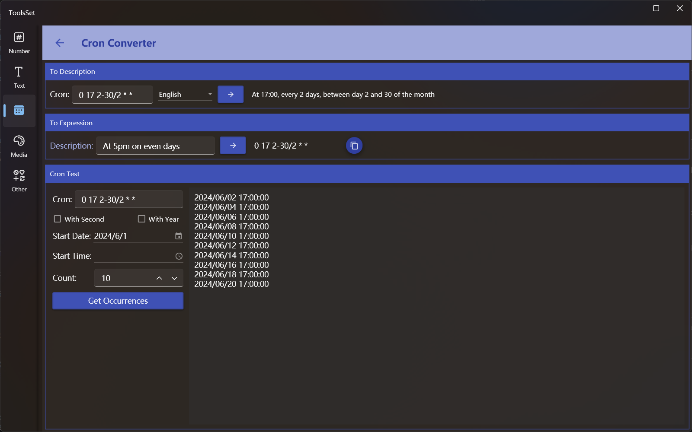

## Introduce

You can convert a Cron expression to text description in a specified language, or convert an English description to a Cron expression, can also generate a specified count of execution time

## How to use

* Cron expressions to description

  Enter the Cron expression in the text box, select a description language from the drop-down box on the right, and click the Convert button to convert the expression to the corresponding language description

* Description to Cron expression

  Click the button on the left side of the middle area to pop up a list of predefined descriptions, and the description will be displayed in the text box on the right after selection, you can edit and modify it, and click the button on the right to convert it to a Cron expression

* Generate time

  1. Enter expression: Enter a valid Cron expression in the text box in the Cron Test area, and if there are more than 5 parts, you need to select whether to include seconds or years
  2. Select start date and time: Enter or select the start date and time below, the date is the current day when the date is empty, and the time is 0:00 when the time is empty
  3. Set quantity: Enter quantity in the text box or use the button on the right to increase or decrease the quantity
  4. Generate time: Click the button below to generate a list of the specified count of times on the right side
