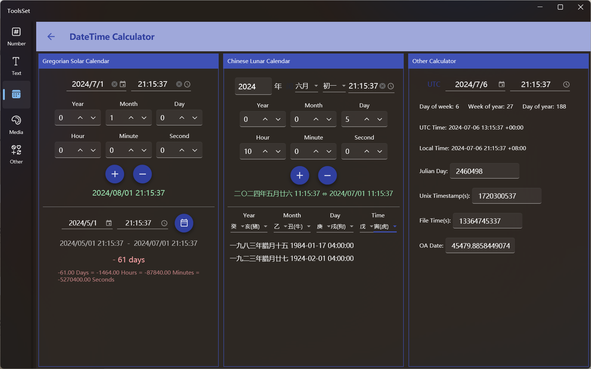

## Introduce

Support solar date and time shift, date time interval calculation, lunar date and time shift, eight-character to solar calendar, and datetime conversion  

## How to use

The interface is divided into three parts, the left side can be used for the solar date and time shift and date time interval calculation, the middle can be used for the lunar date and time shift and the eight-character to solar calendar, and the right side can be used for various datetime conversions

* solar date and time shift
  1. Set start date and time
    
     Enter or select start time in the date and time input box above
     > time can be empty, and when it is empty, only the date shift is calculated
  2. Set the offset
    
     You can set the offset below the date and time input box, includ year, month, day, hour, minute, and second
     
  3. Get the results
     
     Click the [+] button below to calculate the time after the specified offset. Click the [-] button to calculate the time before the specified offset

* Datetime interval calculation
  1. Start time

     The start time is the time set by the input above

  2. End time
     
     Enter the end time in the text box below

  3. Calculate result

     Click the calculation button on the right to calculate the time interval, and use color to distinguish the positive and negative time differences, which can automatically convert units

* Lunar date and time lapse
  1. Set start date and time

     Set the lunar date and time at the top, and there is a leap month switch on the right side of the year input box, which allows you to specify the leap month of the lunar calendar
     
     The time can be empty, and when it is empty, the current time will be used

  2. Set the offset

     You can set the offset below the date and time input box, includ year, month, day, hour, minute, and second
     
  3. Get the result

     Click the [+] button below to calculate the time after the specified offset. Click the [-] button to calculate the time before the specified offset
     > results are automatically displayed with solar calendar

* Eight-character to solar calendar

  In the drop-down box below, select the Chinese lunar year, month, day, and hour, that will be automatically converted to a date if it is a legal combination of eight characters, and displayed as a list if it corresponds to multiple dates.

* Datetime conversion

  You can specify the time to be converted at the top of the right, use the switch on the left to select whether it is local time or UTC time, and the conversion results of UTC time, local time, Julian day, Unix timestamp, file time and OA Date will be displayed below, the Julian day, Unix timestamp, file time and OA Date can be reversed after entering the value.
