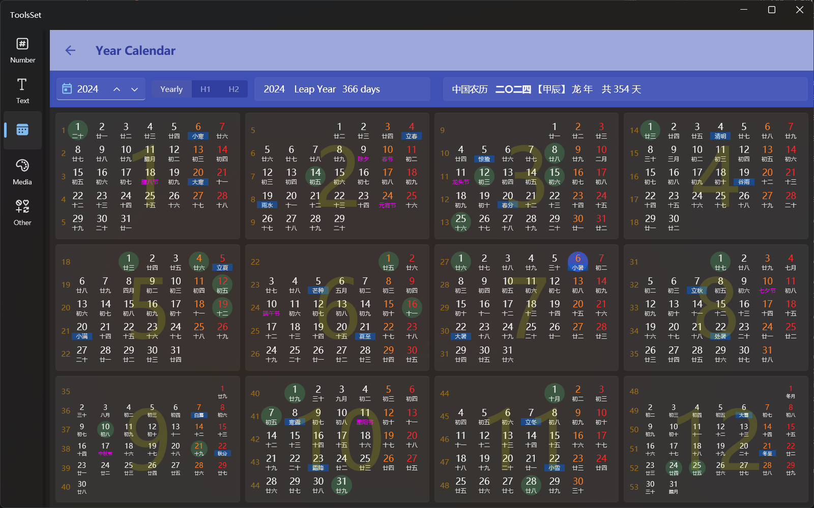

## Introduce

This tool supports viewing the calendar for a specified year in units of the whole year or half a year

## How to use

1. Select the year: Enter the year in the text box on the left side of the toolbar, or you can increase or decrease it year-by-year with the up and down arrows
   > You can click on the icon on the left to jump to the current year
2. Select the view: There are three buttons on the right side of the input box to switch the display mode:
   * Yearly：Year-round view
   * H1：The first half of year view
   * H2：The second half of year view
3. Solar info：selected year, whether it is a leap year, and the number of days in the year
4. Lunar info：lunar calendar Chinese, the lunar stem branch zodiac, and the number of lunar days
5. Calendar view: The calendar view area below displays
   * Month: Large number on the background
   * Date: Number in table
   * Day of the week: Saturday for orange numbers and Sunday for red numbers
   * Number of weeks: The yellow number on the left indicates the week of the year
   * Lunar date: Chinese below the number
   * Solar terms: Chinese with a blue background below the number
   * Traditional Chinese Festival: Purple Chinese below the number
   * Gregorian holidays: Green round background
   * Current date: Blue round background
   > Hover over the date to prompt information including: Date, lunar date, lunar stem, other festivals, phenology, moon phases