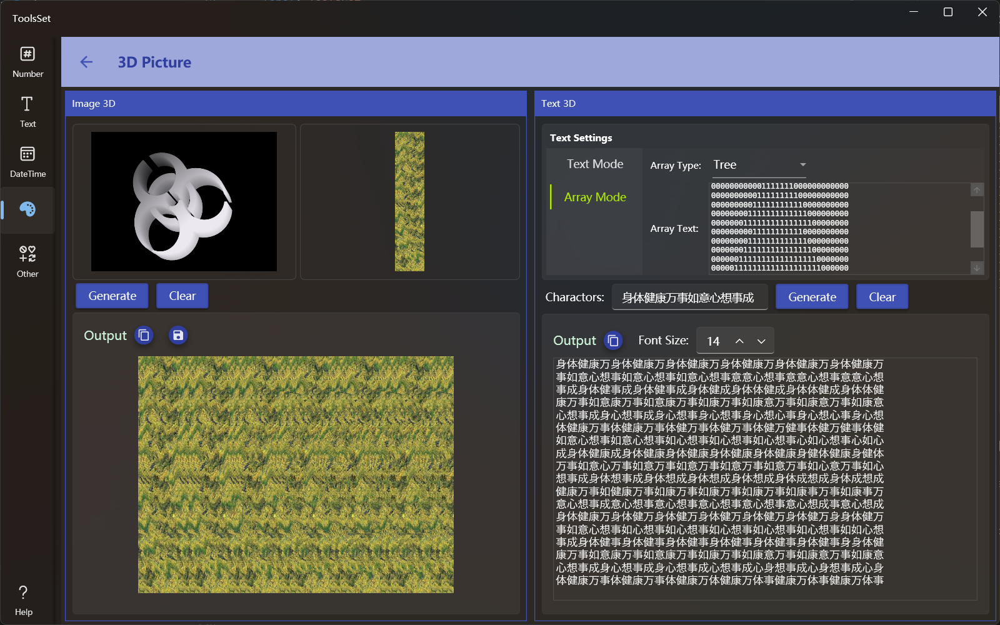

## Introduce

Generate 3D pictrue using grayscale image and backgrounds, as well as 3D text based on text or arrays, which require binocular stereoscopic vision, i.e., cross-eyed viewing

## How to use

The left side is the 3D image generation area, and the right side is the 3D text generation area

### Generate 3D Image
* The top is the image selection area, both of which can be opened or pasted by clicking on the pop-up menu. The left side is used to select the content image, and the right side is used to select the background image
   > The content image needs to select a grayscale image that represents the depth, where the brighter places are closer and the darker places are farther away
   > Do not use images with large areas of color in the background, otherwise the 3D image will be less effective or even unrecognizable
* After the image selected, click the [Generate] button below to generate a 3D image, and click [Clear] to clear all images

### Generate 3D Text
* There are two ways to generate 3D text
  1. Use the text with the specified font
     * After selecting the text mode above, you can set the font family, font size, number of characters in the row and column, and content text
  2. Use an array of numbers
     * After selecting the array mode, you can select a predefined array or a custom array in the drop-down box, the first item is custom array
     * You can enter a array of numbers 1-9 in the text box below, where the numbers 1-9 represent the distance, and the larger the number, the closer the distance
       > This array can be generated using [Pixel Grid](./PixelGrid.md) of this application
  
  > In the middle text box, you can enter the character set to be displayed, and don't have too few characters in the character set and the characters should not be too simple
  >
  > Font size setting for the output area is used to set the font size to be displayed when the output text is previewed
  >
  > Click the [Generate] button to generate 3D text below, and click [Clear] to clear the result
  