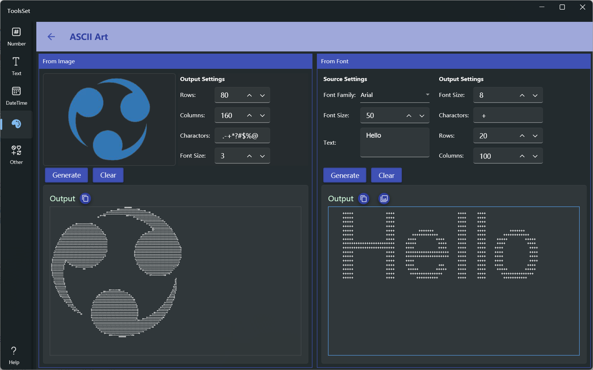

## Introduce

You can convert a picture or a specified text to a character art use specified character

## How to use

The left side is the image conversion area, and the right side is the text conversion area

### From Image

* Add image: Click on the image area on the left and select Open Image or Paste from the pop-up menu
* Output Settings
  * Row and Column: Used to set the count of row and column characters to generate, the default is the pixels count of the height and width of the image, and the maximum output value is twice the width and height
  * Display Characters: Used to set the characters contained in the output, the characters from left to right correspond to the gradual decrease in transparency and the change of brightness from dark to light in the image
  * Font size: Used to set the size of font to preview, with a value range of 1~20
* Click [Generate] to display the output below according to the specified parameters, click [Clear] to clear the image and result, and click the copy icon on the right to copy the generated text

### From Text

* Source Settings: The upper left side is used to set the parameters for input
  * Font Family: Set the font family for the text
  * Font Size: Set the font size to be used for the text
  * Text: Set the text content to be converted
* Output Settings: The usage of output settings is the same as that of the image conversion area
* Click [Generate] to display the output below according to the specified parameters, click [Clear] to clear the result, and the two copy icons below are used to copy the generated text and black-white image
  