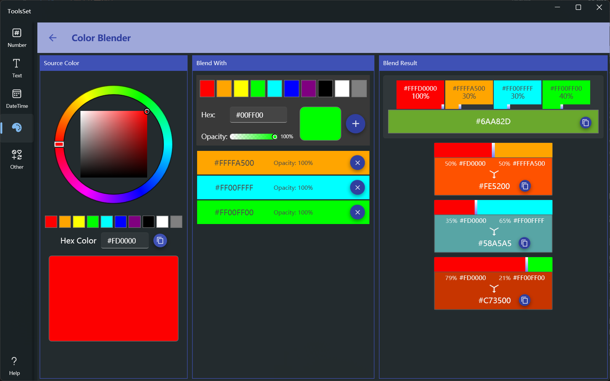

## Introduce

You can select a starting color and mix it with a variety of other colors to see the mixed color

## How to use

The left area is used to set the starting color, the middle area is used to select colors to blend, and the right area shows the blending result

* There are three ways to set the starting color
  1. Use the color picker
  2. Choose from 10 predefined colors
  3. Enter the hexadecimal color value in the text box 
* There are two ways to set color to blend
  1. Choose from 10 predefined colors
  2. Enter the hexadecimal color value in the text box
  > The color to blend can use the slider to set the opacity
* After the color is set, you can click the [+] button on the right to add it to the list below, and it will be added to the result area on the right, and you can click the [x] button on the right side of the list item to remove it
* Configure the ratio
  * The blend result of all colors displayed in the top right side, and their proportions can be adjusted by the slider below each color
  * The lower right side shows the results of each blend, and the ratio can be adjusted by the slider between the two colors
  * Each blend result can be copied with the color value via the copy button on the right