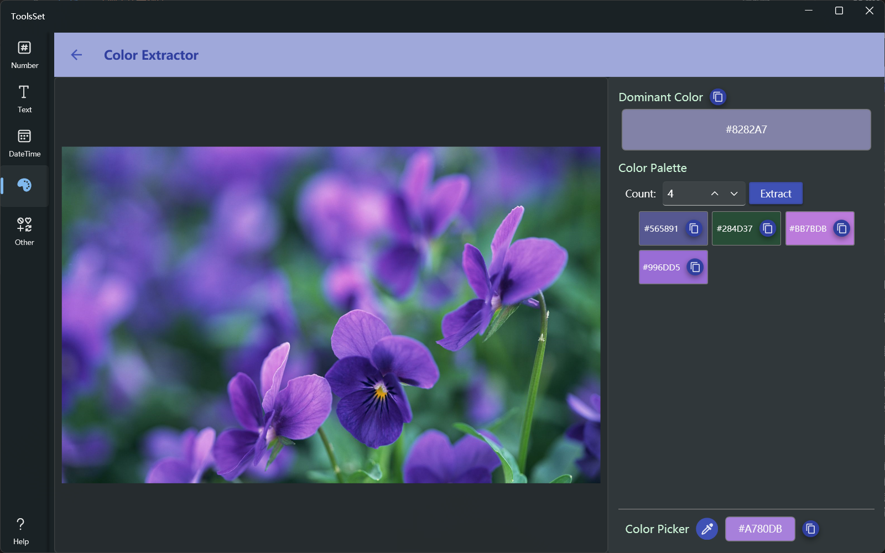

## Introduce

You can extract the dominant color and a specified count of colors from the image, and you can use the mouse to pick color

## How to use

* Click on the image area on the left and select Open Image or Paste from the pop-up menu
* After the image is added, the dominant color of the image can be displayed at the top of the right, and 4 colors extracted from the image are displayed by default below, you can modify the value and click the [Extract] button to get the specified count of colors, the maximum value is 20
* The bottom is the color picker switch, after opening, you can click on the image to pick the color, the obtained color value will be displayed in the text box on the right, you can click the copy button to copy the color value
  