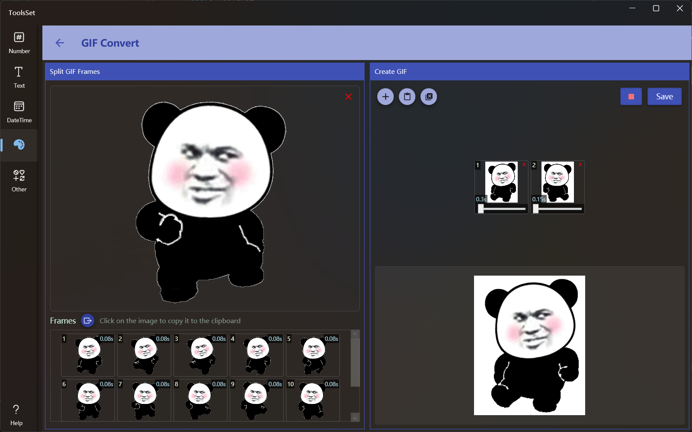

## Introduce

Extract image sequence from a GIF, or use image sequence to generate animated Gif image

## How to use

The left area can extract images from Gifs, and the right area can add image sequence to generate GIF

* Click on the top left area to select the Gif image to open, after the file is opened, the frame sequence contained in it will be automatically extracted and displayed below, you can click the export button to export all the frame pictures, or click on a certain image to copy it to the clipboard
* The three buttons in the top left corner of the right area are: Add Image File, Paste Image, Clear List, and the two buttons on the right can preview the animation and save the Gif image
  > When you open or paste an image, it will be automatically added to the list below, and you can select multiple files at once when opening the image
  >
  > In the image list, you can adjust the image duration through the slider below the image, the range is 0~5 seconds
  >
  > You can click the delete icon in the top right corner of the image to remove it
  
* Version 1.3.0 new features for creating GIF:
  * Auto Reverse: Turning on this switch allows for automatic reverse playback of the image sequence.
  * Repeats: You can input the number of loops for the GIF animation, where a value of 0 indicates infinite looping.
  * Delay: This slider can modify all duration of the image in the image list.
  * Background: When this switch is turned on, a specified background color can be added to the GIF; otherwise, a transparent background color will be used.