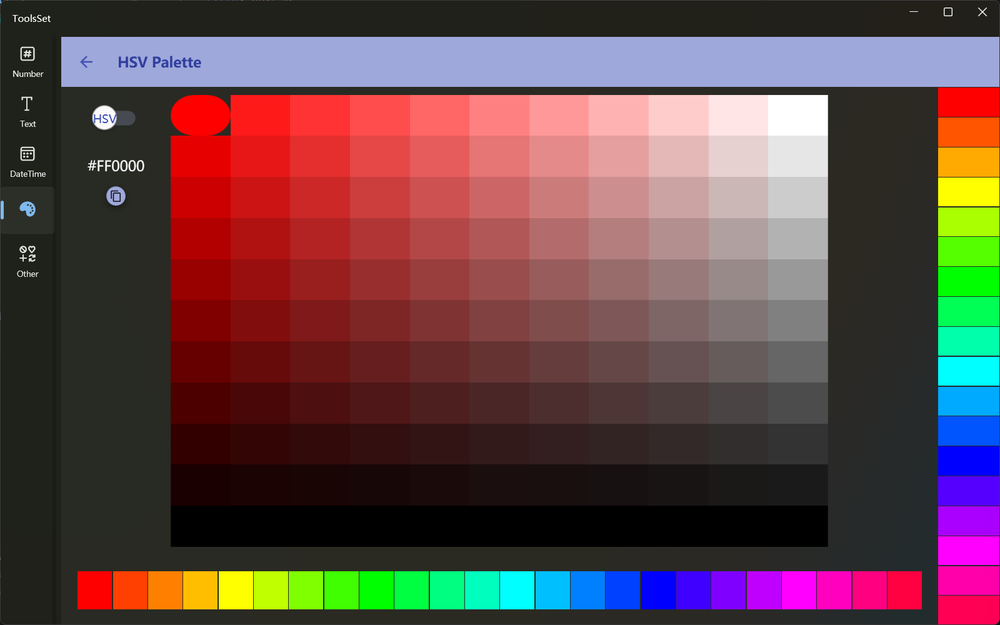

## Introduce

Support HSV and HSL color palette mode

## How to use

* HSV and HSL modes can be switched by the switch in the top left corner
* There are 24 colors available below to switch hues
* 20 colors of the same brightness and contrast are available on the right side for color comparison
* The middle area shows the gradient colors by brightness and saturation, click on the color to synchronize the brightness and contrast to the color bar on the right
* After selecting the color, you can view the color code on the left and copy it
  
