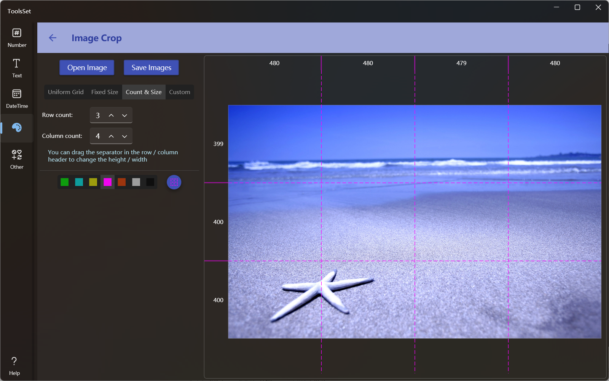

## Introduce

Divide images into blocks by quantity, size, etc

## How to use

* Click the Open Image button to open the image file, and a preview will be displayed on the right side after the file is opened
* You can choose how to split the image, and there are four ways to choose from
  1. Uniform Grid: Split an image by specifying the number of rows and columns, which is set to 3 rows and 3 columns by default, and up to 9 rows and 9 columns
  2. Fixed Size: Split an image according to the specified block size, which is 100x100 by default, and can be divided into up to 100 blocks
  3. Count & Size: After specifying the number of rows and columns to be split, you can adjust the size by the solid lines of the rows and columns in the preview grid
  4. Custom: Customize the size and number of rows and columns by text, use spaces or "," to split the numbers, you can use "*" to represent the proportion, for example, enter **100, \*, 2\*** in the row setting box, which means that the height of the first row is 100 pixels, and the second and third lines occupy 1/3 and 2/3 of the remaining height respectively
* The bottom is the preview grid color setting, click to switch different grid colors, and after changing the grid size, you can click the refresh button on the far right to refresh the preview grid
* After setting, click the save button above to open the dialog box, enter the file name and click Save, and the image sequence will be saved according to the name of *file name-serial number*