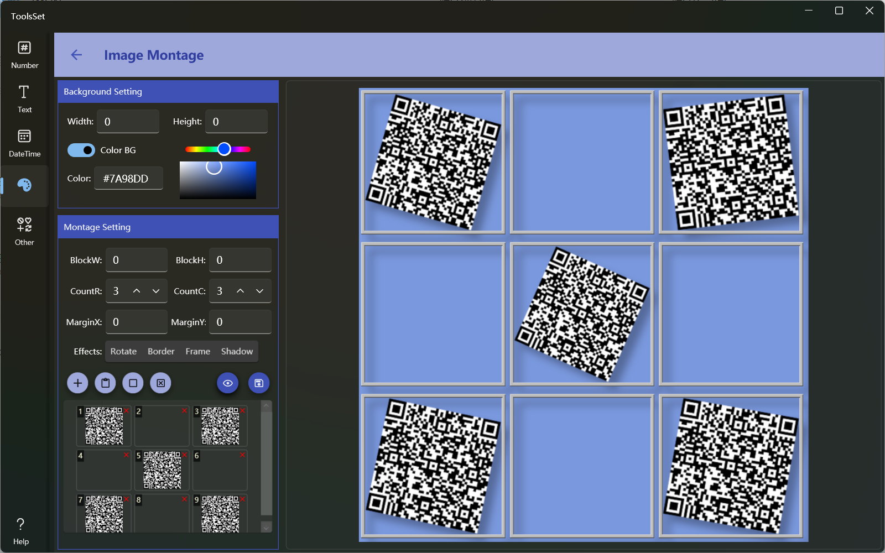

## Introduce
The image stitching and merging tool can merge multiple pictures into one, support setting the count, size and spacing of rows and columns, add special effects and background colors, and use blank spaceholders

## How to use

* Set Background: You can set the background of the image at the top of the left side
  * Width and Height: Set the size of the final image, the default value is 0, that is, it is generated according to the content, and the maximum value is not more than 5000*5000
  * Color BG: Background color switch, you can set the background color when it is turned on, and the background will be transparent when it is turned off
  * The color can be set in the text box or through the color picker
  
* Set image block parameters: In the middle area on the left, you can set image block parameters
  * BlockW and BlockH: Set the width and height of the image block, the default is 0, it will be automatically calculated according to the selected image, no more than 500*500, after setting, all images will be scaled to the specified size
  * CountR and CountC: Set the number of rows and columns when arranging, can be 0, 0 means that there is no limit in this direction, if the total number of grids is less than the number of images, the images will be superimposed
  * MarginX and MarginY: Set the block spacing, the range is 0~99
  * Effects: You can add special effects to image blocks
    * Rotate: Rotate the image block at a random angle
    * Border: Add a border to the image, adding a border will automatically add a gray background
    * Frame: Add a frame to the image
    * Shadow: Add a shadow to the image 
  
* Configure the picture: The four buttons on the left side of the bottom are the image list operation buttons
  * Add Image: You can open the file dialog to select the image file to add to the list, and support multiple selection 
  * Paste Image: You can paste image from the clipboard to the list
  * Add Placeholder: You can add a blank placeholder to the list
  * Clear Pictures: You can empty the list of images
  * Delete an image: Click the delete button in the top right corner of the image in the list to delete the corresponding image

* Preview and save result:
  * Preview: After the parameters and images are set, you can click the preview button to generate a preview on the right side
  * Save Result: Click the Save button on the right to save the image to file