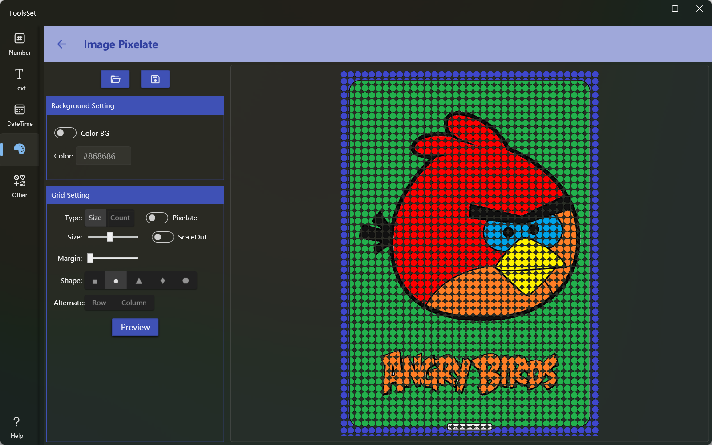
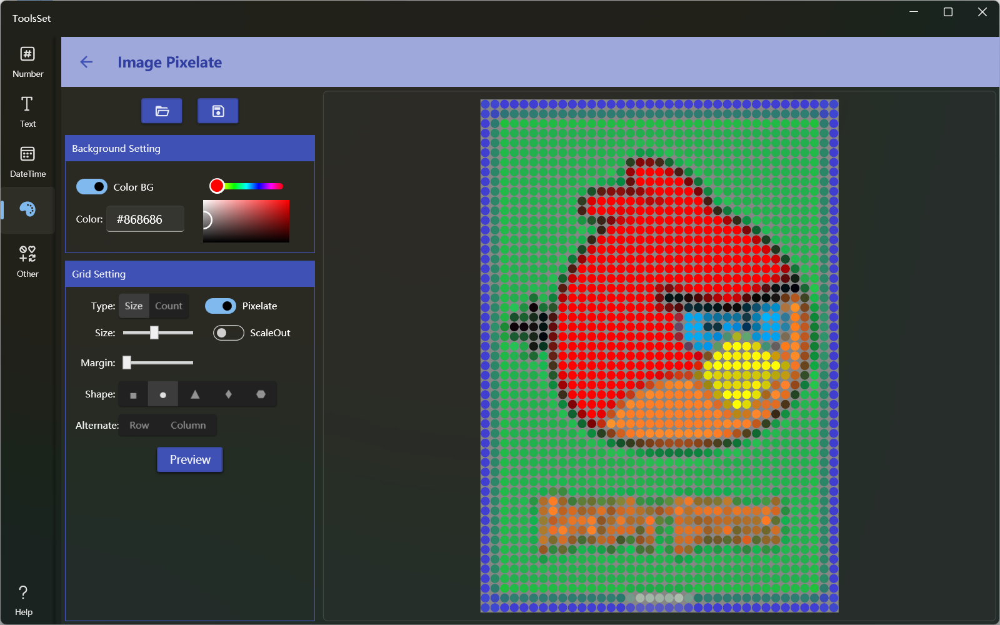

## Introduce
Grid or pixelate images by size or count, and you can specify pattern shape and background color

## How to use

* Open Image: Click the Open File button at the top, and it will be displayed in the preview area on the right after opening the image
* Set Background: Use the switch to set the background color, after the switch is turned on, you can enter or select the color, and when the switch is off, the transparent background will be used
* Grid settings: The generated grid can be configured at the left side
  * Type: Set the grid generation method
    * Size: Generate a grid according to the specified size, the range is 5~50, and the ScaleOut on the right is used to control whether it is processed by pixels
      > The switch is on to enlarge each pixel to the specified size, and is only valid if the image has less than 4000 pixels 
    * Count: Generate grid by specified count, which is set to the number of short sides of the image
    >! If the size of the image is large, and the number of generated grids exceeds 20,000 by size or count, an error will be displayed

  * Pixlate: Set whether to pixelate the image or not, and when turned on, only one color will be included in each grid
  * Margin: Set the grid spacing
  * Shape: Set the shape of the pattern in the grid, which is: square, circle, triangle, diamond, hexagon
  * Alternate: Set whether rows and columns are interleaved during generation, you can set only rows or columns to interleave, or rows and columns at the same time
* Generate Preview: Click the [Preview] button below to generate a gridded image preview on the right side according to the specified settings
* Save Result: Click the Save button on the top to save the result to a file
  

When the Pixlate switch is turned on, and set the gray background:
