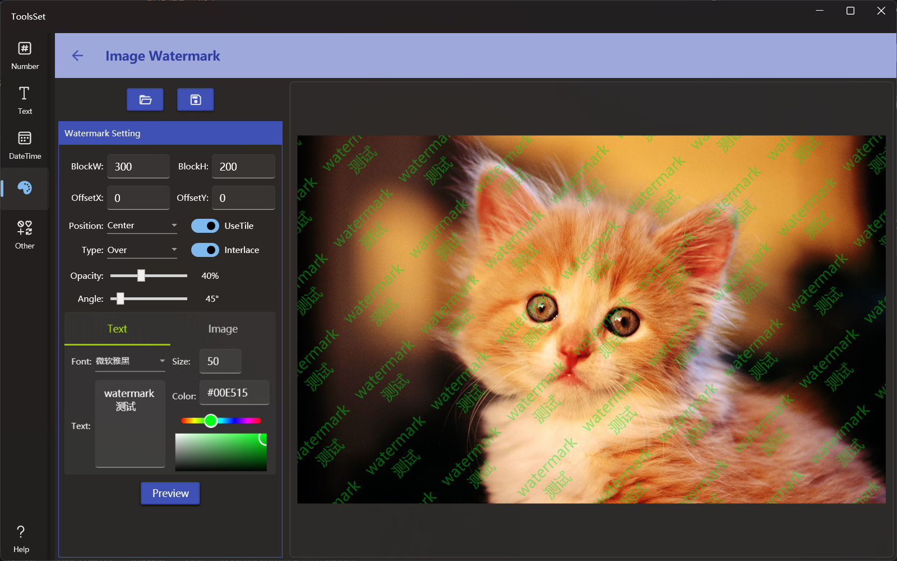

## Introduce

The watermark addition tool allows you to open the image to add text or image watermark, and you can specify the watermark size, interval, transparency, angle, overlay effect, and whether to tile

## How to use

* Add Image: Click the Open File button on the top to open the image file you want to add watermark, and the file will be displayed in the preview area on the right after opened
* Watermark parameter setting
  * BlockW, BlockH: Used to set the size of the watermark block, this setting will affect the spacing of the watermark tiling
  * OffsetX, OffsetY: Used to set the offset of the watermark in the horizontal and vertical directions, which is related to the watermark position setting
  * Position: Used to set the position of the watermark relative to the image, which is invalid when the tile switch is turned on
  * Type: Set the blending effect when the watermark is overlayed
  * UseTile: When enabled, you can fill the image with a watermark tile
  * Interlace: Available after the tile switch is turned on, it is used to specify whether to use the staggered arrangement, after which the watermark will be staggered by half the watermark width in the odd and even row
  * Opacity: Set the opacity of the watermark, 0 is transparent
  * Angle: Set the rotation angle of the watermark
* Watermark content settings
  * Text Watermark: Select the Text tab below to add a text watermark to the image
    * Text watermark can be set to font family, font size, text content and color
  * Image Watermark: Select the Image tab below to add an image watermark to the image
    * Width and Height are used to set the width and height of the watermark of the image
    * Click the area below to select the watermark image from the open file dialog
* Generate watermark: Click the [Preview] button below to generate preview image on the right side
* Save Image: Click the Save button on the top to save the generated result to file
  