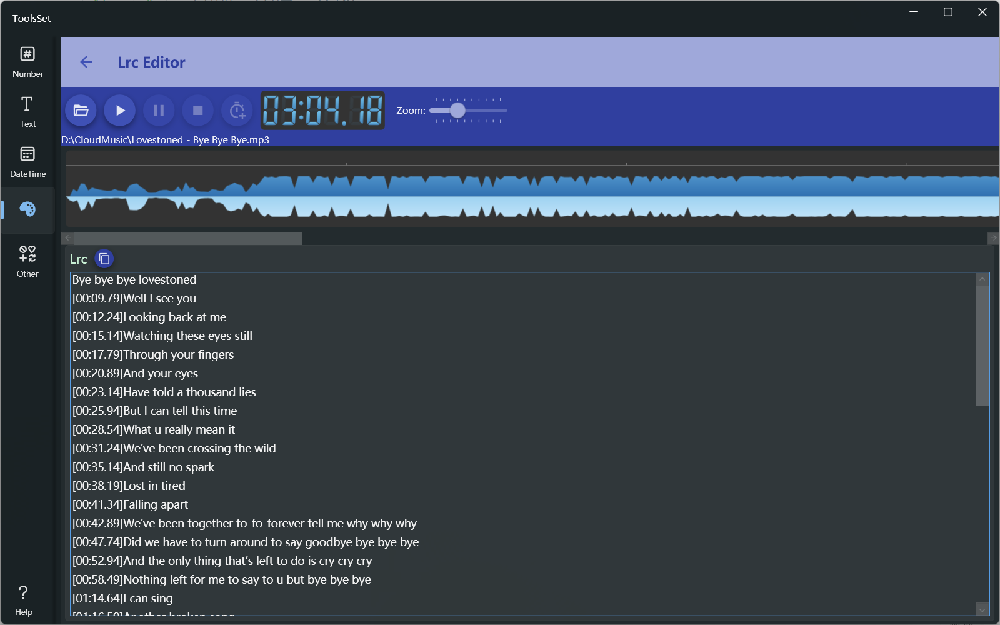

## Introduce

Display the music spectrum, click the button to quickly insert time stamp

## How to use

* Click the Open File button to open the MP3 file, and the music spectrum will be displayed
* Use the three buttons on the right to control the playback
* The slider on the far right allows you to zoom in and out of the spectrum
* Enter the lyrics in the Lrc text box below, and click the add time button at the top to quickly insert the time at the beginning of the cursor line
  > After time inserted, the cursor will automatically move to the beginning of the next line, which can be inserted continuously
  