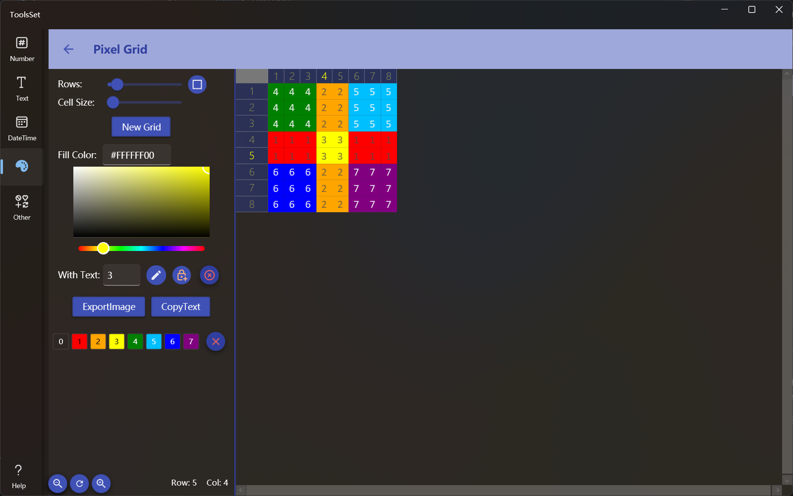

## Introduce

Use the grid to draw a pixel image, you can lock colors, fill text, scale the grid, and export image and copy text

## How to use

The left side is the setting area, and the right side is the drawing area

* When the tool is opened, an 8x8 grid is created by default, which can be modified through the settings on the left
  * Adjust the number of grids through the Rows slider, the range is 4~64, the rows and columns will be modified at the same time when adjusting, if you want the number of rows and columns is different, you can click the button on the right to switch the mode, and then you can set the number of rows and columns respectively
  * Use the Cell Size slider to set the grid size in the range of 20~50, this setting will affect the pixel size of the exported image
  * After modifying the quantity and size, click [New Grid] to create a new grid
* There are three ways to set the color
  1. Enter the color value in hexadecimal in the Fill Color text box
  2. Use the color picker to select
  3. Click on the predefined color below
* You can enter character in the text box of With Text, and fill them into the grid as you draw
* The three buttons on the right side of the text input are: toggle draw and clear mode, lock color, and clear all drawing
  > Mouse press and drag to draw or clear continuously 
  >
  > When the lock color is on, it has different effects in the draw and clear mode
  > * In the draw mode, the area that has been filled with color is locked so that it will not be filled
  > * In the clear mode, is locked to only clear the same color as when the mouse clicked, and other colors will not be cleared
* Click the [ExportImage] button to export the drawn pattern as an image file
* Click the [CopyText] button to copy the text filled in the grid
* Each new color used when drawing will record the color history at the bottom, so that you can quickly reuse it, and the color history can be cleared by click the button to the right of the predefined color
* The bottom three buttons on the left can be used to zoom and reset the display of the drawing grid, and this zoom will not affect the final exported image file