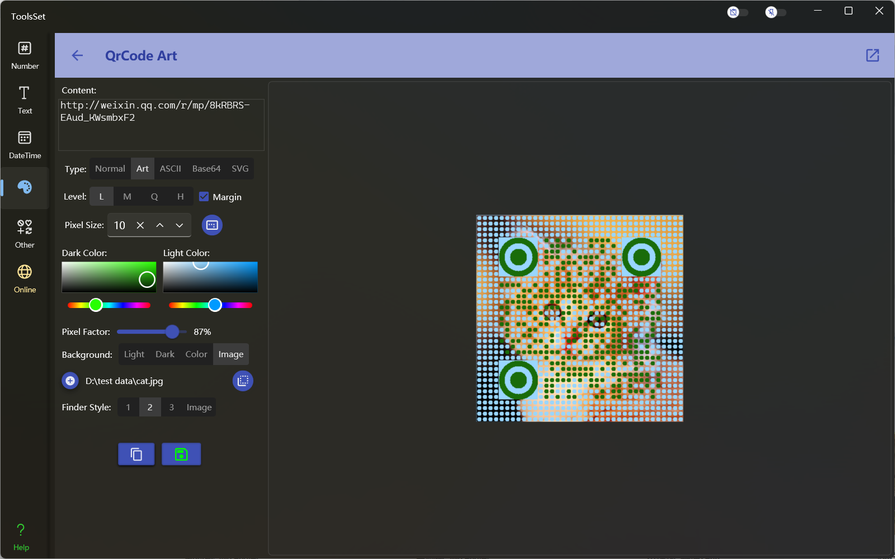
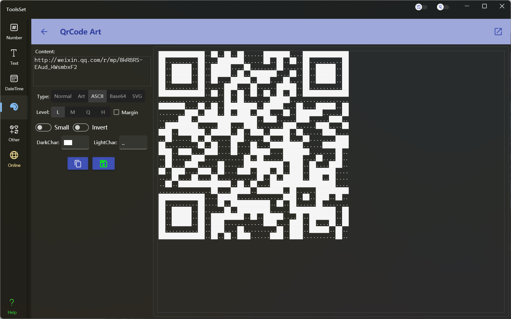

## Introduce

A QR code generator tool that can generate regular QR code, art QR code, ASCII text QR code, as well as Base64 and SVG format

## How to use

* Set content: Enter the text to be converted in the text box at the top of left
* Select the generation type: You can select the QR code generation type below the text box, in order: Normal (regular QR code), Art (art QR code), ASCII (text QR code), Base64, SVG

* Settings: The first two lines are common settings, and the subsequent settings are different according to types
  * General settings:
    * Level: Specify the ECC level, L (Low): 7%, M (Medium): 15%, Q (High): 25%, H (High): 30%
    * Margin: Specifies whether the result contains margins
    * Pixel Size: Specify the pixel size in the QR code, the range is 1~50, the default is 10
  
  * Type settings:
    * Normal settings:
      * With Logo: you can add a logo image in the middle of the QR code after checking
      * QR code Color: set the color of the dark and light parts
      * Logo settings: after select with logo, you can set the logo image, size, border, and background color
    * Art settings:
      * QR code Color: set the color of the dark and light parts
      * Pixel Factor: set the size of the pixel dots
      * Background: specified as the dark or light part of the QR code, custom color, and image, and you can set whether the image expands to the margin area after set the image
        
        > After enable the margin, you can set whether the margin is displayed as dots, and the background color or image will be displayed in the margin section only after the dot display is enabled
      * Finder Style: you can choose a predefined style or image  

  

    * ASCII settings:
      * Display Chars: set the display characters for the dark and light parts
      * Small: When selected, a text QR code with a smaller size will be generated, and the display characters cannot be specified at this time
      * Invert: Inverts the display characters for the dark and light sections
    
  

    * Base64 settings:
      * QR code Color: set the color of the dark and light parts
    * SVG settings:
      * With Logo: you can add a logo image in the middle of the QR code after checking
      * QR code Color: set the color of the dark and light parts
      * Logo settings: after select with logo, you can set the logo image and size

  * Copy or save the result: At the bottom of the left side are the result action buttons
    * If the type is Normal and Art, the generated result is image, so the copy and save are in the image format
    * If the type is ASCII and Base64, the generated result is text, so the copy and save are in text format
    * If the type is SVG, the generated result is text, the copy content is SVG text, and save file format is SVG
  