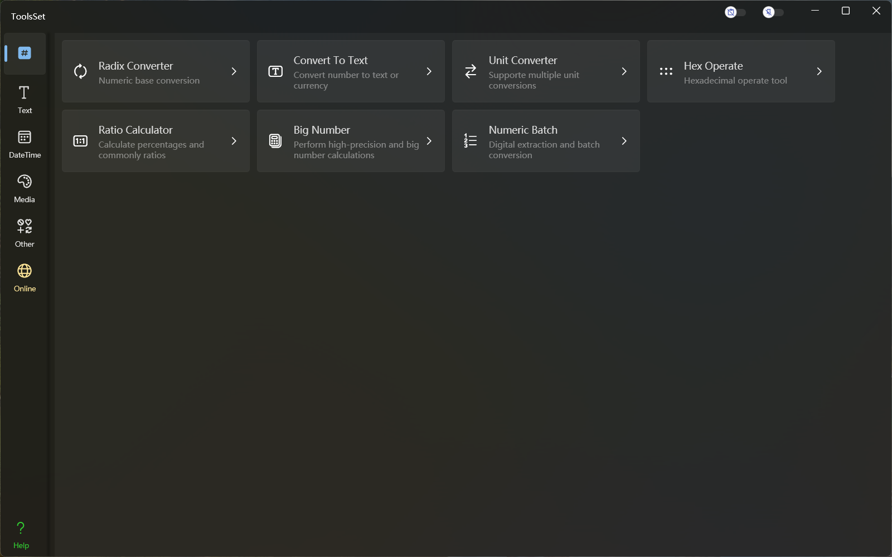

## Introduce

Features include: Radix Converter, Convert To Text, Unit Converter, Hex Operate, Ratio Calculator, Big Number, Numeric Batch

## Features List

### Radix Converter 
* Integer (13 types)
  * Dec -> Hex
  * Dec -> Oct
  * Dec -> Bin
  * Hex -> Dec
  * Hex -> Oct
  * Hex -> Bin
  * Oct -> Dec
  * Oct -> Hex
  * Oct -> Bin
  * Bin -> Dec
  * Bin -> Hex
  * Bin -> Oct
  * Dec -> Any radix text

* Float (4 types)
  * Dec -> Hex
  * Dec -> Bin
  * Hex -> Dec
  * Hex -> Bin

* Double (4 types)
  * Dec -> Hex
  * Dec -> Bin
  * Hex -> Dec
  * Hex -> Bin

### Convert To Text 
* Chinese Conversion (12 types)
  * Dec number -> Chinese lowercase number
  * Dec number -> Chinese uppercase number
  * Dec number -> Chinese lowercase of serial number
  * Dec number -> Chinese uppercase of serial number
  * Dec number -> Chinese lowercase currency
  * Dec number -> Chinese uppercase currency
  
  * Chinese lowercase number -> Dec number
  * Chinese lowercase number -> Chinese uppercase number大写
  * Chinese lowercase of serial number -> Dec number
  * Chinese lowercase of serial number -> Chinese uppercase of serial number
  * Chinese lowercase currency -> Dec number
  * Chinese lowercase currency -> Chinese uppercase currency
* Other national texts
  * Number text (10 types)
    * English en
    * Polish pl
    * Spanish es
    * French fr
    * Russian ru
    * Turkish tr
    * Ukrainian ua
    * Bulgarian bg
    * Amharic am
    * Portuguese pt
  * Currency text (7 types)
    * US Dollar USD.
    * Euro EUR
    * Russian Ruble RUB
    * Turkish Lira TRY
    * Hryvnia UAH
    * Ethiopian Birr ETB
    * Zloty PLN
* Symbol conversion
  * Integer -> 19 predefined characters
  * Integer -> custom character

### Unit Converter 
* Specify category (79 types)
* Category search

### Hex Operate 
* Hex to Bin
* High and low swapping
* Bitwise calculations
  * Format support Hex, Dec, Bin
  * Single operand operations: Not, ShiftL, ShiftR (with or without the sign)
  * Two operand operations: AND, OR, XOR, XNOR, NAND, NOR
* Get the bit range value

### Ratio Calculator 
* Proportional operate
  * Ratio calculat
  * Incremental calculat
* Decimal to Fraction
* Fraction simplification
* Proportional arithmetic
* Fraction comparison

### Big Number
* Mathematical operations
  * Four arithmetic
  * Exponent
  * Root
  * Greatest Common Divisor
  * Least Common Multiple
* Result display
  * Normally
  * Scientific notation
  * Specify the number of decimal places
* Random numbers
  * Specify the number of integer digits
  * Specify the number of decimal places
* Get the number of decimal places for Pi

### Numeric Batch
* Numerical extraction
  * Integer extraction
  * Real number extraction
  * Hexadecimal extraction
* Numeric formatting
  * Decimal specifies the format string
  * Hexadecimal byte arrays lowercase, delimited with or without separation, and in reverse order
* Numerical conversion
  * Decimal to binary, Chinese, hexadecimal byte arrays
  * Byte arrays to other types