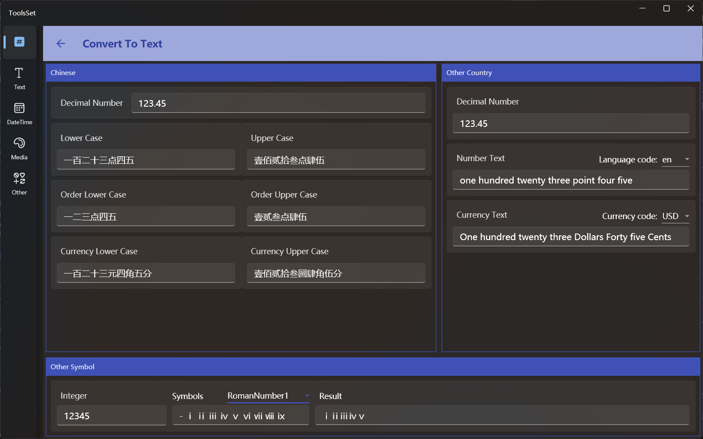

## Introduce

This tool supports
* Convert decimal number to Chinese uppercase and lowercase digits, Chinese order numbers, and Chinese currency
* Convert decimal number into multi-language texts and currency
* Convert integer to the text of the specified character set

> If the conversion data format is entered incorrectly, the contents of the other corresponding result text boxes will be cleared

## How to use

### Chinese Conversion
The left area on the top is the Chinese conversion area, and the types that can be entered include:
* Decimal number (up to 28 digits)
* Chinese lowercase number
* Chinese lowercase order number
* Chinese lowercase currency

Enter a string that conforms to the format in each text box, and the other text boxes can display the corresponding conversion results of other formats

> Chinese lowercase number and order number can be entered "点" to represent the decimal point, or you can enter Chinese uppercase number
>
> The currency amount precision is to the cent, and when the amount is entered into the unit precision to the 元 or 角, you need to enter "整" at the end, otherwise you need to enter "分". Like what:
> * The amount of 100 is 一百元整
> * The amount of 100.2 is 一百元二角整
> * The amount of 100.23 is 一百元二角三分
> * The amount of 100.03 is 一百元零三分

### Other national texts
The right area on the top is the other language conversion area, which supports 10 languages and 7 currency formats
* Languages
    * English en
    * Polish pl
    * Spanish es
    * French fr
    * Russian ru
    * Turkish tr
    * Ukrainian ua
    * Bulgarian bg
    * Amharic am
    * Portuguese pt
* Currency
    * US Dollar USD.
    * Euro EUR
    * Russian Ruble RUB
    * Turkish Lira TRY
    * Hryvnia UAH
    * Ethiopian Birr ETB
    * Zloty PLN
  
> Numbers support 12-digit integers, and currency amount conversion supports two-digit decimal places
>
> The currency is displayed in the selected language, taking 123.45 as an example:

|Language|Text|Currency|Amount|
|-|-|-|-|
|English|one hundred twenty three point four five|US Dollar|One hundred twenty three Dollars Forty five Cents|
|French|cent vingt trois . quatre cinq|Euro|Cent vingt trois Euros Quarante cinq Centimes|
|Amharic|አንድ መቶ ሀያ ሶስት . አራት አምስት|Turkish Lira|አንድ መቶ ሀያ ሶስት የቱርክ ሊራ ከ አርባ አምስት ሳንቲም|

### Integer to text

At the bottom, you can convert integers to text of a specified character set, which contains a variety of predefined character sets, which can be modified into custom characters

The predefined character set includes Roman number, Chinese, numbers with circle/point/bracket, Braille, and more

Conversion examples:

| | |
|-|-|
| Decimal value | 1357 |
| BoldNumber | 𝟭𝟯𝟱𝟳 |
| Chinese3 | ㍙㍛㍝㍟ |
| RomanNumber2| ⅠⅢⅤⅦ|
|CircleNumber|①③⑤⑦|
|BracketNumber|⑴⑶⑸⑺|
|PointNumber|⒈⒊⒌⒎|
|Cuneiform|𒐕𒐗𒐙𒐛|
|Braille|⠼⠁⠼⠉⠼⠑⠼⠛|
|Mahjong|🀙🀛🀝🀟|
|Poker|🂡🂣🂥🂧|

You can using custom characters to convert
For example, 123 convert by the character set 😁 😀 🙂 ❤️ is 😀🙂❤️
 
> The first character in a custom character represents number **0**
> 
> Custom characters are separated by **one space** 
>
> This conversion to 10 base conversion, if you need to convert to other base you can use the [RadixConverter](../ToolsSet_Number/RadixConverter.md)
>
> Reverse conversion is not supported