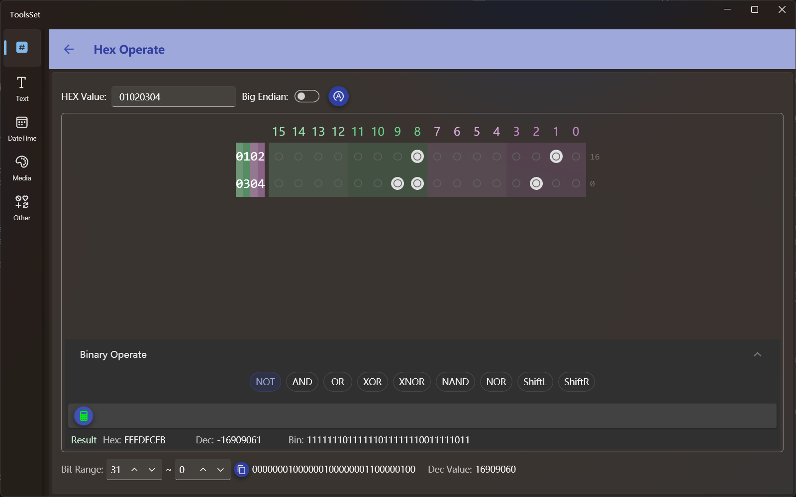

## Introduce

This tool is used for hexadecimal data manipulation, which can be converted to binary for operation, and supports binary bit operations and logical operations 

## How to use

* Operand setting: Select the number of bytes from the dropdown on the top left. You can enter hexadecimal digits in the text box. On the right is the byte order switch; turning it on can reverse the order of hexadecimal bytes. On the far right, you can set the byte sorting method, choosing to swap positions by byte, word, or double word.
  > The number in the input box is 4 digits by default, and it is converted to binary is 16 bits, by changing the number of bytes, the number of bits in the binary area can be changed
  >
  > Setting the byte order only affects the arrangement in the binary area below and does not affect the original hexadecimal value
  >
  > Hexadecimal data supports up to 16 bits, i.e. up to 64 binary bits

* Binary operation
  
  Each bit in the binary area is a switch, and the corresponding bit value can be set to 1 or 0 by turning it on and off
  > When the switch is turned on or off, the changes to the values are automatically synchronized to the upper hexadecimal data and the lowest bit range data
* Logical operations
  
  Below the binary area is the logical operation area, which can perform bitwise logic operations. This area is not expanded by default, and you can click the section title bar to switch when you need to operate

  Actions you can perform in this area include:
  * Single operand operation
    * NOT: Bitwise negation of binary data
      > Click the Update Data button at the top to automatically update the value, if you modify the binary bits, you need to click the Calculate button in this area to recalculate the value
    * ShiftL: Shift the binary data to the left bits, and operate through the slider, and the data range is the same as the number of binary digits of the current data
    * ShiftR: Shifts binary data to the right bits, and the operation is the same as that of ShiftL
      > When shift to right, you can choose whether to shift with the sign through the switch on the right, and the default is on = shift right with the sign
  * Two operand operations
    * AND
    * OR
    * XOR
    * XNOR
    * NAND
    * NOR
    > This set of operations is the same, first click the button to select the operation you want to perform, then set the second operand, and then click the calculate button to get the result
    >
    > There are three ways to input the second operand: hexadecimal, decimal and binary, the hexadecimal and decimal values can be entered directly in accordance with the format
    >
    > Binary input is a set of on/off buttons that can be increased or decreased count by varying the number of data bits
    >
    > The data of these three bases will be automatically converted, that is, if you modify one value, the value of the other base will be automatically update

* Get the bit range value
  
The bottom area can get the value of the selected range by bits, and the default bits are all bits, and you can get some of them by modifying the start and end bits

The start and end bits are interchangeable, and the bits obtained after the swap will also be in reverse order

You can click the copy button in the middle to copy the intercepted binary data
