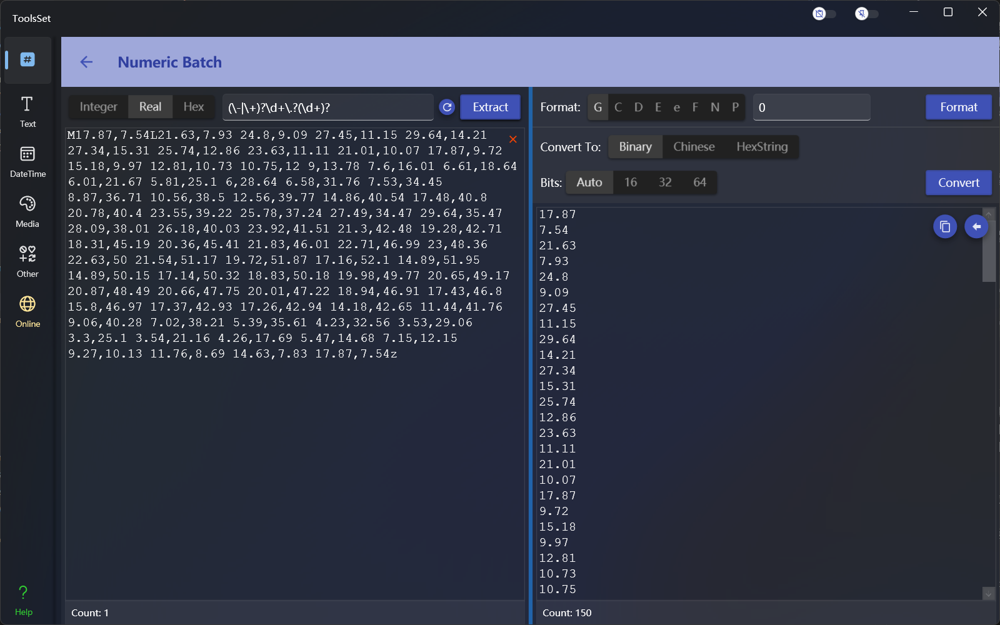
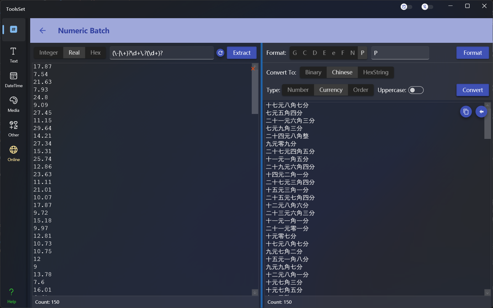
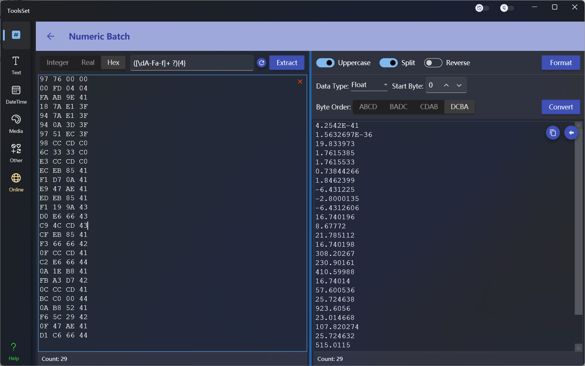

## Introduce

This tool can extract integers, real numbers, and hexadecimal values from strings through regular expressions, and perform numerical formatting and various transformations in batches.

## How to use

* Numerical extraction
  In the upper left toolbar, you can select the type of operation, including integer, real number and hexadecimal operation, the text box on the right side of the type is used to enter the regular expression of the extracted content, enter the string containing the numeric value in the lower text box, and click the [Extract] button on the right to perform the extraction, and the data matching the regular expression will be displayed in the result text box at the bottom of the right.
* Numeric formatting
  * Select integers or real numbers on the left to format decimal values
    * Standard formatting
      
      The standard formatting method that can be selected at the top right will automatically appear in the text box on the right after selection, and you can add numbers at the end.
      Options include:
      1. G: General format, which can be followed by a number to indicate the number of significant digits
      2. C: Currency format, currency symbol will be added automatically, can be followed by a number to indicate the number of decimal places, the default is 2 digits
      3. D: Decimal format, integer only, can be followed by a number to indicate the lower limit of the number, the number of digits less than the lower limit will be preceded by 0
      4. E: Exponential format, can be followed by a number to indicate the number of decimal places, the default is 6 digits, you can use lowercase e to make the result lowercase
      5. F: Fixed-point format, which can be followed by a number to represent the number of decimal places, and the default is 2 digits
      6. N: Number format, the group separator will be added automatically, you can follow the number of decimal places, the default is 2 digits
      7. P: Percentage format, the number is multiplied by 100 and displayed with a percentage symbol, the group separator will be added automatically, and the number can be followed by a number to indicate the number of decimal places, and the default is 2 digits
      8. X: Hexadecimal format, integer only, can be followed by a number to indicate the lower limit of the number, the number of digits less than the lower limit will be preceded by 0, you can use lowercase x to make the result lowercase
    * Custom formatting

      The text box to the right of the standard format allows you to enter a custom formatting string, and the formatting specifiers that can be used include:
      1. 0: Zero placeholder, replace 0 with the corresponding number (if present); Otherwise, zeros are displayed in the result string.
      2. \#: Number placeholder, replacing the "#" symbol with the corresponding number (if present); Otherwise, no numbers are displayed in the result string. If the number is a nonsensical 0, no number appears in the result string.
      3. .: Decimal point, which determines the position of the decimal separator in the result string.
      4. ,: Group separator and numeric scale conversion, when used as a numeric scale specifier, divides the number by 1000 for each specified comma.
      5. %: A percentage placeholder, multiply the number by 100, and insert a localized percentage symbol in the result string.
      6. ‰: A thousandth placeholder that multiplies the number by 1000 and inserts a localized thousandth symbol in the resulting string.
      7. E0: Exponential notation, where the number of zeros followed by the "E" or "e" character determines the minimum number of digits in the exponent. (If the format string contains only E and numbers, it is standard formatting)
      8. \\: Escape character so that the next character is interpreted as text instead of a custom formatting specifier.
      9. ;: A partial separator that defines positive, negative, and zero parts by separating the format string.
      10. Other strings: A text string separator that indicates the characters that should be copied to the unchanged resulting string.
  * Select Hexadecimal on the left to format the byte array, options include:
    * Uppercase: The result will be uppercase characters when opened, otherwise it will be lowercase
    * Split: When opened, the result will be separated by bytes with a space, otherwise it will not be separated
    * Reverse: When opened, the results will be in reverse byte order
  

* Numerical conversion
  * Select integer or real number on the left to convert decimal values
    * Convert to binary
  
      You can select the number of digits to be displayed in the result, and the number of digits will be automatically converted according to the data format, and other options will be added to the specified number of digits.
    * Converted to Chinese
      
      Chinese conversion supports Chinese number, Chinese currency, and Chinese order, and you can select uppercase to convert the result to Chinese uppercase.
    * Converted to hexadecimal

      Hexadecimal conversion converts numbers into hexadecimal byte arrays, and you can specify the byte order
  * Select hexadecimal on the left to convert the byte array, the options are:
    * Data Type: You can choose different data types
    * Start Byte: Set the byte position where the conversion starts
    * Byte Order: Set the byte order used during conversion

> The results on the right can be quickly copied by clicking the copy button
> 
> Click the left arrow button to quickly copy to the left for the next processing